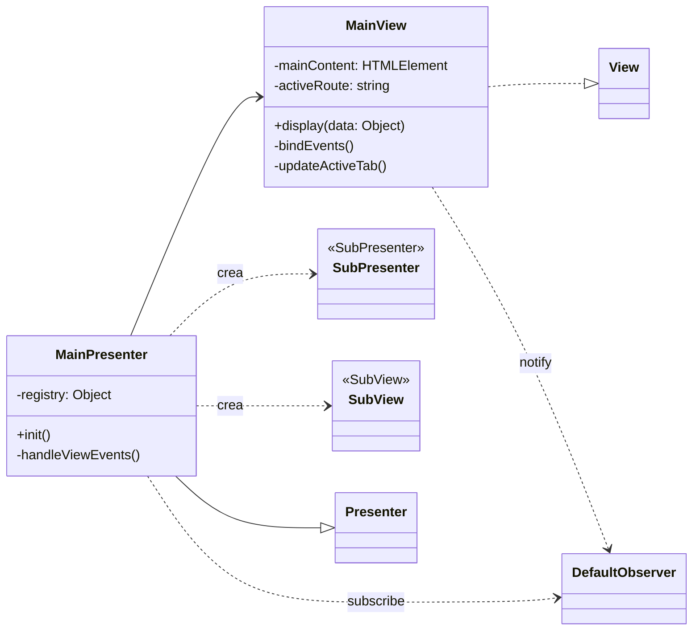
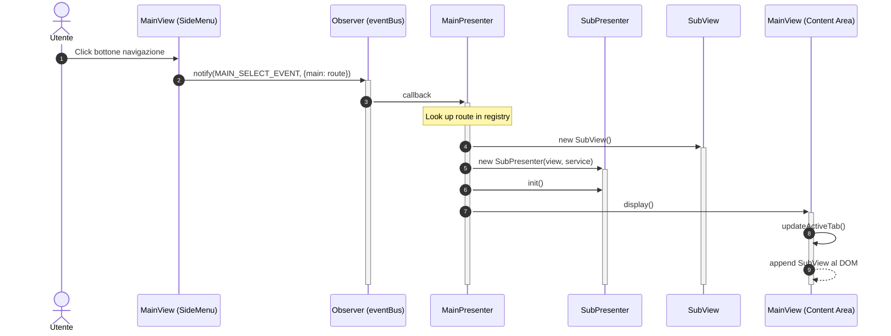

# Architettura Base

Questo documento descrive l'architettura generale del sistema. Le interfacce e classi astratte sono documentate in file separati nella directory `architettura_base/`.
I design pattern utilizzati sono documentati in:
- [Design Pattern Frontend](design_pattern/frontend.md)
- [Design Pattern Backend](design_pattern/backend.md)

## Interfacce e Classi Astratte

### Backend
- [Router](architettura_base/Router.md) - Classe astratta per il routing delle richieste HTTP (`DefaultRouter`)
- [Controller](architettura_base/Controller.md) - Classe astratta per i controller (`CommandController`)

### Frontend
- [View](architettura_base/View.md) - Interfaccia per le view (MVP Pattern)
- [Presenter](architettura_base/Presenter.md) - Classe astratta per i presenter (MVP Pattern)
- [Observer](architettura_base/Observer.md) - Interfaccia per il pattern Observer
- [APIService](architettura_base/APIService.md) - Interfaccia per le chiamate API

---

I seguenti diagrammi mostrano come viene gestita una chiamata HTTP dal backend. 
Per la creazione del controller associato alla chiamata viene utilizzata una factory che delega a dei creator registrati.
Ogni controller gestisce diverse azioni tramite il pattern **Command**.

---

## Gestione Navigazione (MainView & MainPresenter)

Il sistema di navigazione principale è gestito dal `MainPresenter`, che agisce come orchestratore per le diverse sezioni dell'applicazione.

### Diagramma delle Classi

### Diagramma di Sequenza (Navigazione)

---

## Model - Classi Comuni

I seguenti model rappresentano le entità principali del sistema e sono utilizzati in diversi casi d'uso.
