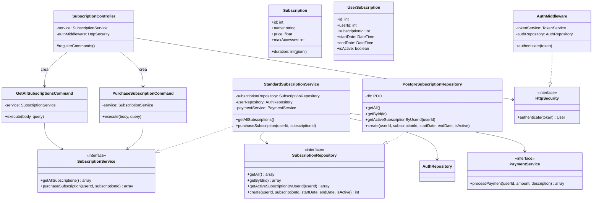
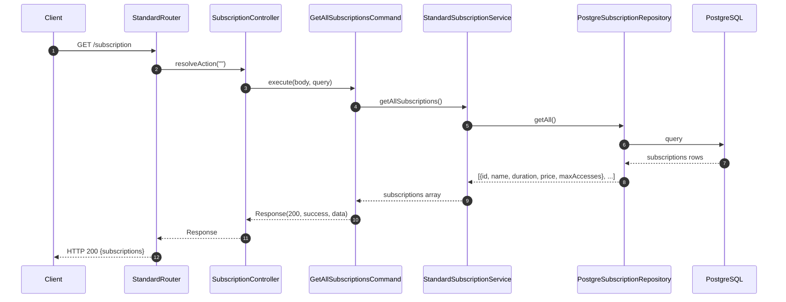
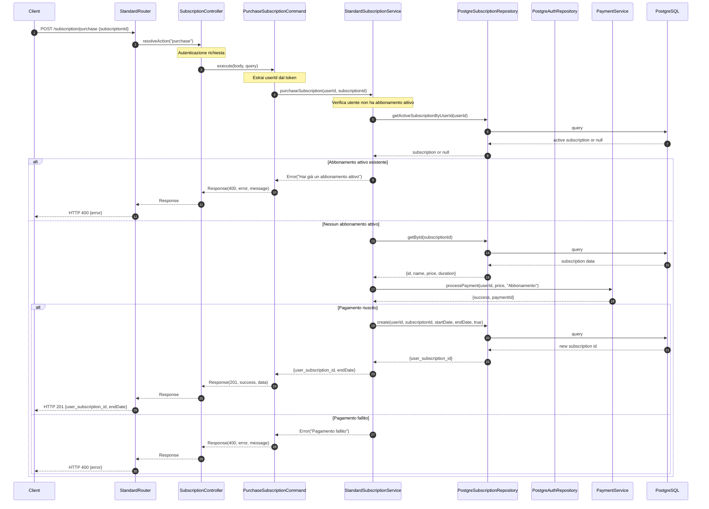

# Modulo Abbonamenti - Backend

## Panoramica

Questo modulo gestisce gli abbonamenti, permettendo agli utenti di visualizzare gli abbonamenti disponibili e acquistarli, e agli admin di gestire le tariffe e gli abbonamenti.

## Diagramma delle Classi

## Flusso di Visualizzazione Abbonamenti

## Flusso di Acquisto Abbonamento

