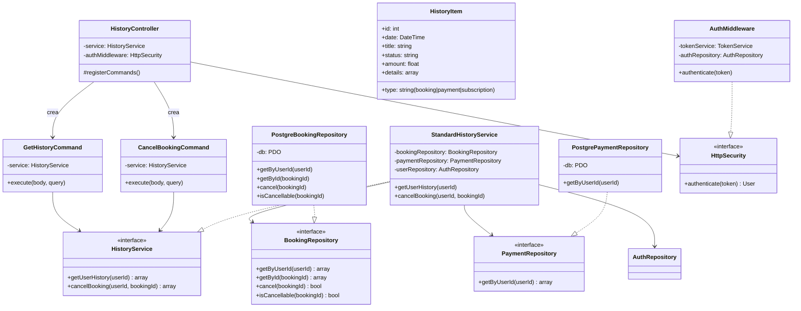
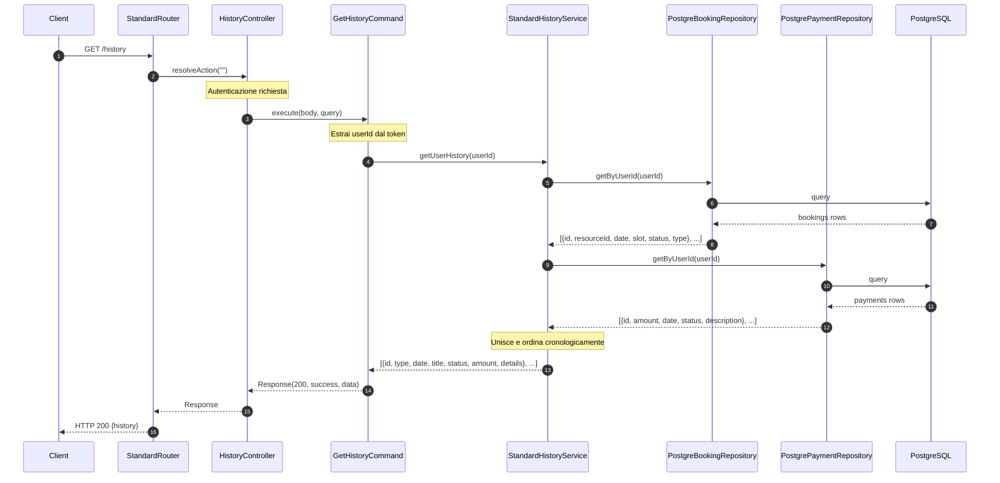
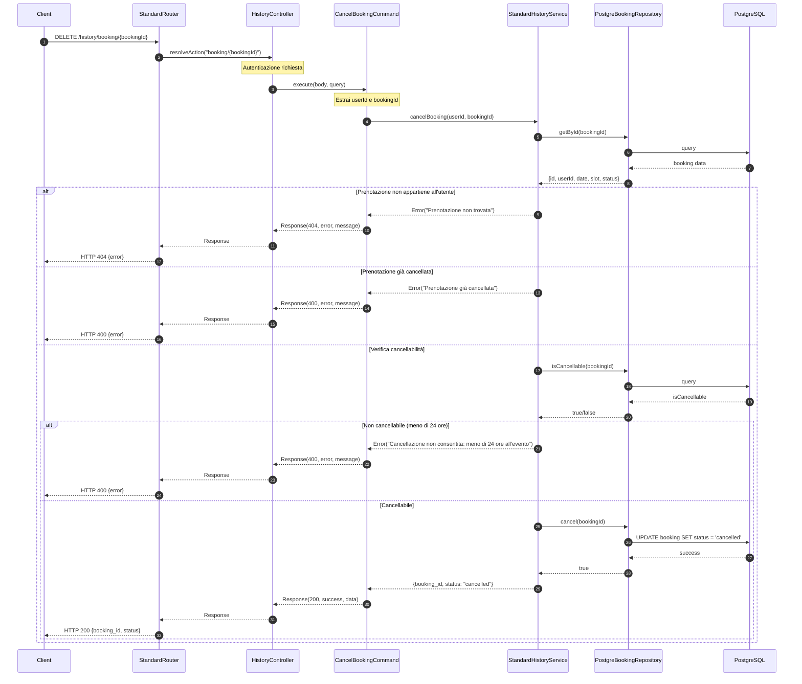

# Modulo History - Backend

## Panoramica

Questo modulo gestisce lo storico delle prenotazioni e pagamenti degli utenti, permettendo loro di visualizzare il loro storico e di cancellare prenotazioni future.

## Diagramma delle Classi

## Flusso di Visualizzazione Storico

## Flusso di Cancellazione Prenotazione

