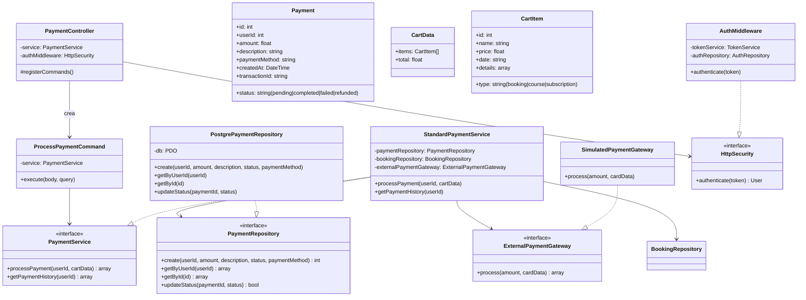
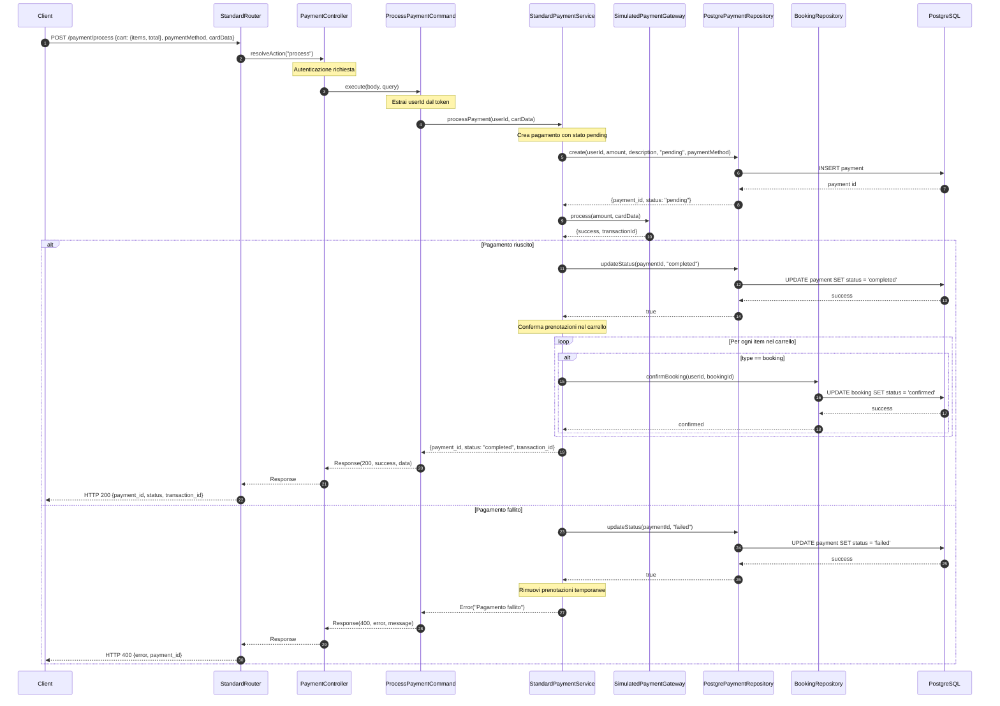
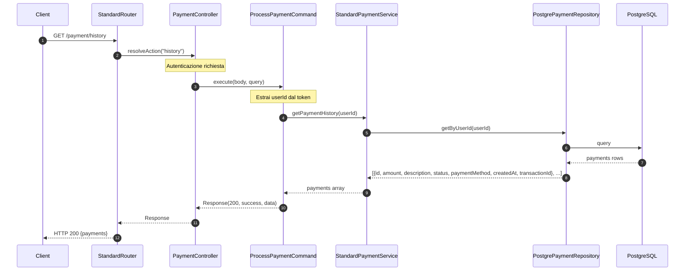

# Modulo Pagamento - Backend

## Panoramica

Questo modulo gestisce i processi di pagamento per prenotazioni, corsi e abbonamenti, simulando un sistema di pagamento esterno.

## Diagramma delle Classi

## Flusso di Processamento Pagamento

## Flusso di Recupero Storico Pagamenti

