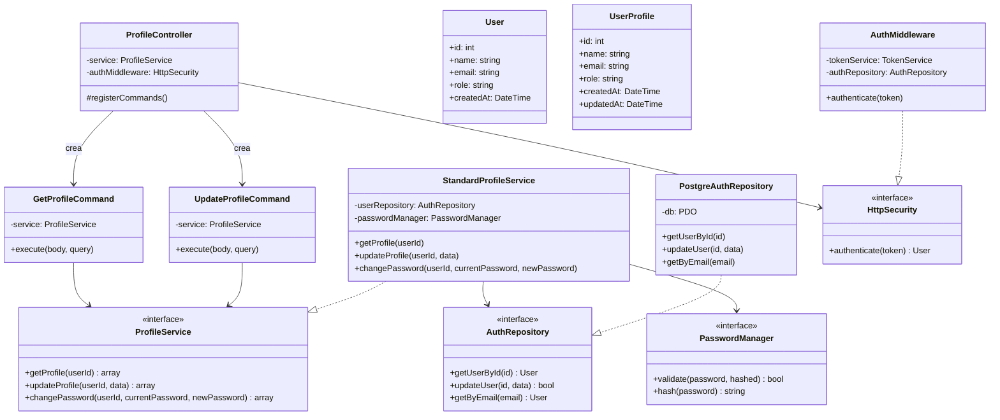
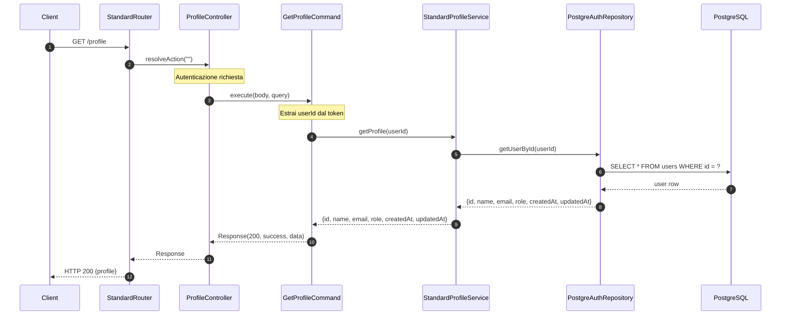
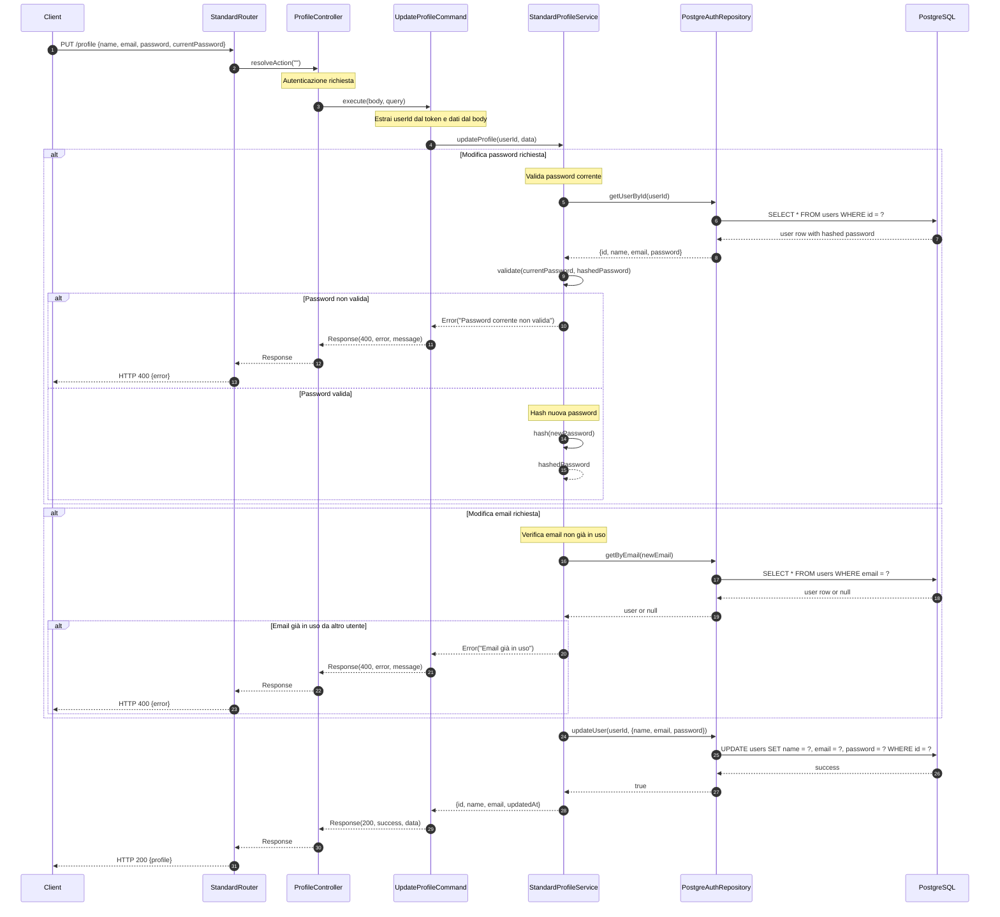

# Modulo Profilo - Backend

## Panoramica

Questo modulo gestisce il profilo utente, permettendo agli utenti di visualizzare i propri dati personali e di modificarli.

## Diagramma delle Classi

## Flusso di Visualizzazione Profilo

## Flusso di Aggiornamento Profilo

