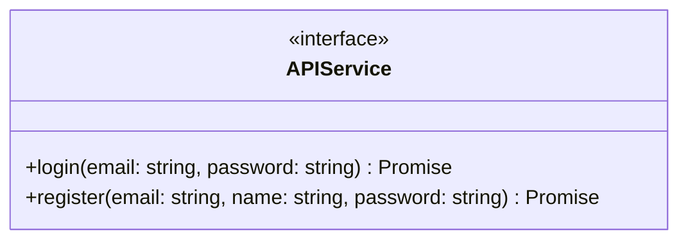
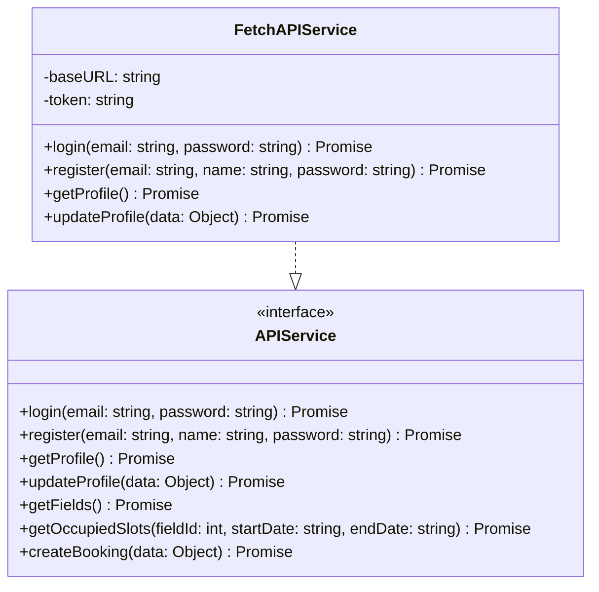
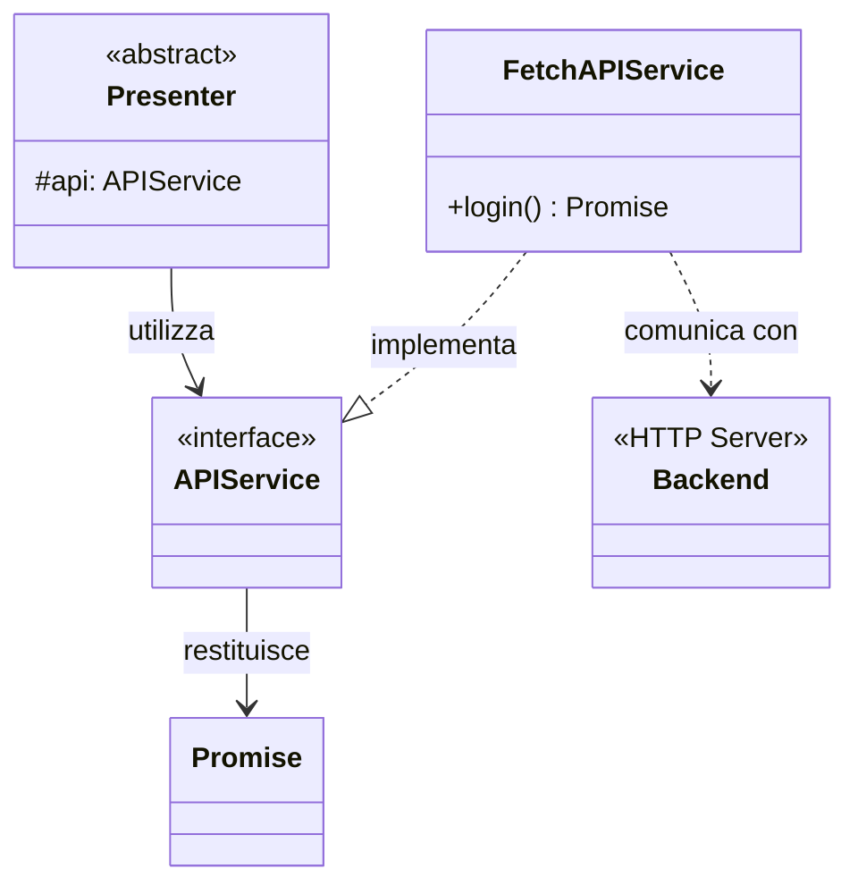

# APIService Interface

Questa è l'interfaccia utilizzata nel progetto per la **comunicazione con il backend** tramite chiamate API HTTP.

## Descrizione

L'interfaccia `APIService` definisce il contratto per effettuare chiamate HTTP al backend. Fornisce metodi per le operazioni di autenticazione e altre funzionalità dell'applicazione.

## Metodi

## Responsabilità

- Effettuare chiamate HTTP al backend
- Gestire le risposte e gli errori
- Restituire Promise per gestione asincrona

## Implementazioni

Le seguenti classi implementano questa interfaccia:

### FetchAPIService
- **Scopo**: Implementazione reale usando Fetch API
- **Utilizzo**: Produzione
- **Caratteristiche**: Gestione token JWT, error handling, retry logic

## Dipendenze

Il seguente diagramma mostra le relazioni e dipendenze di questa interfaccia:

### Relazioni
- **Utilizzata da**: `Presenter` (e tutte le sue sottoclassi)
- **Restituisce**: `Promise` - per gestione asincrona
- **Comunica con**: Backend HTTP - tramite fetch
- **Implementata da**: `MockAPIService`, `FetchAPIService`

