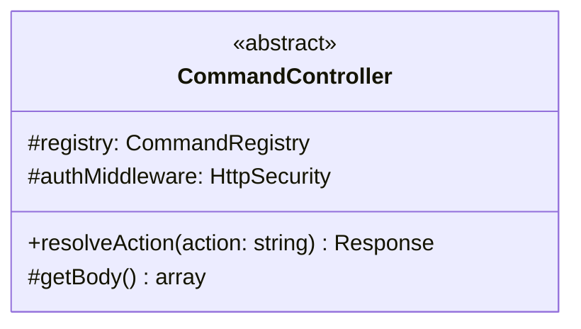
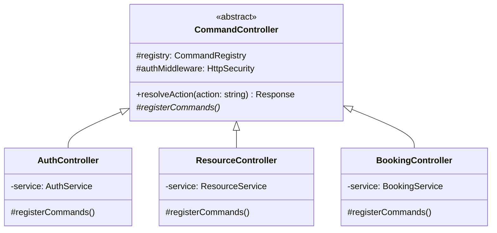
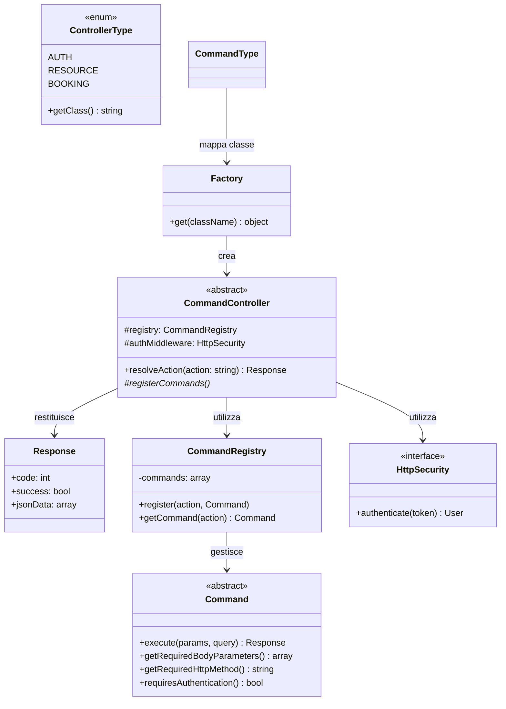
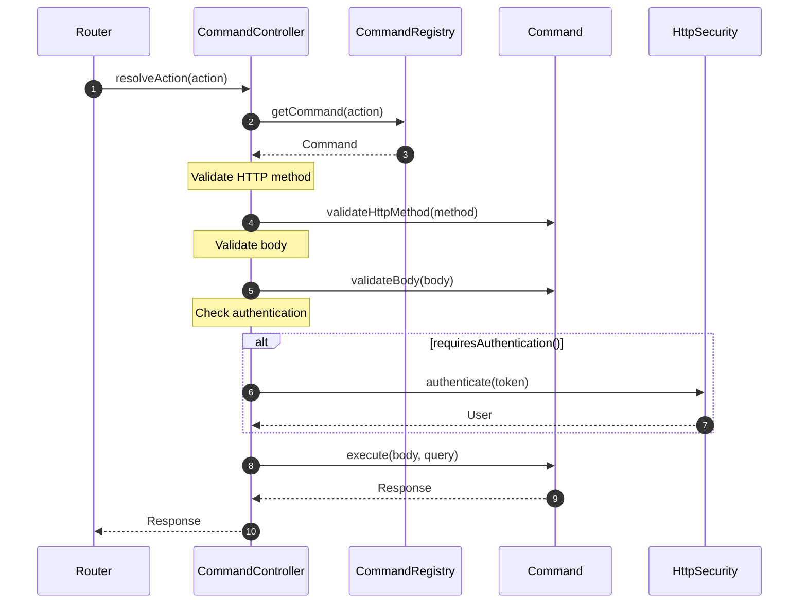

# Controller

Questa è la classe astratta utilizzata nel progetto per la **gestione delle richieste HTTP** nel backend.

## Descrizione

La classe astratta `Controller` definisce la struttura base per tutti i controller dell'applicazione. Fornisce metodi comuni per gestire le richieste, elaborare i dati e creare risposte.

## Struttura

## Responsabilità

- **resolveAction()**: Esegue l'action richiesta, ottenendo il command dal registry
- **getBody()**: Recupera i dati dal body della richiesta
- **registerCommands()**: Registra i comandi disponibili (da implementare)

## Implementazioni

Le seguenti classi estendono questa classe astratta:

## Dipendenze

Il seguente diagramma mostra le relazioni e dipendenze di questa classe:

### Relazioni

- **Utilizza**: `CommandRegistry` - per ottenere il command associato all'action
- **Utilizza**: `HttpSecurity` - per autenticazione richieste protette
- **Restituisce**: `Response` - oggetto risposta HTTP
- **Creato da**: `Factory` - tramite dependency injection
- **Mappato da**: `ControllerType` enum - converte stringa controller in classe

## Flusso di Risoluzione Action

