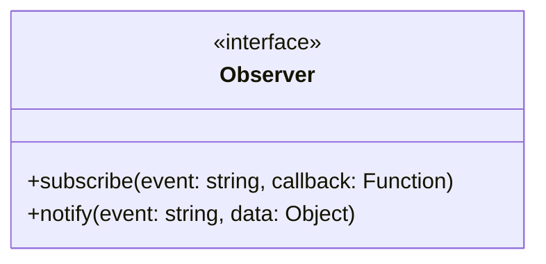
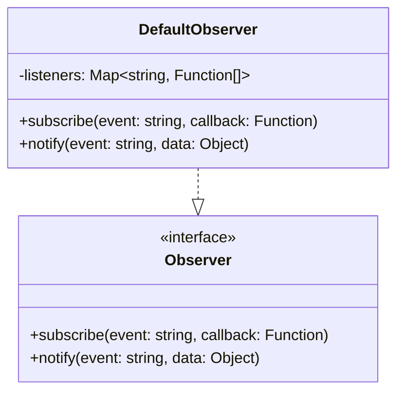
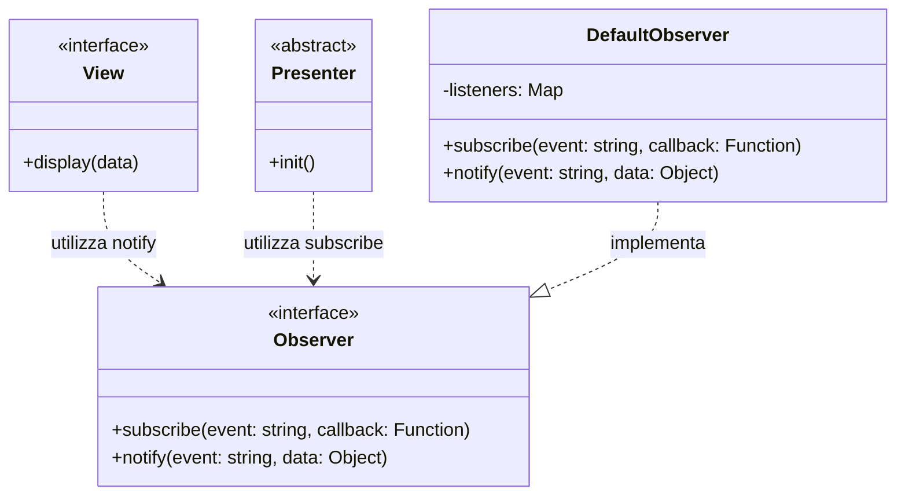

# Observer Interface

Questa è l'interfaccia utilizzata nel progetto per l'**implementazione del pattern Observer**, permettendo la comunicazione event-driven tra View e Presenter.

## Descrizione

L'interfaccia `Observer` definisce il contratto per il sistema di eventi dell'applicazione. Permette ai componenti di sottoscriversi a eventi e di notificare altri componenti quando si verificano cambiamenti.

## Metodi

## Responsabilità

- **subscribe()**: Registra un callback per un determinato evento
- **notify()**: Notifica tutti i subscriber di un evento con i relativi dati

## Pattern

Implementa il **Observer Pattern** per disaccoppiare View e Presenter.

## Implementazioni

Le seguenti classi implementano questa interfaccia:

## Utilizzo

- Le **View** usano `notify()` per comunicare eventi (es. click, submit)
- I **Presenter** usano `subscribe()` per ascoltare gli eventi delle view

## Dipendenze

Il seguente diagramma mostra le relazioni e dipendenze di questa interfaccia:

### Relazioni
- **Utilizzata da**: `View` - per notificare eventi (metodo `notify`)
- **Utilizzata da**: `Presenter` - per sottoscriversi agli eventi (metodo `subscribe`)
- **Implementata da**: `DefaultObserver`

