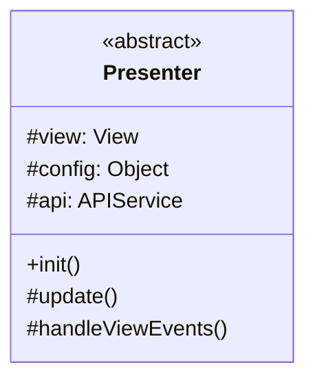
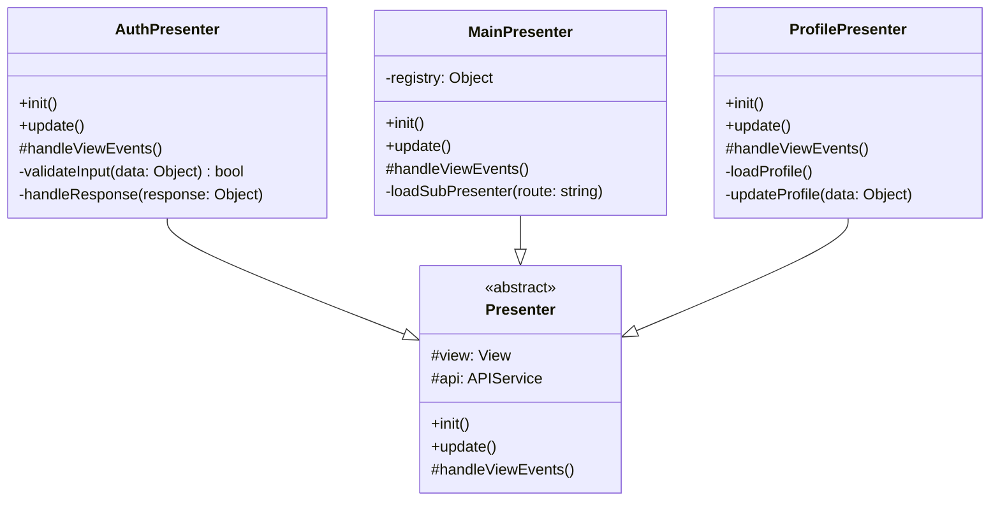
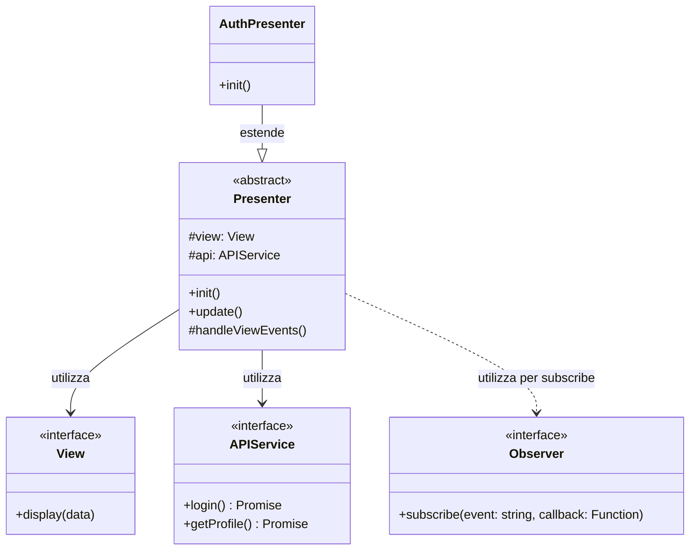

# Presenter (Classe Astratta)

Questa è la classe astratta utilizzata nel progetto per la **logica di presentazione** nel pattern MVP (Model-View-Presenter).

## Descrizione

La classe astratta `Presenter` definisce la struttura base per gestire la logica di presentazione dell'applicazione frontend. Funge da intermediario tra la View e i servizi (API).

## Struttura

## Responsabilità

- **init()**: Inizializza il presenter e la view
- **update()**: Aggiorna la view con nuovi dati
- **handleViewEvents()**: Gestisce gli eventi provenienti dalla view

## Pattern

Implementa la parte **Presenter** del pattern **MVP (Model-View-Presenter)** con comunicazione tramite **Observer Pattern**.

## Implementazioni

Le seguenti classi estendono questa classe astratta:

## Dipendenze

Il seguente diagramma mostra le relazioni e dipendenze di questa classe:

### Relazioni
- **Utilizza**: `View` - per aggiornare l'interfaccia utente
- **Utilizza**: `APIService` - per comunicare con il backend
- **Utilizza**: `Observer` - per sottoscriversi agli eventi della view
- **Estesa da**: `AuthPresenter`, `MainPresenter`, `CampiPresenter`, `BookingPresenter`, `ProfilePresenter`

