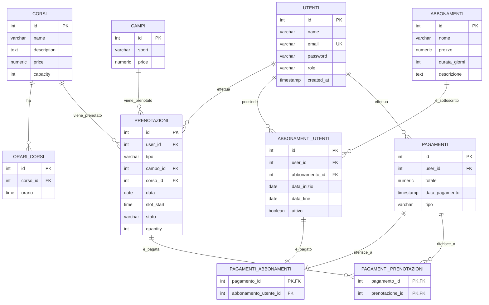

# Diagramma ER del Database Centro Sportivo

```mermaid
erDiagram
    UTENTI {
        int id PK
        varchar name
        varchar email UK
        varchar password
        varchar role
        timestamp created_at
    }
    CAMPI {
        int id PK
        varchar sport
        numeric price
    }
    CORSI {
        int id PK
        varchar name
        text description
        numeric price
        int capacity
    }
    ORARI_CORSI {
        int id PK
        int corso_id FK
        time orario
    }
    PRENOTAZIONI {
        int id PK
        int user_id FK
        varchar tipo
        int campo_id FK
        int corso_id FK
        date data
        time slot_start
        varchar stato
        int quantity
    }
    ABBONAMENTI {
        int id PK
        varchar nome
        numeric prezzo
        int durata_giorni
        text descrizione
    }
    ABBONAMENTI_UTENTI {
        int id PK
        int user_id FK
        int abbonamento_id FK
        date data_inizio
        date data_fine
        boolean attivo
    }
    PAGAMENTI {
        int id PK
        int user_id FK
        numeric totale
        timestamp data_pagamento
        varchar tipo
    }
    PAGAMENTI_ABBONAMENTI {
        int pagamento_id PK,FK
        int abbonamento_utente_id FK
    }
    PAGAMENTI_PRENOTAZIONI {
        int pagamento_id PK,FK
        int prenotazione_id PK,FK
    }

    UTENTI ||--o{ PRENOTAZIONI : "effettua"
    UTENTI ||--o{ ABBONAMENTI_UTENTI : "possiede"
    UTENTI ||--o{ PAGAMENTI : "effettua"
    CAMPI ||--o{ PRENOTAZIONI : "viene_prenotato"
    CORSI ||--o{ ORARI_CORSI : "ha"
    CORSI ||--o{ PRENOTAZIONI : "viene_prenotato"
    ABBONAMENTI ||--o{ ABBONAMENTI_UTENTI : "è_sottoscritto"
    PAGAMENTI ||--|| PAGAMENTI_ABBONAMENTI : "riferisce_a"
    PAGAMENTI ||--o{ PAGAMENTI_PRENOTAZIONI : "riferisce_a"
    ABBONAMENTI_UTENTI ||--|| PAGAMENTI_ABBONAMENTI : "è_pagato"
    PRENOTAZIONI ||--o{ PAGAMENTI_PRENOTAZIONI : "è_pagata"
```

