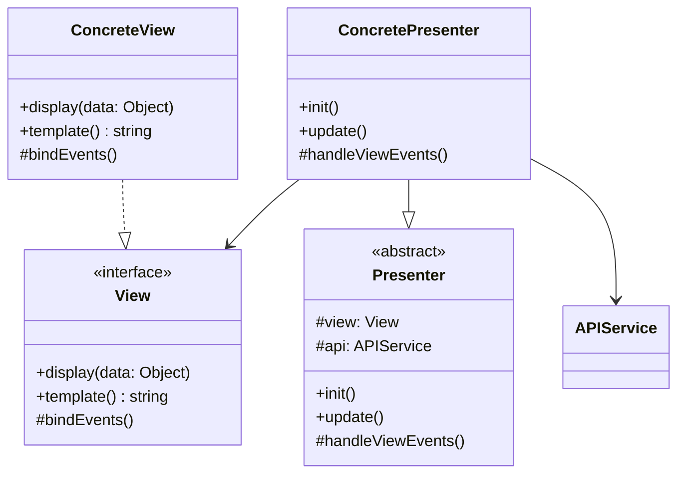
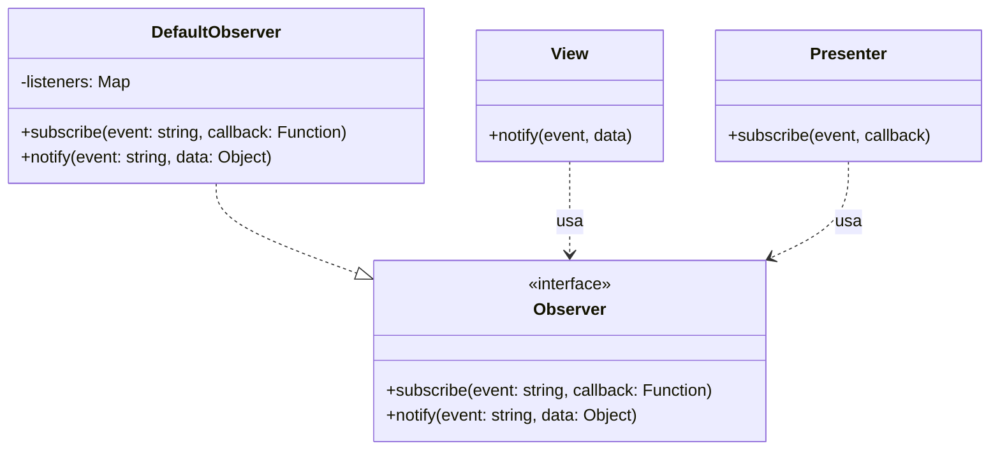
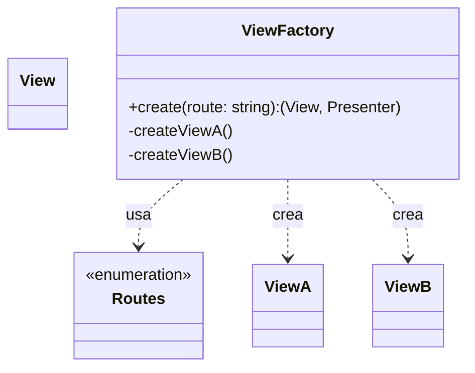
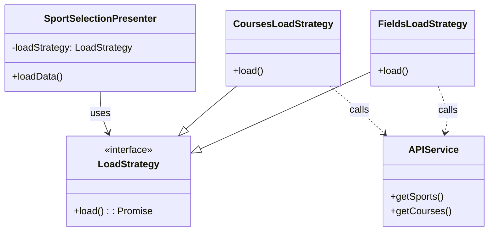
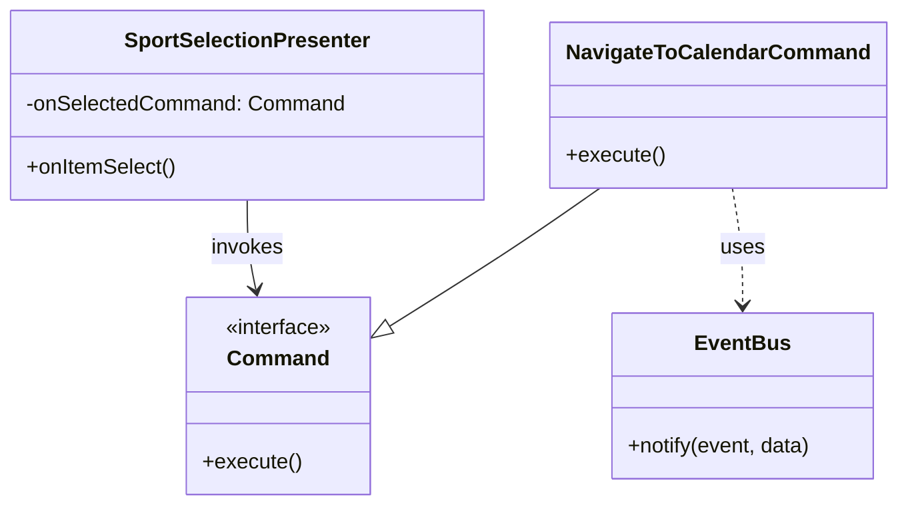
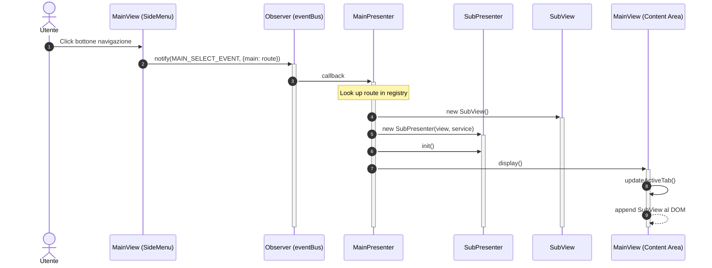

# Design Patterns Frontend

Questo documento descrive i principali design pattern implementati nell'architettura frontend del sistema.

---

## Model-View-Presenter (MVP)

### Scopo
Separare la logica di presentazione dalla logica di business e dalla visualizzazione, migliorando la testabilità e la manutenibilità del codice frontend.

### Componenti

---

## Observer Pattern

### Scopo
Permettere la comunicazione tra View e Presenter, disaccoppiando i componenti.

### Struttura

---

## Factory Pattern (Frontend)

### Scopo
Centralizzare la creazione delle View e dei Presenter, disaccoppiando il router dalla logica di istanziazione dei componenti.

### Struttura

---

## Strategy Pattern (Frontend)

### Scopo
Incapsulare diverse logiche di caricamento dati (es. Campi vs Corsi) permettendo di riutilizzare lo stesso Presenter per casi d'uso diversi.

### Struttura

---

## Command Pattern (Frontend)

### Scopo
Disaccoppiare il Presenter dall'azione effettiva da eseguire (es. navigazione), iniettando il comando da eseguire.

### Struttura

---

## Gestione Navigazione (Flusso Event-Driven)

Il seguente diagramma mostra come il pattern Observer e MVP collaborano per gestire la navigazione tra le sezioni dell'applicazione.

### Diagramma di Sequenza (Navigazione)

