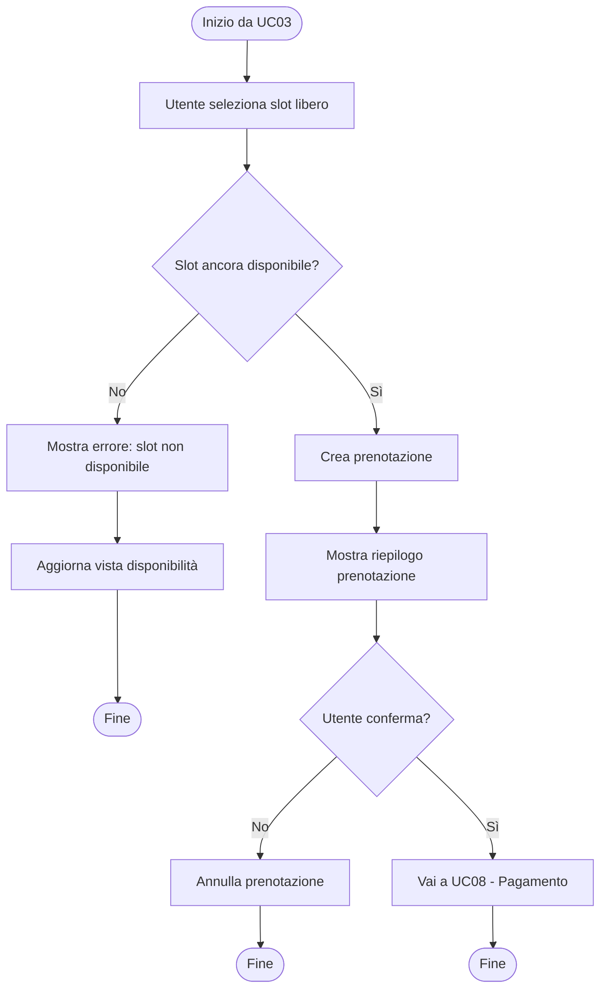
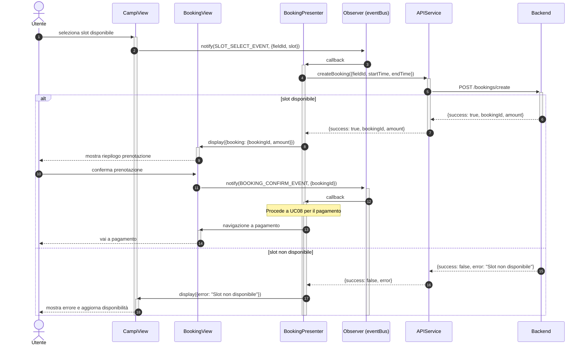

# UC04 - Prenotazione Campo Sportivo

Per inizializzazione dei componenti o componenti comuni a tutto il software vedere [Architettura base](./Architettura%20base.md)

---

## Diagramma di Attività



---

## Diagrammi di Sequenza

### Frontend



### Backend
 
 ```mermaid
 sequenceDiagram
     autonumber
 
     participant frontend as Frontend
     participant router as Router
     participant controller as :FieldBookingController
     participant service as :FieldBookingService
     participant bookingRepo as :FieldBookingRepository
     participant db as Database
 
     frontend ->>+ router: POST /bookings/create
     router ->>+ controller: resolveAction("create")
     controller ->>+ service: createBooking(userId, fieldId, startTime, endTime)
     service ->>+ bookingRepo: findOverlaps(fieldId, startDate, endDate)
     bookingRepo ->>+ db: query
     db -->>- bookingRepo: occupied slot records
     bookingRepo -->>- service: Slot[]
     service ->> service: checkSlotAvailability(fieldId, startTime, endTime)
 
     alt slot disponibile
         service ->>+ bookingRepo: createBooking(booking)
         bookingRepo ->>+ db: query
         db -->> bookingRepo: booking id
         bookingRepo -->>- service: FieldBooking (status: "pending")
         service -->>- controller: Response(200, success, {bookingId, amount})
         controller -->>- router: Response(200, success, {bookingId, amount})
         
     else slot occupato
         service -->> controller: Response(409, false, "Slot non disponibile")
         controller -->> router: Response(409, false, "Slot non disponibile")
     end
 
     router -->>- frontend: HTTP Response
```