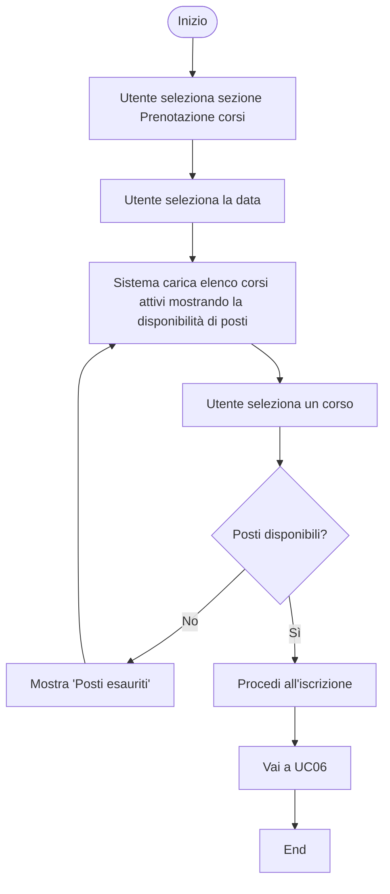
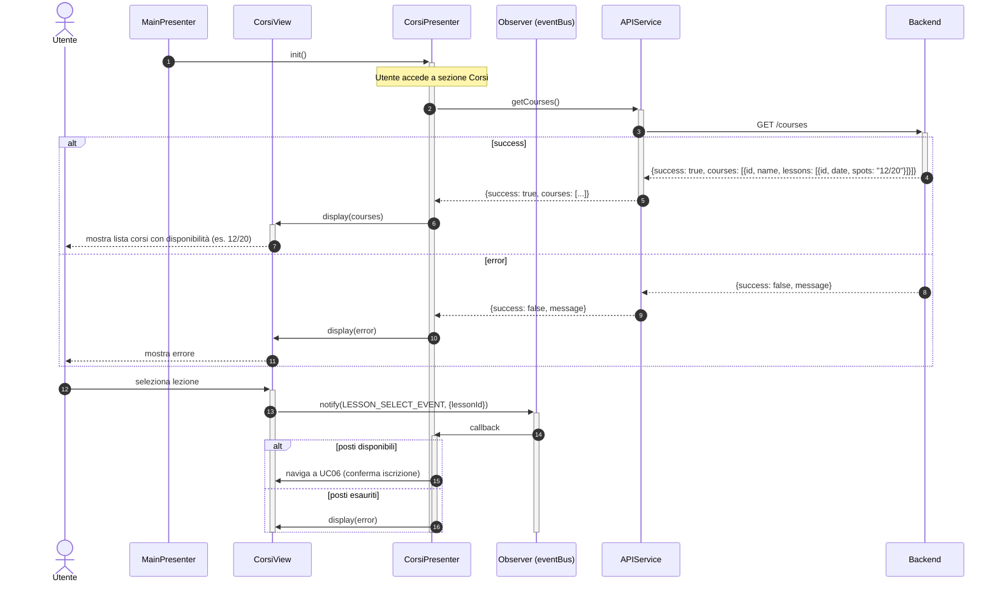

# UC05 - Visualizzazione Corsi

Per inizializzazione dei componenti o componenti comuni a tutto il software vedere [Architettura base](./Architettura%20base.md)

---

## Diagramma di Attività



---

## Diagrammi di Sequenza

### Frontend



### Backend

#### Caso GET /courses
 
 ```mermaid
 sequenceDiagram
     autonumber
 
     participant frontend as Frontend
     participant router as Router
     participant controller as :CourseController
     participant service as :CourseService
     participant courseRepo as :CourseRepository
     participant bookingRepo as :CourseBookingRepository
     participant db as Database
 
     frontend ->>+ router: GET /courses
     router ->>+ controller: resolveAction()
     controller ->>+ service: getActiveCourses()
    
     service ->>+ courseRepo: getCourses()
          courseRepo ->>+ db: query
     db -->>- courseRepo: data
     courseRepo -->> service: Resource[]
     
     alt success
         service -->> controller: Response(200, success, coursesWithAvailability)
         controller -->> router: Response(200, success, coursesWithAvailability)
     else db error
         courseRepo -->>- service: throw Exception
         service -->>- controller: Response(500, false, "db error")
         controller -->> router: Response(500, false, "db error")
         deactivate controller
     end
     
     router -->>- frontend: HTTP Response
 ```
