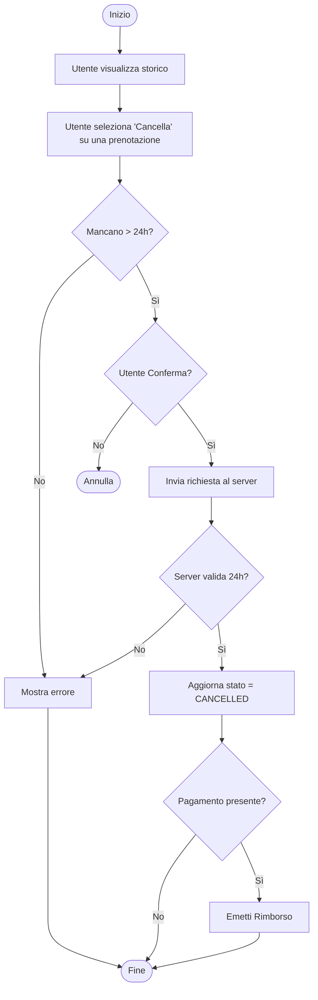
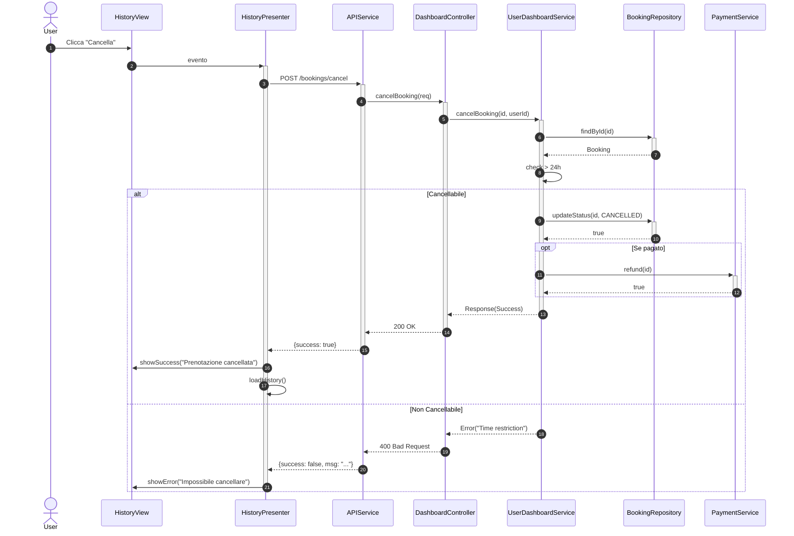

## UC07 - Cancellazione Prenotazione

### Diagrammi di Attività

```mermaid
flowchart TD
    Start([Inizio]) --> ViewHist[Utente visualizza storico]
    ViewHist --> Select[Utente seleziona 'Cancella' su una prenotazione]
    Select --> CheckTime{Mancano > 24h?}
    
    CheckTime -->|No| Err[Mostra errore: Tempo scaduto]
    CheckTime -->|Sì| ConfirmUser{Utente Conferma?}
    
    ConfirmUser -->|No| Abort([Annulla])
    ConfirmUser -->|Sì| ReqServer[Invia richiesta al server]
    
    ReqServer --> CheckServer{Server valida 24h?}
    
    CheckServer -->|No| Err[Mostra errore]
    CheckServer -->|Sì| UpdateDB[Aggiorna stato = CANCELLED]
    
    UpdateDB --> CheckPaid{Pagamento presente?}
    CheckPaid -->|No| Stop([Fine])
    CheckPaid -->|Sì| Refund[Emetti Rimborso]
    Err --> Stop([Fine])    
	Refund --> Stop([Fine])
    
```

### Diagrammi di Sequenza 

```mermaid
sequenceDiagram
    autonumber
    
    actor User
    participant View as HistoryView
    participant Pres as HistoryPresenter
    participant API as APIService
    participant Ctrl as DashboardController
    participant Svc as UserDashboardService
    participant Repo as BookingRepository
    participant Pay as PaymentService

    User->>View: Clicca "Cancella"
    View->>+Pres: evento
    
    Pres->>+API: POST /bookings/cancel
    API->>+Ctrl: cancelBooking(req)
    Ctrl->>+Svc: cancelBooking(id, userId)
    
    Svc->>+Repo: findById(id)
    Repo-->>-Svc: Booking
    
    Svc->>Svc: check > 24h
    
    alt Cancellabile
        Svc->>+Repo: updateStatus(id, CANCELLED)
        Repo-->>-Svc: true
        
        opt Se pagato
            Svc->>+Pay: refund(id)
            Pay-->>-Svc: true
        end
        
        Svc-->>-Ctrl: Response(Success)
        Ctrl-->>-API: 200 OK
        API-->>-Pres: {success: true}
        Pres->>View: showSuccess("Prenotazione cancellata")
        Pres->>Pres: loadHistory()
    else Non Cancellabile
        Svc-->>Ctrl: Error("Time restriction")
        Ctrl-->>API: 400 Bad Request
        API-->>Pres: {success: false, msg: "..."}
        Pres->>-View: showError("Impossibile cancellare")
    end
```