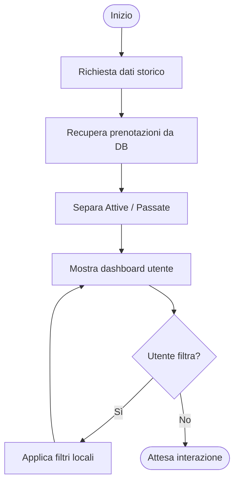
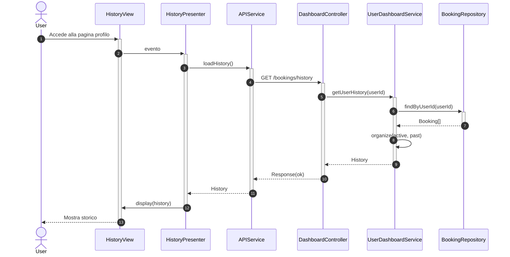

## UC10 - Visualizzazione Storico

### Diagrammi di Attività

```mermaid
flowchart TD
    Start([Inizio]) --> ReqHist[Richiesta dati storico]
    ReqHist --> FetchDB[Recupera prenotazioni da DB]
    FetchDB --> Split[Separa Attive / Passate]
    Split --> Show[Mostra dashboard utente]
    Show --> UserFilter{Utente filtra?}
    
    UserFilter -->|Sì| ApplyFilter[Applica filtri locali]
    ApplyFilter --> Show
    UserFilter -->|No| Wait([Attesa interazione])
```

### Diagramma di sequenza 

```mermaid
sequenceDiagram
    autonumber

    actor User
    participant View as HistoryView
    participant Pres as HistoryPresenter
    participant API as APIService
    participant Ctrl as DashboardController
    participant Svc as UserDashboardService
    participant Repo as BookingRepository

    User->>+View: Accede alla pagina profilo
    View->>+Pres: evento
    
    Pres->>+API: loadHistory()
    API->>+Ctrl: GET /bookings/history
    Ctrl->>+Svc: getUserHistory(userId)
    
    Svc->>+Repo: findByUserId(userId)
    Repo-->>-Svc: Booking[]
    
    Svc->>Svc: organize(active, past)
    Svc-->>-Ctrl: History
    Ctrl-->>-API: Response(ok)
    API-->>-Pres: History
    
    Pres->>-View: display(history)
    View-->>-User: Mostra storico
```