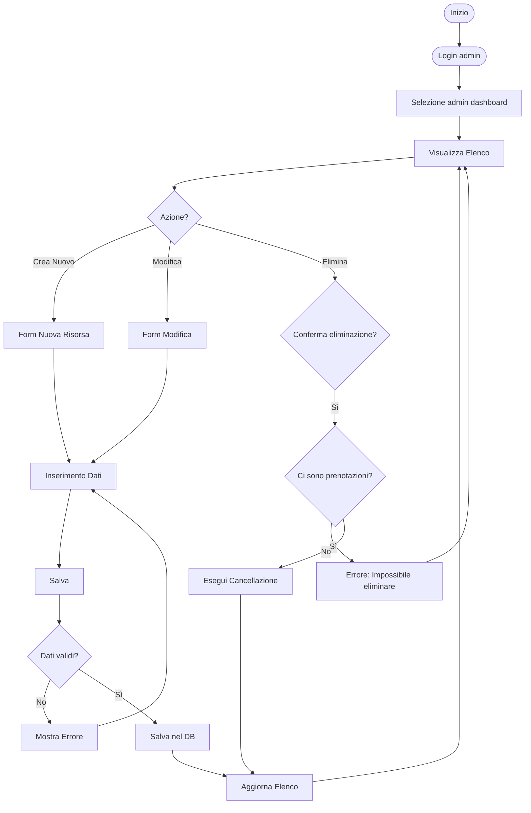
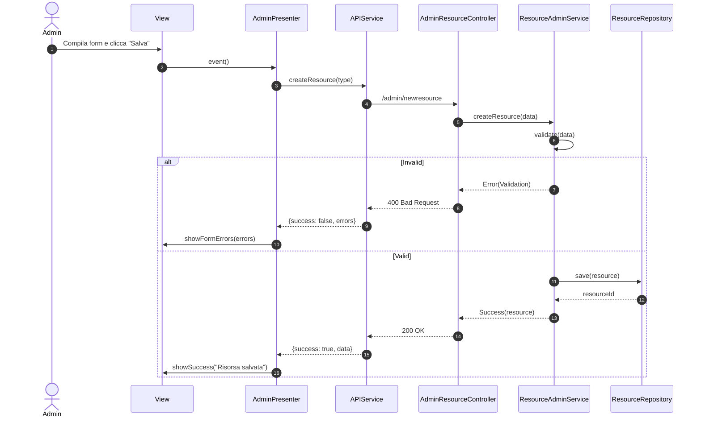

```mermaid
flowchart TD
    Start([Inizio]) --> Login([Login admin])
    Login --> SelectRes[Selezione admin dashboard]
    SelectRes --> ShowList[Visualizza Elenco]
    
    ShowList --> UserAction{Azione?}
    
    UserAction -->|Crea Nuovo| FormNew[Form Nuova Risorsa]
    UserAction -->|Modifica| FormEdit[Form Modifica]
    UserAction -->|Elimina| ConfirmDel{Conferma eliminazione?}
    
    FormNew --> InputData[Inserimento Dati]
    FormEdit --> InputData
    
    InputData --> Submit[Salva]
    
    Submit --> Validate{Dati validi?}
    Validate -->|No| ShowErr[Mostra Errore]
    ShowErr --> InputData
    
    Validate -->|Sì| SaveDB[Salva nel DB]
    
    ConfirmDel -->|Sì| CheckDepend{Ci sono prenotazioni?}
    CheckDepend -->|Sì| BlockDel[Errore: Impossibile eliminare]
    CheckDepend -->|No| ExecDel[Esegui Cancellazione]
    
    SaveDB --> Refresh[Aggiorna Elenco]
    ExecDel --> Refresh
    BlockDel --> ShowList
    Refresh --> ShowList
```

## Diagrammi di Sequenza

### UC11, UC12 - Salvataggio Risorsa (Create/Update)

```mermaid
sequenceDiagram
    autonumber
    
    actor Admin
    participant View as View
    participant Pres as AdminPresenter
    participant API as APIService
    participant Ctrl as AdminResourceController
    participant Svc as ResourceAdminService
    participant Repo as ResourceRepository
    
    Admin->>View: Compila form e clicca "Salva"
    View->>Pres: event()
    
    Pres->>API: createResource(type)
    API->>Ctrl: /admin/newresource
    Ctrl->>Svc: createResource(data)
    
    Svc->>Svc: validate(data)
    alt Invalid
        Svc-->>Ctrl: Error(Validation)
        Ctrl-->>API: 400 Bad Request
        API-->>Pres: {success: false, errors}
        Pres->>View: showFormErrors(errors)
    else Valid
        Svc->>Repo: save(resource)
        Repo-->>Svc: resourceId
        Svc-->>Ctrl: Success(resource)
        Ctrl-->>API: 200 OK
        API-->>Pres: {success: true, data}
        Pres->>View: showSuccess("Risorsa salvata")
    end
```