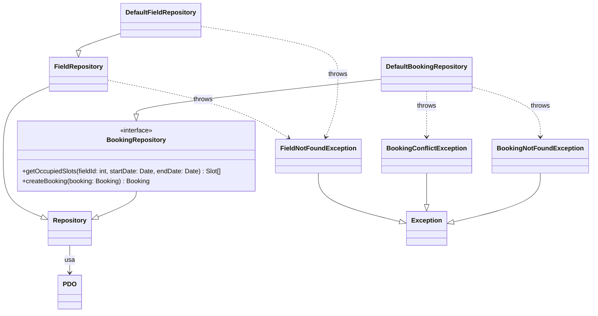
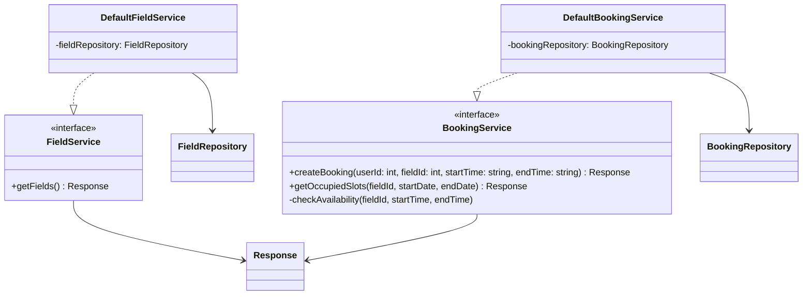
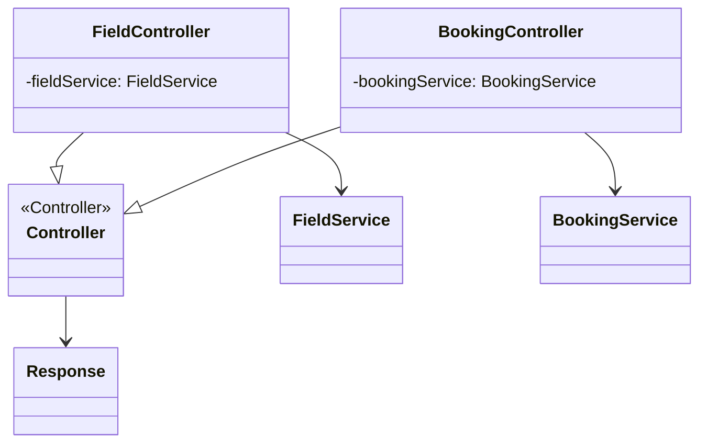
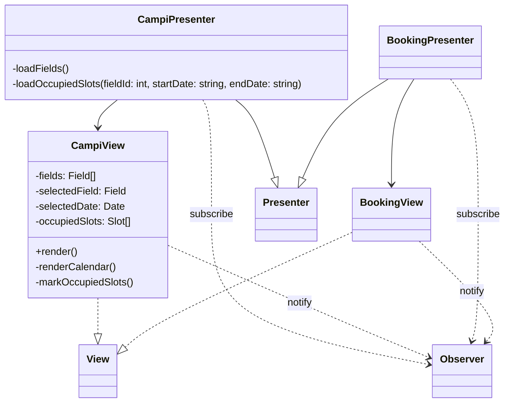

## Classi Comuni UC03 e UC04

Le seguenti classi sono condivise tra UC03 (Visualizzazione disponibilità) e UC04 (Prenotazione campo).

### Backend - Repository Layer

### Backend - Service Layer

### Backend - Controller Layer

### Frontend - View e Presenter

