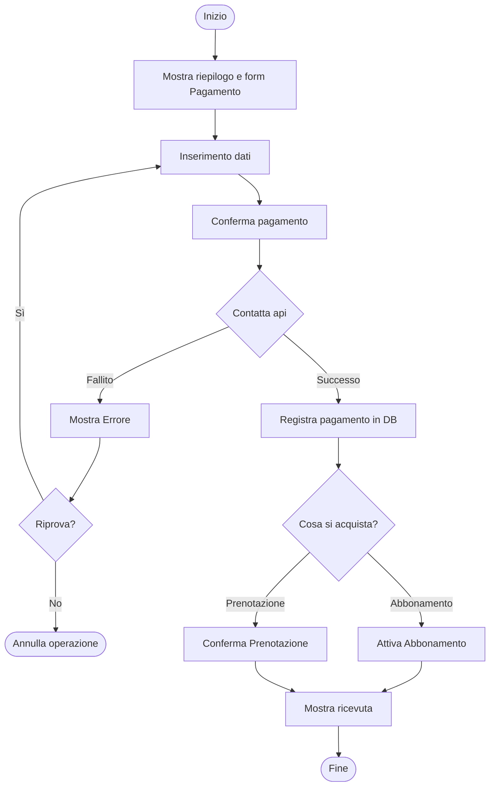

## UC08, UC09 - Processo di Acquisto

### Diagrammi di Attività

```mermaid
flowchart TD

    Start([Inizio]) --> Checkout[Mostra riepilogo e form Pagamento]
    Checkout --> UserInput[Inserimento dati ]
    UserInput --> Submit[Conferma pagamento]
    
    Submit --> Api{Contatta api}
    
    Api -->|Fallito| Err[Mostra Errore]
    Err --> Retry{Riprova?}
    Retry -->|Sì| UserInput
    Retry -->|No| Abort([Annulla operazione])
    
    Api -->|Successo| TxSave[Registra pagamento in DB]
    TxSave --> ItemType{Cosa si acquista?}
    
    ItemType -->|Abbonamento| ActivateSub[Attiva Abbonamento]
    ItemType -->|Prenotazione| ConfirmBook[Conferma Prenotazione]
    
    ActivateSub --> ShowSuccess[Mostra ricevuta]
    ConfirmBook --> ShowSuccess
    
    ShowSuccess --> End([Fine])
```