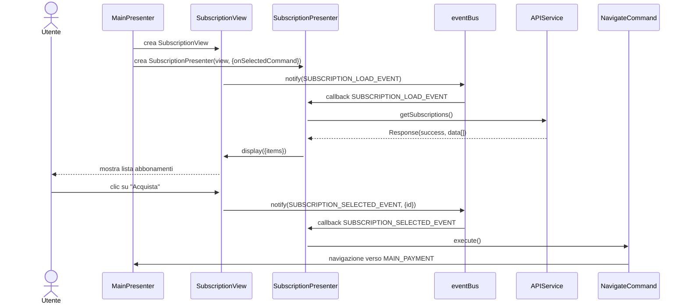
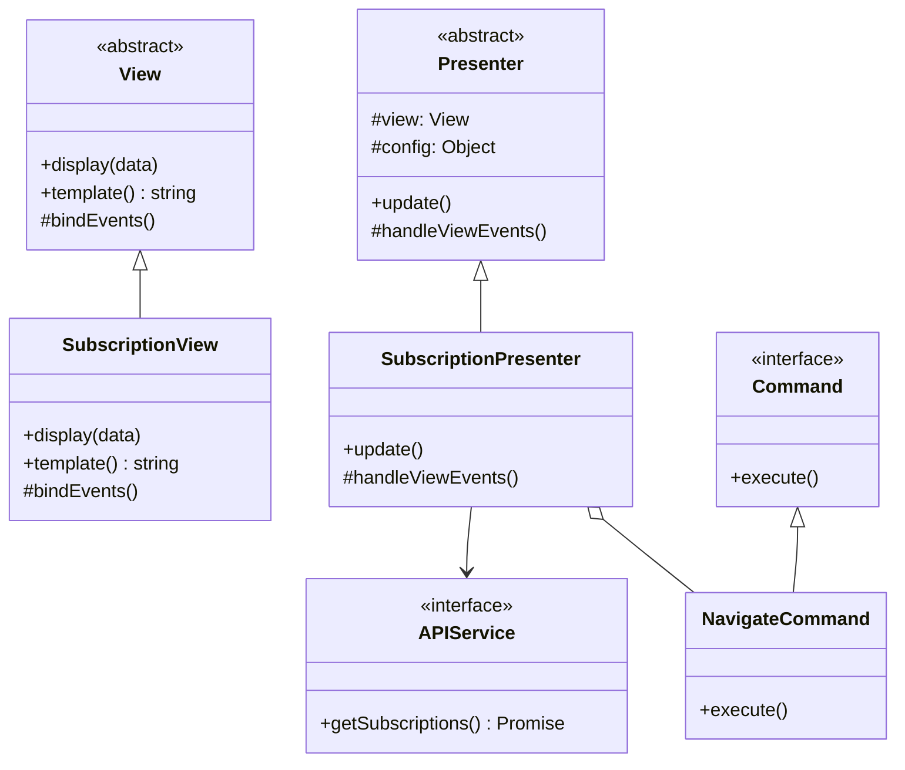

# Modulo Abbonamenti - Frontend

## Casi d'uso correlati
- **UC09**: Acquistare abbonamento
- **UC13**: Gestire tariffe e abbonamenti (parte lato utente)
## Panoramica

Il modulo **abbonamenti** consente all'utente di:
- visualizzare la lista degli abbonamenti disponibili,
- selezionare un abbonamento da acquistare,
- procedere al pagamento.

## Diagramma di sequenza (frontend)

## Diagramma delle classi

