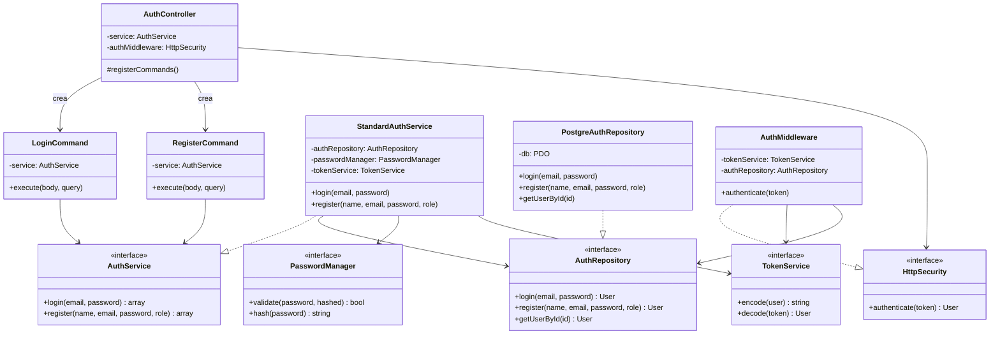
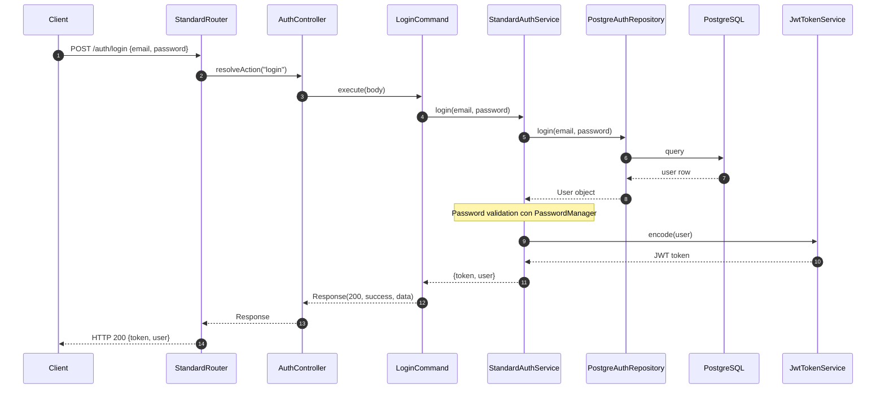
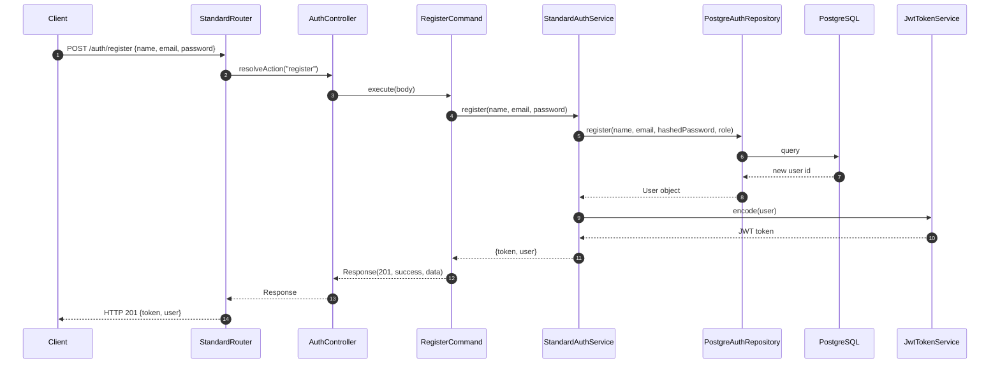

# Modulo auth - Backend

## Panoramica

Questo modulo gestisce l'autenticazione degli utenti tramite login e registrazione, utilizzando JWT per l'autenticazione stateless.

## Diagramma delle Classi

## Flusso di Login (Diagramma di Sequenza)

## Flusso di Registrazione (Diagramma di Sequenza)

