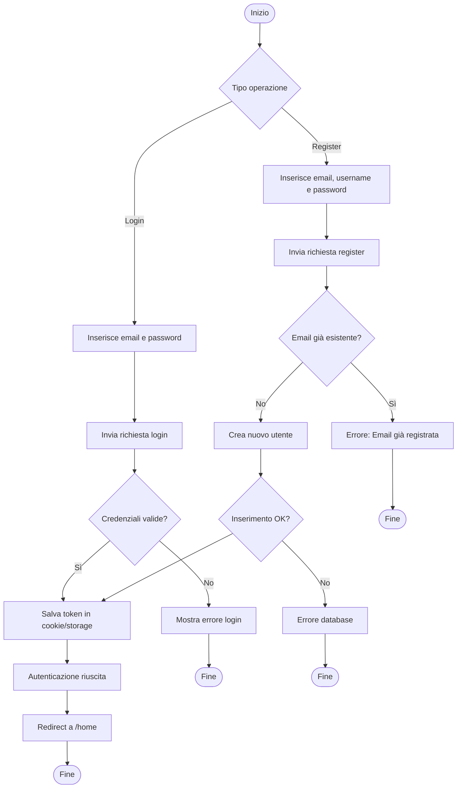
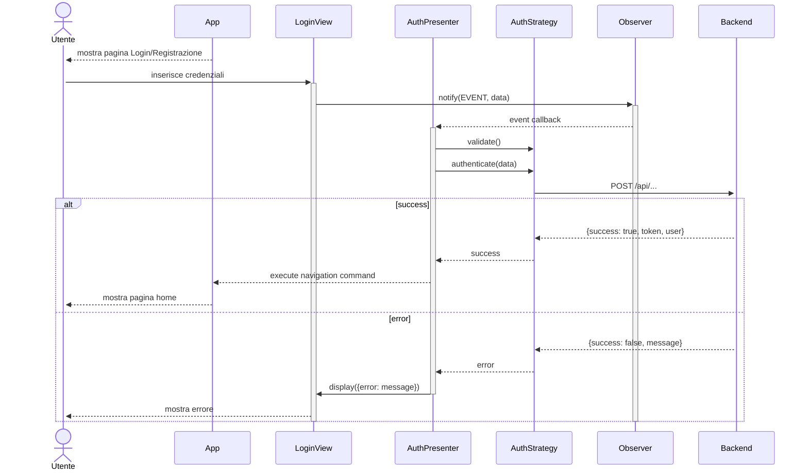
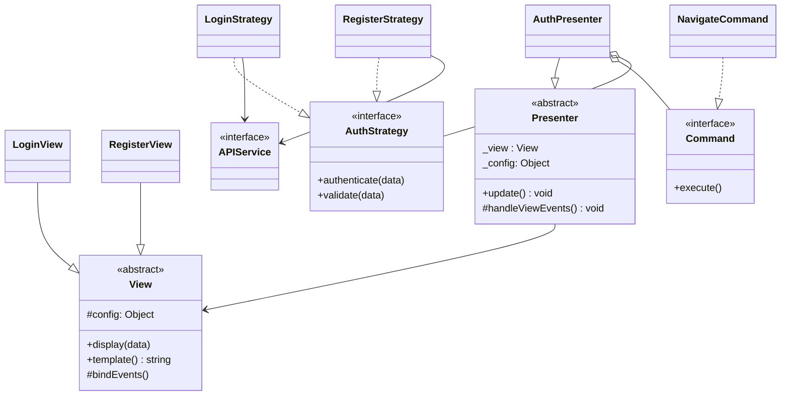

# Modulo Auth - Frontend

## Casi d'uso Correlati
- **UC01**: Registrazione / Autenticazione
- **UC02**: Visualizzare e Gestire Profilo Utente

## Diagramma di Attività

## Diagrammi di Sequenza

### Flusso Login - Registrazione (Frontend)

## Diagramma delle Classi

