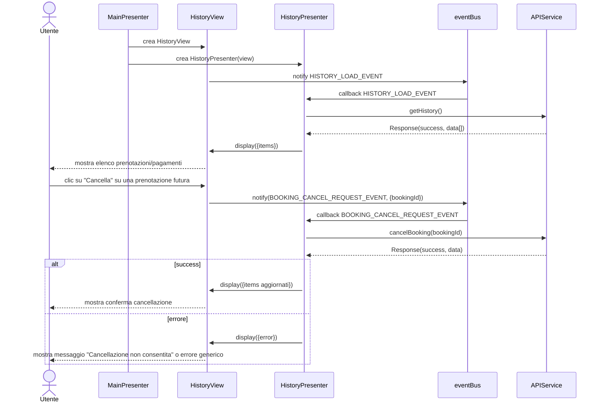
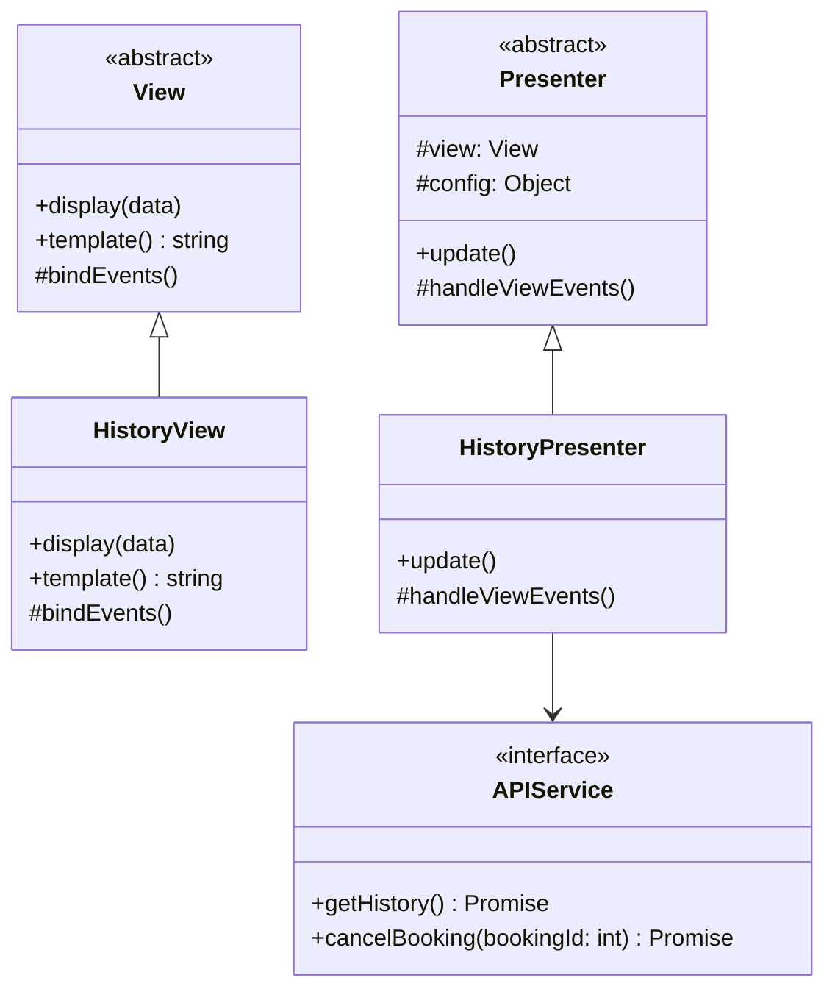

# Modulo Storico - Frontend

## Casi d'uso correlati
- **UC10**: Visualizzare storico prenotazioni e pagamenti
- **UC07**: Cancellare prenotazione (entry point dalla lista storico)

## Panoramica

Il modulo **storico** gestisce:
- la visualizzazione di una lista di **prenotazioni** e **pagamenti** effettuati dall'utente (UC10)
- l'avvio del flusso di **cancellazione prenotazione** a partire dallo storico (UC07).

## Diagramma di sequenza (frontend)

## Diagramma delle classi

