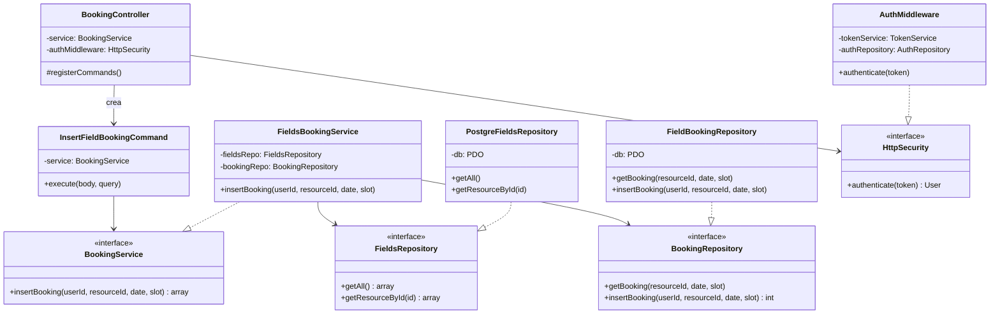
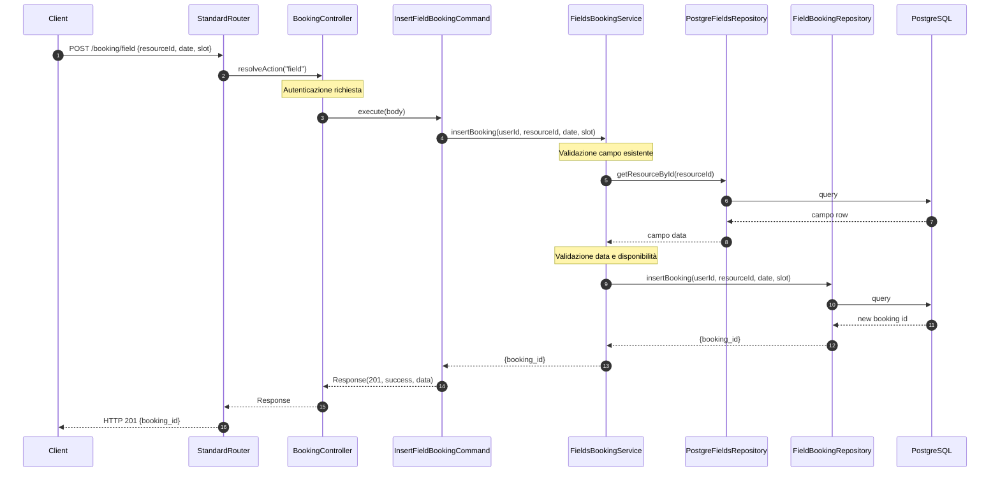

## Diagramma delle Classi

```mermaid
classDiagram
    class BookingController {
        -service: BookingService
        -authMiddleware: HttpSecurity
        #registerCommands()
    }

    class InsertFieldBookingCommand {
        -service: BookingService
        +execute(body, query)
    }

    class BookingService {
        <<interface>>
        +insertBooking(userId, resourceId, date, slot) array
    }

    class FieldsBookingService {
        -fieldsRepo: FieldsRepository
        -bookingRepo: BookingRepository
        +insertBooking(userId, resourceId, date, slot)
    }

    class BookingRepository {
        <<interface>>
        +getBooking(resourceId, date, slot)
        +insertBooking(userId, resourceId, date, slot) int
    }

    class FieldBookingRepository {
        -db: PDO
        +getBooking(resourceId, date, slot)
        +insertBooking(userId, resourceId, date, slot)
    }

    class FieldsRepository {
        <<interface>>
        +getAll() array
        +getResourceById(id) array
    }

    class PostgreFieldsRepository {
        -db: PDO
        +getAll()
        +getResourceById(id)
    }

    class HttpSecurity {
        <<interface>>
        +authenticate(token) User
    }

    class AuthMiddleware {
        -tokenService: TokenService
        -authRepository: AuthRepository
        +authenticate(token)
    }

    BookingController --> InsertFieldBookingCommand : crea
    InsertFieldBookingCommand --> BookingService
    FieldsBookingService ..|> BookingService
    FieldsBookingService --> FieldsRepository
    FieldsBookingService --> BookingRepository
    FieldBookingRepository ..|> BookingRepository
    PostgreFieldsRepository ..|> FieldsRepository
    BookingController --> HttpSecurity
    AuthMiddleware ..|> HttpSecurity
```

## Flusso di Prenotazione Campo (Diagramma di Sequenza)

```mermaid
sequenceDiagram
    autonumber
    participant Client
    participant Router as StandardRouter
    participant Controller as BookingController
    participant Command as InsertFieldBookingCommand
    participant Service as FieldsBookingService
    participant FieldsRepo as PostgreFieldsRepository
    participant BookingRepo as FieldBookingRepository
    participant DB as PostgreSQL

    Client ->> Router: POST /booking/field {resourceId, date, slot}
    Router ->> Controller: resolveAction("field")
    
    Note over Controller: Autenticazione richiesta
    
    Controller ->> Command: execute(body)
    
    Command ->> Service: insertBooking(userId, resourceId, date, slot)
    
    Note over Service: Validazione campo esistente
    
    Service ->> FieldsRepo: getResourceById(resourceId)
    FieldsRepo ->> DB: query
    DB -->> FieldsRepo: campo row
    FieldsRepo -->> Service: campo data
    
    Note over Service: Validazione data e disponibilità
    
    Service ->> BookingRepo: insertBooking(userId, resourceId, date, slot)
    BookingRepo ->> DB: query
    DB -->> BookingRepo: new booking id
    BookingRepo -->> Service: {booking_id}
    
    Service -->> Command: {booking_id}
    Command -->> Controller: Response(201, success, data)
    Controller -->> Router: Response
    Router -->> Client: HTTP 201 {booking_id}
```

