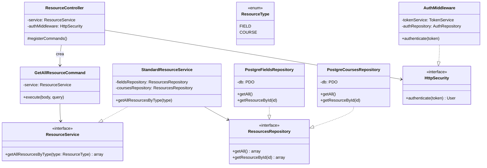
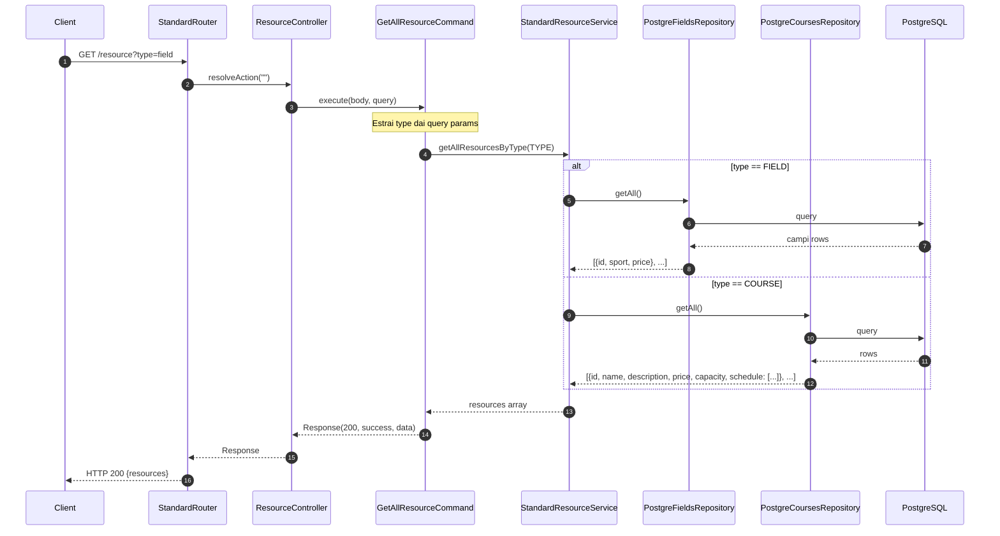

# Modulo resources - Backend

## Panoramica

Questo modulo gestisce le risorse del centro sportivo, inclusi campi sportivi e corsi. Fornisce operazioni di lettura per ottenere tutti i resource o filtrare per tipo.

## Diagramma delle Classi

## Diagramma di Sequenza

