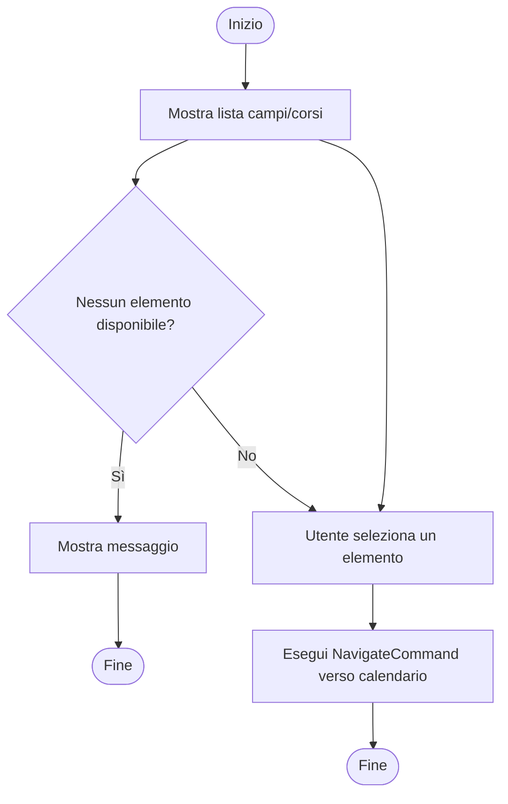
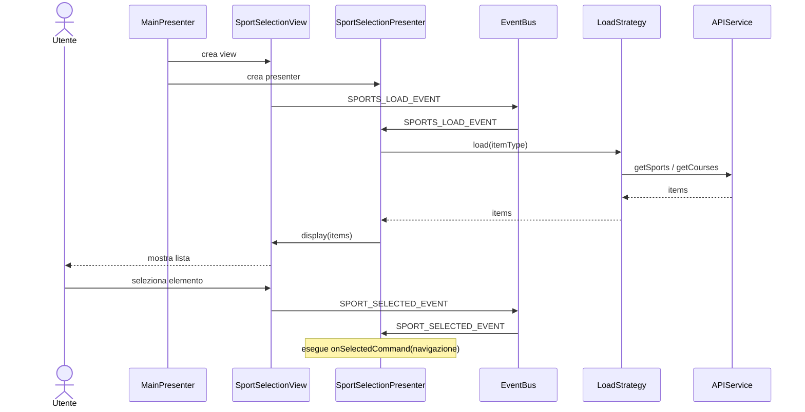
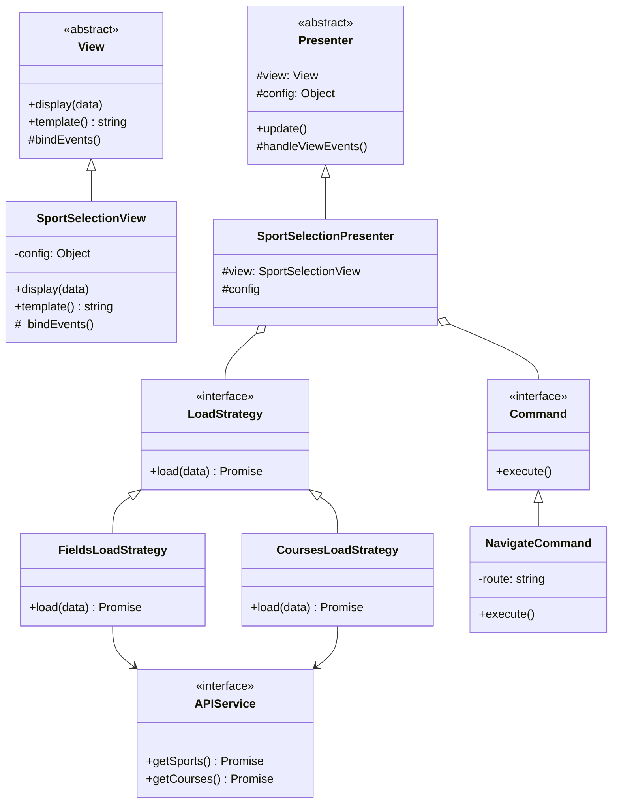

# Modulo Selezione sport - Frontend

## Casi d'uso correlati
- **UC03**: Visualizzare disponibilità campi (parte di selezione campo)
- **UC05**: Visualizzare corsi

## Panoramica

Il modulo **sport-selection** gestisce la selezione iniziale di un **campo sportivo** o di un **corso**.
È il punto di ingresso per i flussi di prenotazione (UC03/UC04 e UC05/UC06).

## Diagramma di attività (selezione campo/corso)

## Diagramma di sequenza (frontend)

## Diagramma delle classi

