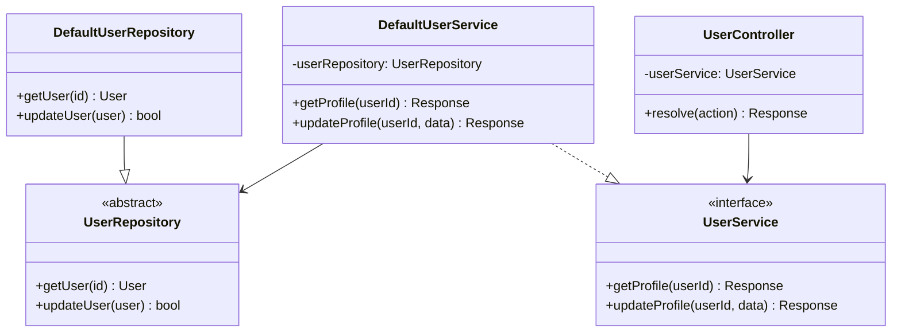
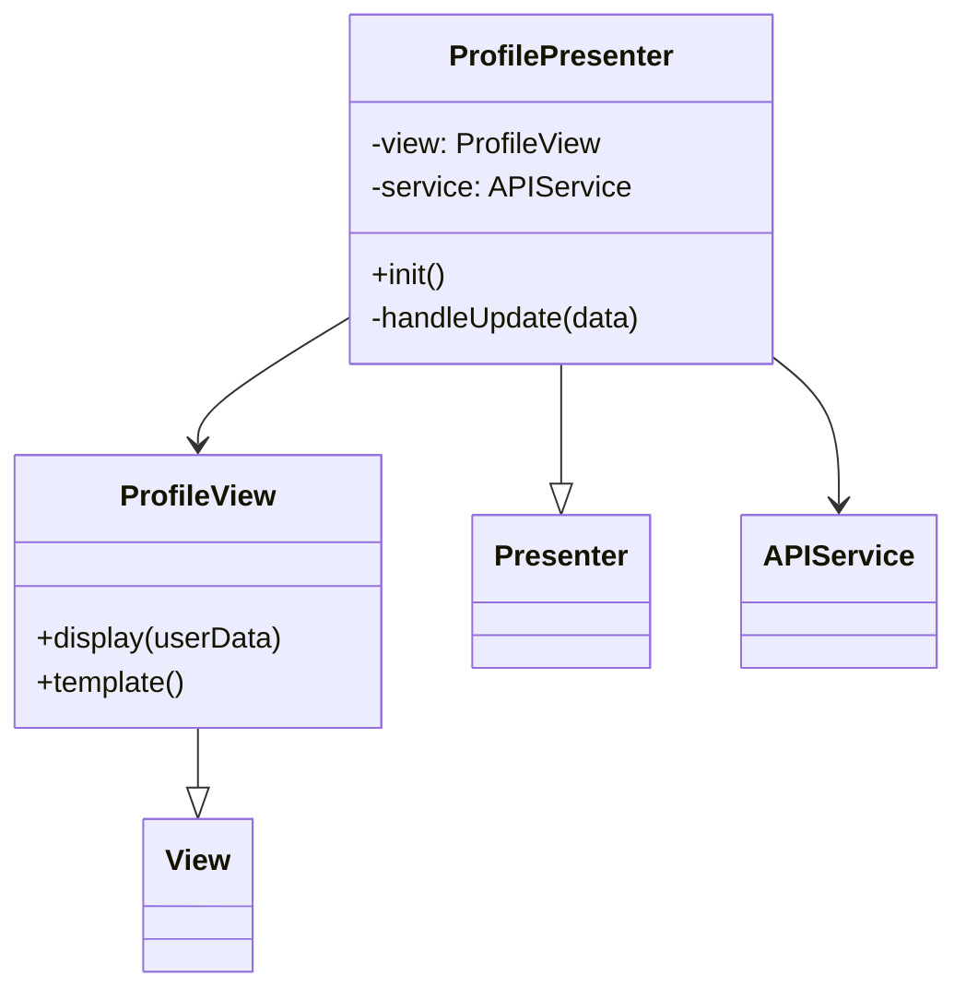
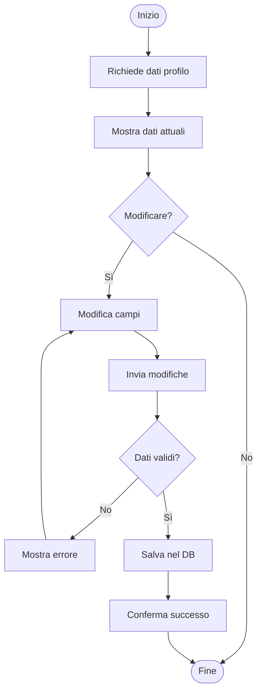
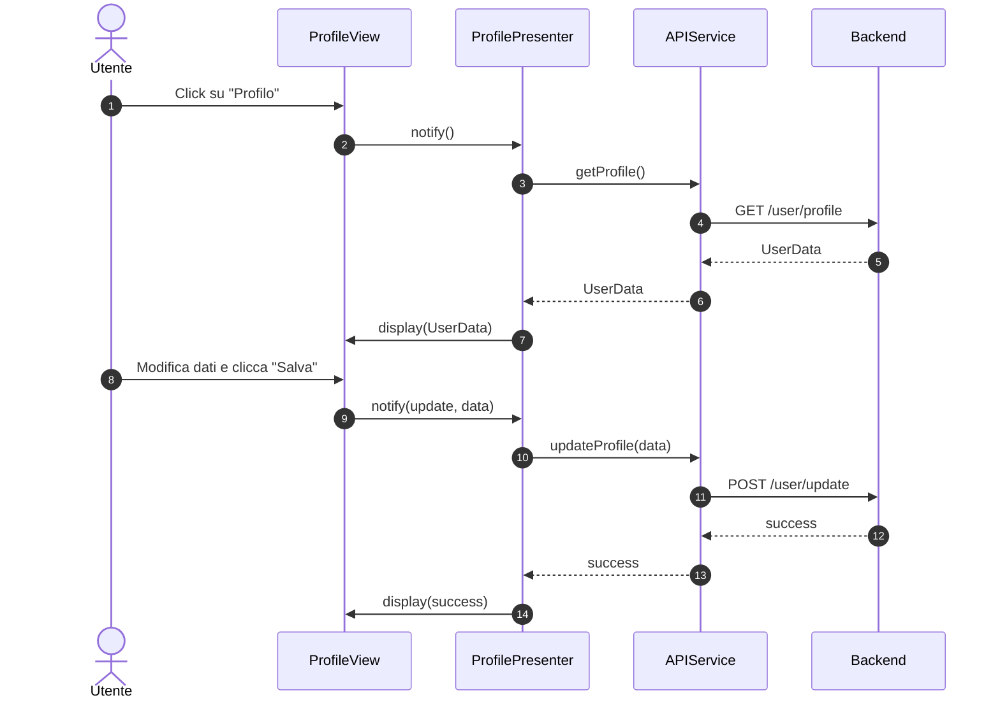

### Diagrammi caso d'uso UC02 - Gestione profilo utente

#### Diagramma delle classi

##### Backend


##### Frontend


#### Diagramma attività


#### Diagramma di sequenza
##### Frontend


##### Backend

``` mermaid
sequenceDiagram

autonumber

participant frontend as Frontend

participant main as Main

participant router as :Router

participant controller as :ProfileController

participant service as :ProfileService

participant repository as :ProfileRepository

participant db as Database

frontend ->>+ main: HTTP GET /user/profile?id=...
main ->>+ router: dispatch()
router ->>+ controller: resolve(action)
controller ->>+ service: getProfile(userId)
service ->>+ repository: getById(userId)
repository ->>+ db: query()
db -->>- repository: User
repository -->>- service: User
alt successo
    service -->> controller : Response(200, success, user)
    controller -->> router: Response(200, success, user)
else eccezione 
    service -->>- controller : Response(code, false, error message)
    controller -->>- router: Response(code, false, error message )
end

router -->>- frontend: Response

 ```

