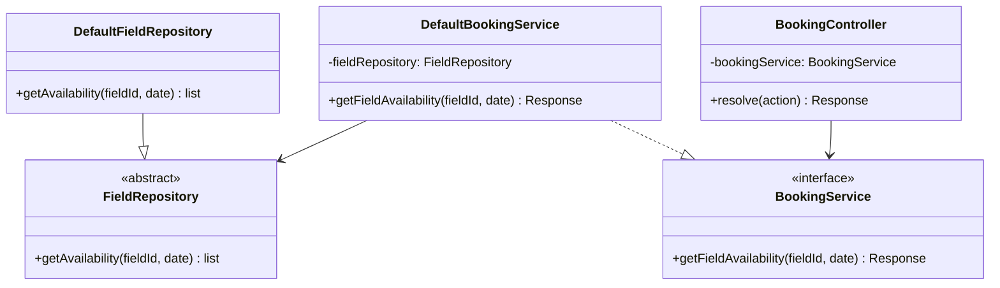
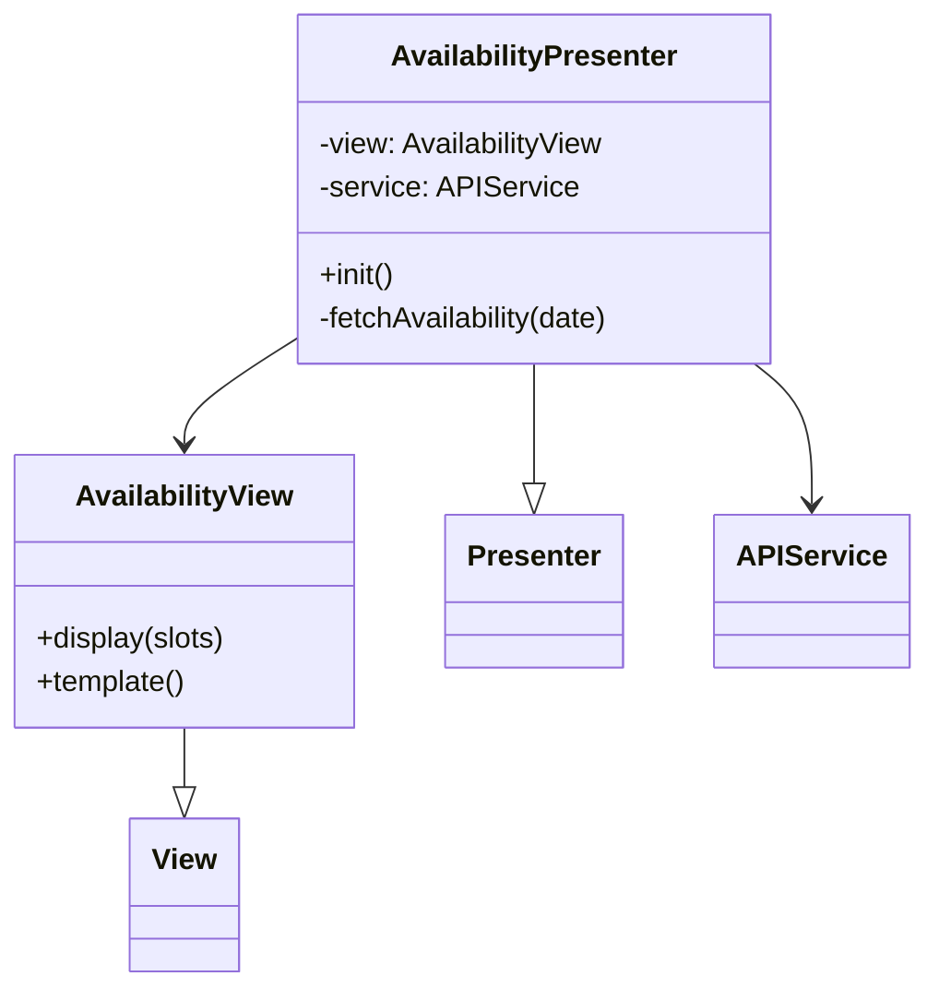
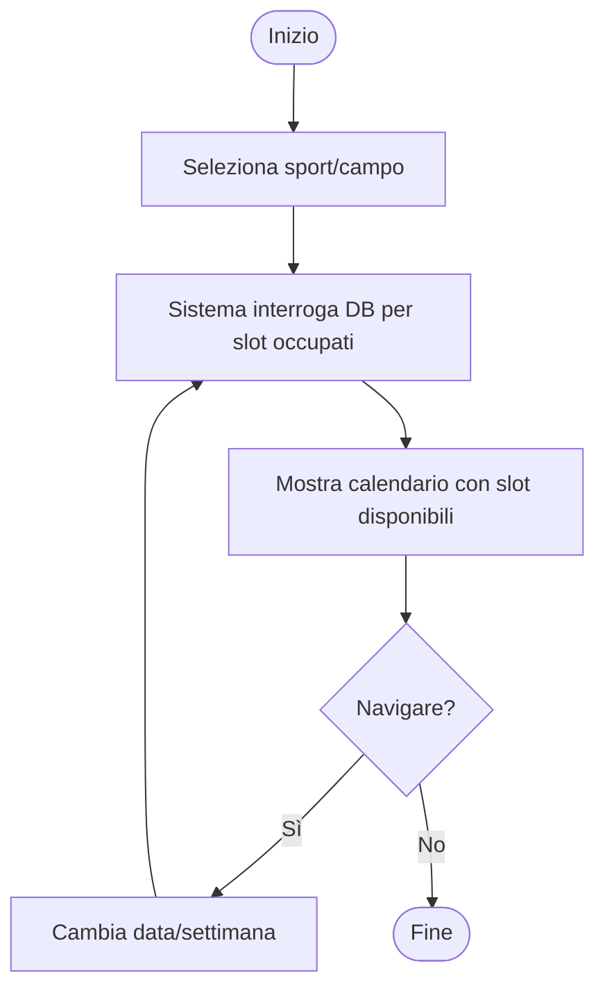
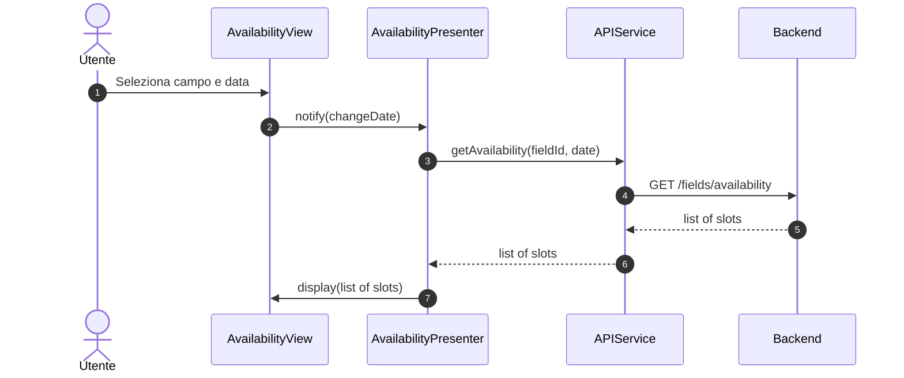

### Diagrammi caso d'uso UC03 - Visualizzazione disponibilità campi

#### Diagramma delle classi

##### Backend

##### Frontend

#### Diagramma attività

#### Diagramma di sequenza
##### Frontend

