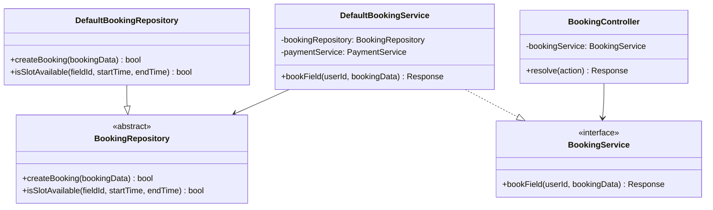
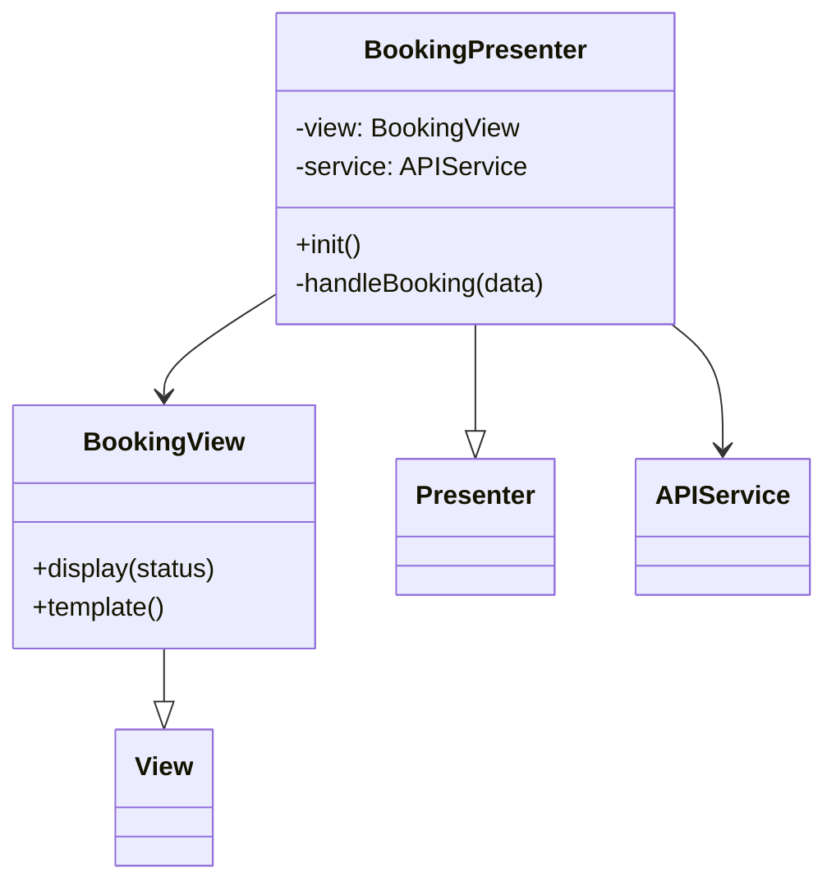
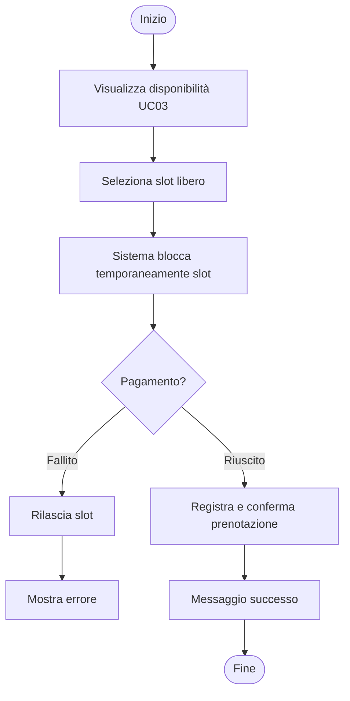
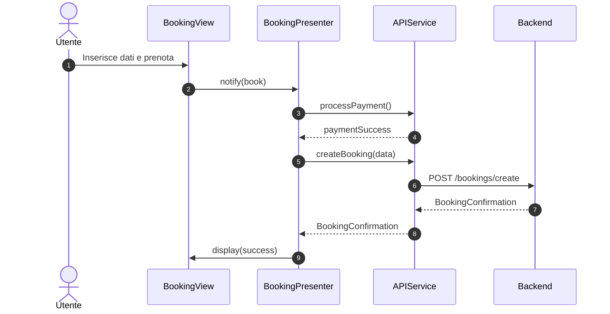

### Diagrammi caso d'uso UC04 - Prenotare campo sportivo

#### Diagramma delle classi

##### Backend

```mermaid
classDiagram
    class BookingRepository {
        <<abstract>>
        +createBooking(bookingData) bool
        +isSlotAvailable(fieldId, startTime, endTime) bool
    }
    class DefaultBookingRepository {
        +createBooking(bookingData) bool
        +isSlotAvailable(fieldId, startTime, endTime) bool
    }
    class BookingService {
        <<interface>>
        +bookField(userId, bookingData) Response
    }
    class DefaultBookingService {
        -bookingRepository: BookingRepository
        -paymentService: PaymentService
        +bookField(userId, bookingData) Response
    }
    class BookingController {
        -bookingService: BookingService
        +resolve(action) Response
    }

    DefaultBookingRepository --|> BookingRepository
    DefaultBookingService ..|> BookingService
    DefaultBookingService --> BookingRepository
    BookingController --> BookingService
```

##### Frontend

```mermaid
classDiagram
    class BookingView {
        +display(status)
        +template()
    }
    class BookingPresenter {
        -view: BookingView
        -service: APIService
        +init()
        -handleBooking(data)
    }
    BookingView --|> View
    BookingPresenter --|> Presenter
    BookingPresenter --> BookingView
    BookingPresenter --> APIService
```

#### Diagramma attività

```mermaid
flowchart TD
    Start([Inizio]) --> ViewAvailability[Visualizza disponibilità UC03]
    ViewAvailability --> SelectSlot[Seleziona slot libero]
    SelectSlot --> LockSlot[Sistema blocca temporaneamente slot]
    LockSlot --> Payment{Pagamento?}
    Payment -->|Fallito| UnlockSlot[Rilascia slot]
    UnlockSlot --> Error[Mostra errore]
    Payment -->|Riuscito| Confirm[Registra e conferma prenotazione]
    Confirm --> Success[Messaggio successo]
    Success --> End([Fine])
```

#### Diagramma di sequenza
##### Frontend

```mermaid
sequenceDiagram
    autonumber
    actor user as Utente
    participant view as BookingView
    participant presenter as BookingPresenter
    participant api as APIService
    participant backend as Backend

    user ->> view: Inserisce dati e prenota
    view ->> presenter: notify(book)
    presenter ->> api: processPayment()
    api -->> presenter: paymentSuccess
    presenter ->> api: createBooking(data)
    api ->> backend: POST /bookings/create
    backend -->> api: BookingConfirmation
    api -->> presenter: BookingConfirmation
    presenter ->> view: display(success)
```
