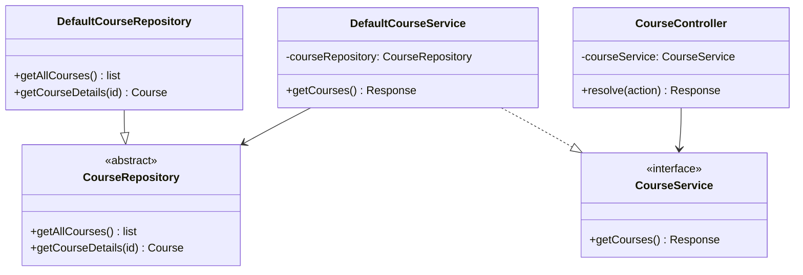
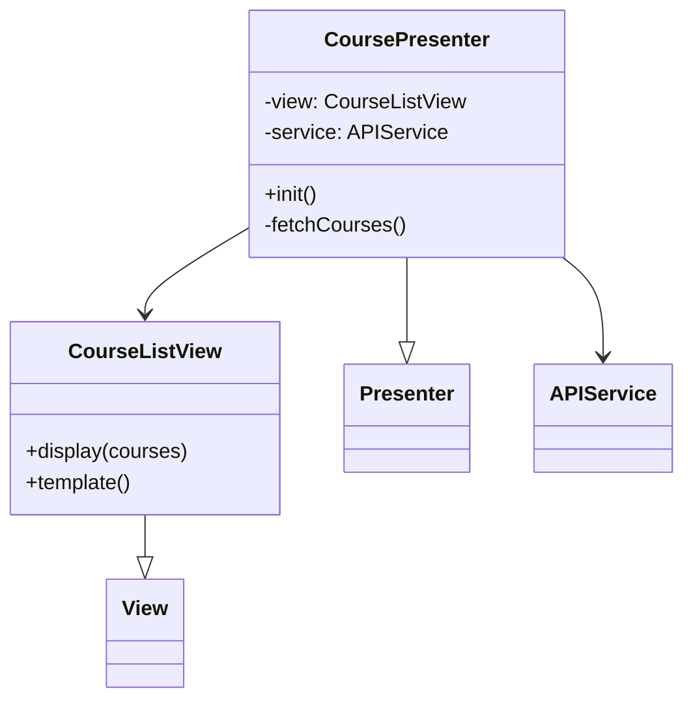
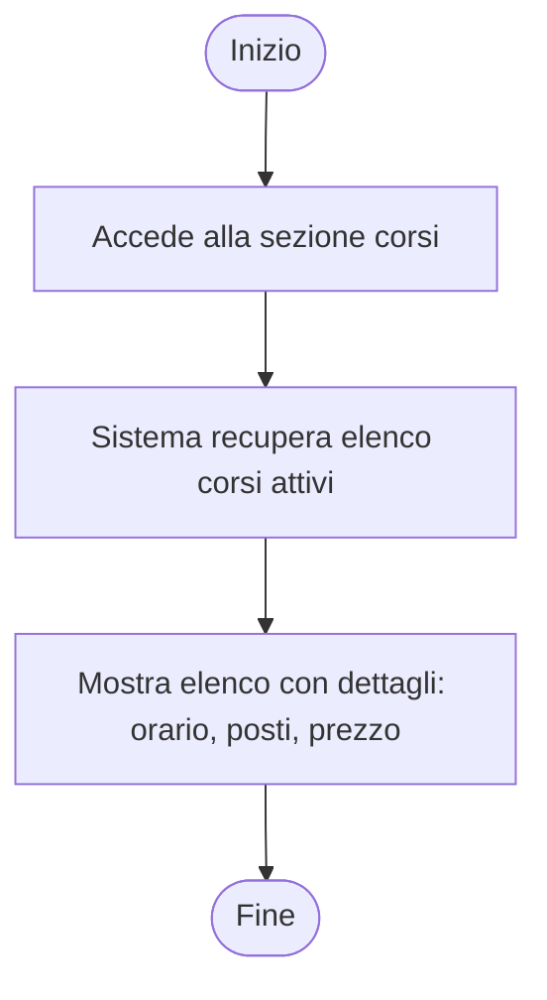
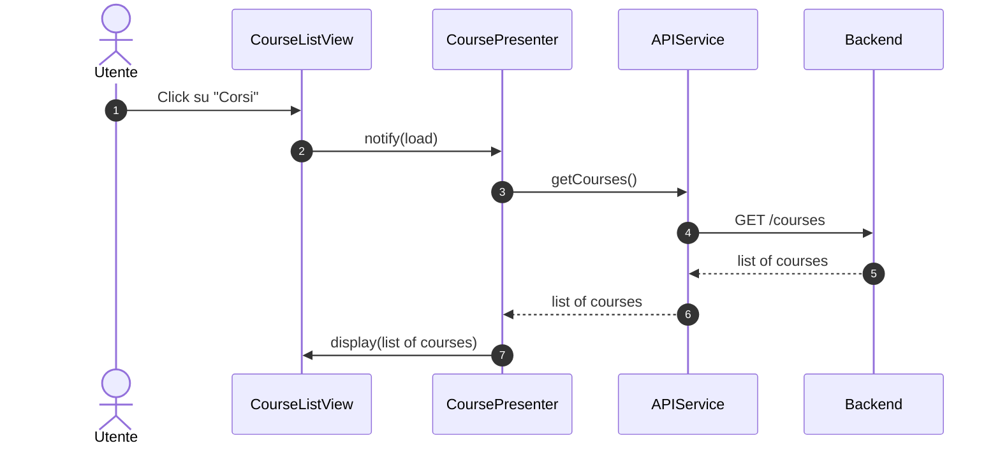

### Diagrammi caso d'uso UC05 - Visualizzazione corsi

#### Diagramma delle classi

##### Backend

```mermaid
classDiagram
    class CourseRepository {
        <<abstract>>
        +getAllCourses() list
        +getCourseDetails(id) Course
    }
    class DefaultCourseRepository {
        +getAllCourses() list
        +getCourseDetails(id) Course
    }
    class CourseService {
        <<interface>>
        +getCourses() Response
    }
    class DefaultCourseService {
        -courseRepository: CourseRepository
        +getCourses() Response
    }
    class CourseController {
        -courseService: CourseService
        +resolve(action) Response
    }

    DefaultCourseRepository --|> CourseRepository
    DefaultCourseService ..|> CourseService
    DefaultCourseService --> CourseRepository
    CourseController --> CourseService
```

##### Frontend

```mermaid
classDiagram
    class CourseListView {
        +display(courses)
        +template()
    }
    class CoursePresenter {
        -view: CourseListView
        -service: APIService
        +init()
        -fetchCourses()
    }
    CourseListView --|> View
    CoursePresenter --|> Presenter
    CoursePresenter --> CourseListView
    CoursePresenter --> APIService
```

#### Diagramma attività

```mermaid
flowchart TD
    Start([Inizio]) --> AccessSection[Accede alla sezione corsi]
    AccessSection --> FetchCourses[Sistema recupera elenco corsi attivi]
    FetchCourses --> ShowCourses[Mostra elenco con dettagli: orario, posti, prezzo]
    ShowCourses --> End([Fine])
```

#### Diagramma di sequenza
##### Frontend

```mermaid
sequenceDiagram
    autonumber
    actor user as Utente
    participant view as CourseListView
    participant presenter as CoursePresenter
    participant api as APIService
    participant backend as Backend

    user ->> view: Click su "Corsi"
    view ->> presenter: notify(load)
    presenter ->> api: getCourses()
    api ->> backend: GET /courses
    backend -->> api: list of courses
    api -->> presenter: list of courses
    presenter ->> view: display(list of courses)
```
