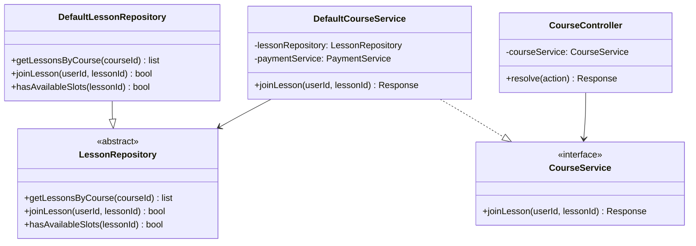
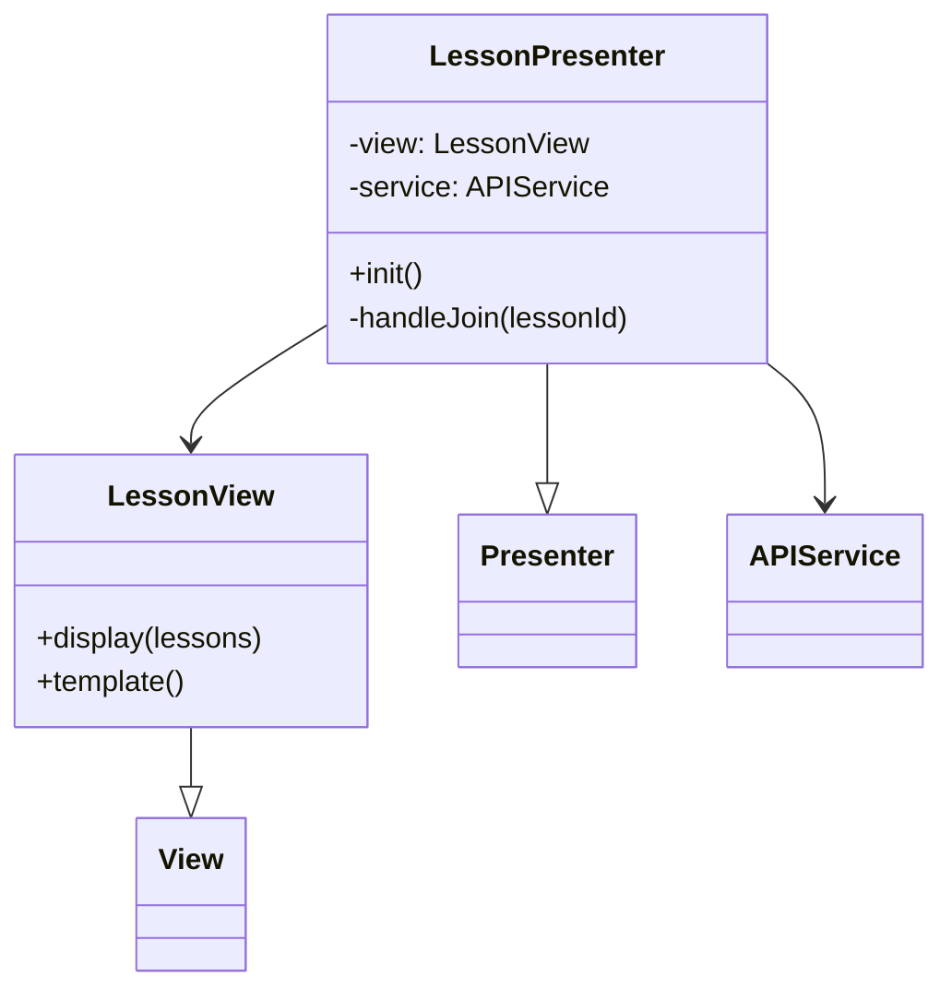
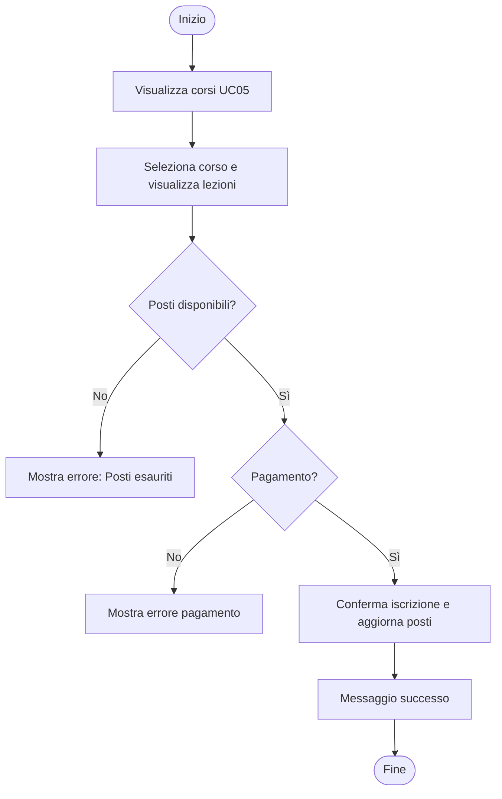
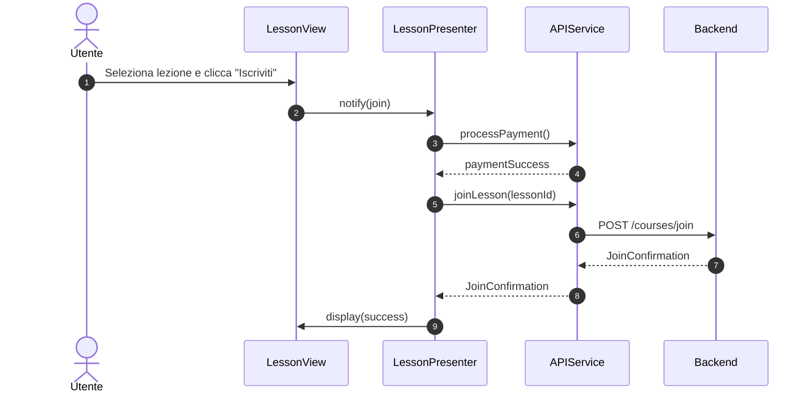

### Diagrammi caso d'uso UC06 - Iscriversi a una lezione di un corso

#### Diagramma delle classi

##### Backend

##### Frontend

#### Diagramma attività

#### Diagramma di sequenza
##### Frontend

