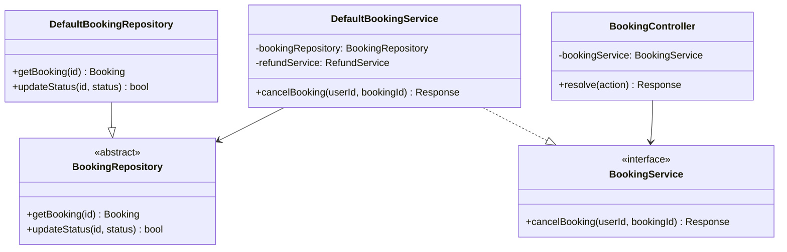
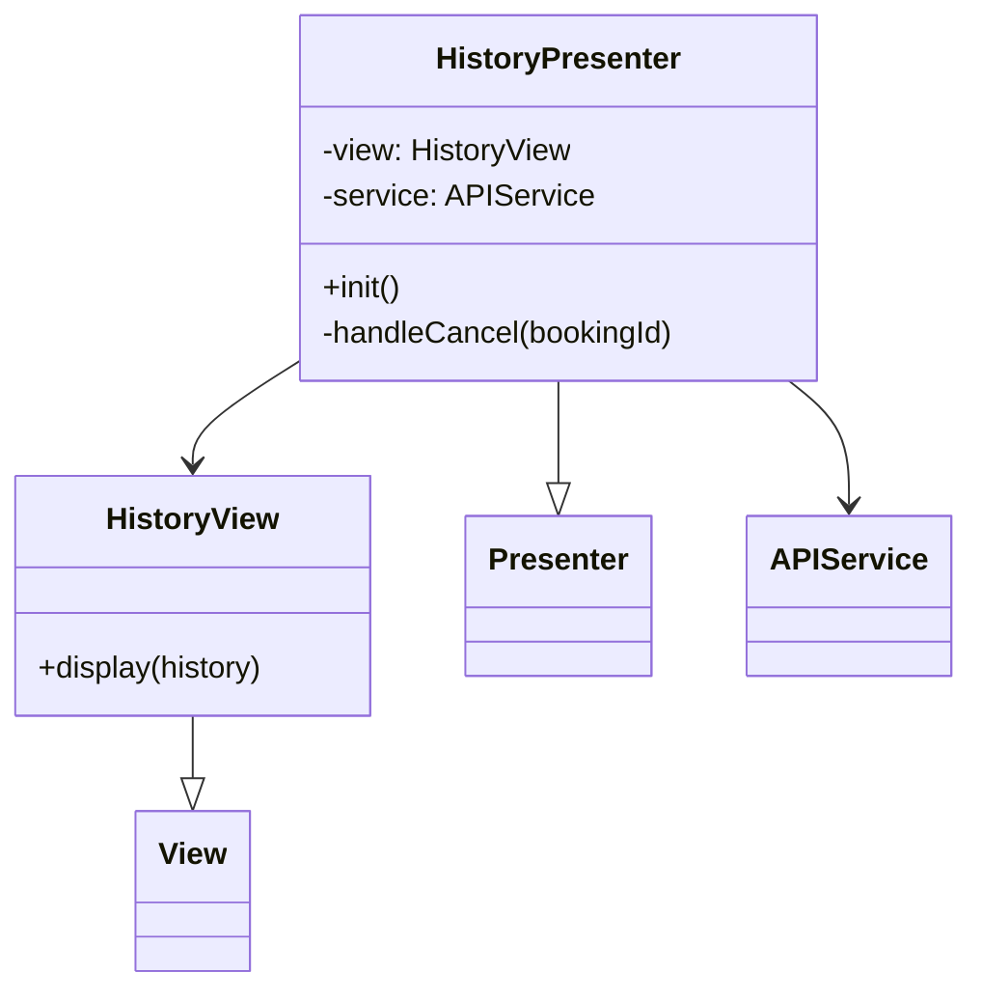
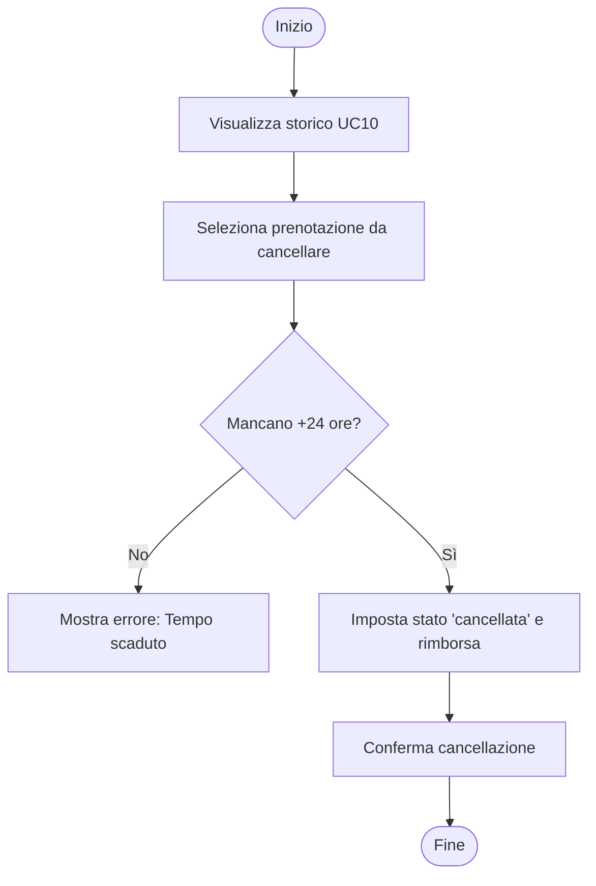
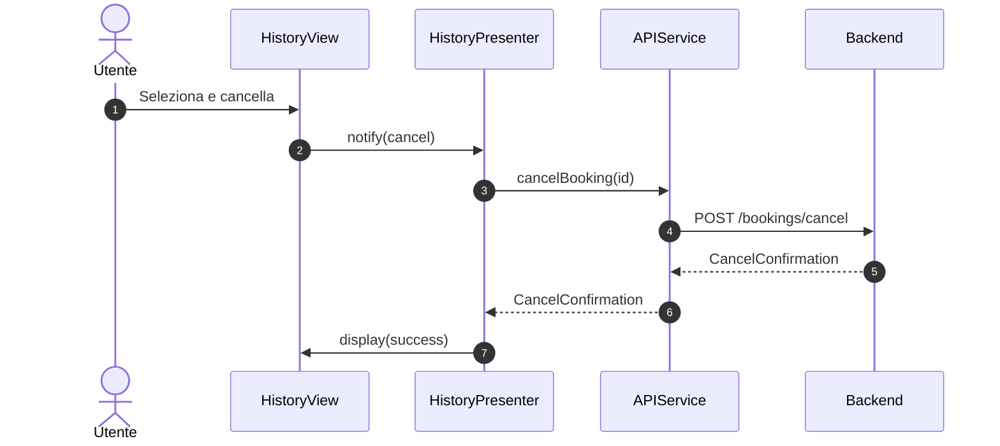

### Diagrammi caso d'uso UC07 - Cancellare prenotazione

#### Diagramma delle classi

##### Backend

```mermaid
classDiagram
    class BookingRepository {
        <<abstract>>
        +getBooking(id) Booking
        +updateStatus(id, status) bool
    }
    class DefaultBookingRepository {
        +getBooking(id) Booking
        +updateStatus(id, status) bool
    }
    class BookingService {
        <<interface>>
        +cancelBooking(userId, bookingId) Response
    }
    class DefaultBookingService {
        -bookingRepository: BookingRepository
        -refundService: RefundService
        +cancelBooking(userId, bookingId) Response
    }
    class BookingController {
        -bookingService: BookingService
        +resolve(action) Response
    }

    DefaultBookingRepository --|> BookingRepository
    DefaultBookingService ..|> BookingService
    DefaultBookingService --> BookingRepository
    BookingController --> BookingService
```

##### Frontend

```mermaid
classDiagram
    class HistoryView {
        +display(history)
    }
    class HistoryPresenter {
        -view: HistoryView
        -service: APIService
        +init()
        -handleCancel(bookingId)
    }
    HistoryView --|> View
    HistoryPresenter --|> Presenter
    HistoryPresenter --> HistoryView
    HistoryPresenter --> APIService
```

#### Diagramma attività

```mermaid
flowchart TD
    Start([Inizio]) --> ViewHistory[Visualizza storico UC10]
    ViewHistory --> SelectBooking[Seleziona prenotazione da cancellare]
    SelectBooking --> CheckPolicy{Mancano +24 ore?}
    CheckPolicy -->|No| Reject[Mostra errore: Tempo scaduto]
    CheckPolicy -->|Sì| UpdateDB[Imposta stato 'cancellata' e rimborsa]
    UpdateDB --> Success[Conferma cancellazione]
    Success --> End([Fine])
```

#### Diagramma di sequenza
##### Frontend

```mermaid
sequenceDiagram
    autonumber
    actor user as Utente
    participant view as HistoryView
    participant presenter as HistoryPresenter
    participant api as APIService
    participant backend as Backend

    user ->> view: Seleziona e cancella
    view ->> presenter: notify(cancel)
    presenter ->> api: cancelBooking(id)
    api ->> backend: POST /bookings/cancel
    backend -->> api: CancelConfirmation
    api -->> presenter: CancelConfirmation
    presenter ->> view: display(success)
```
