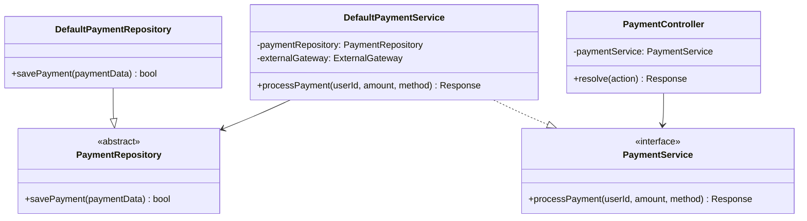
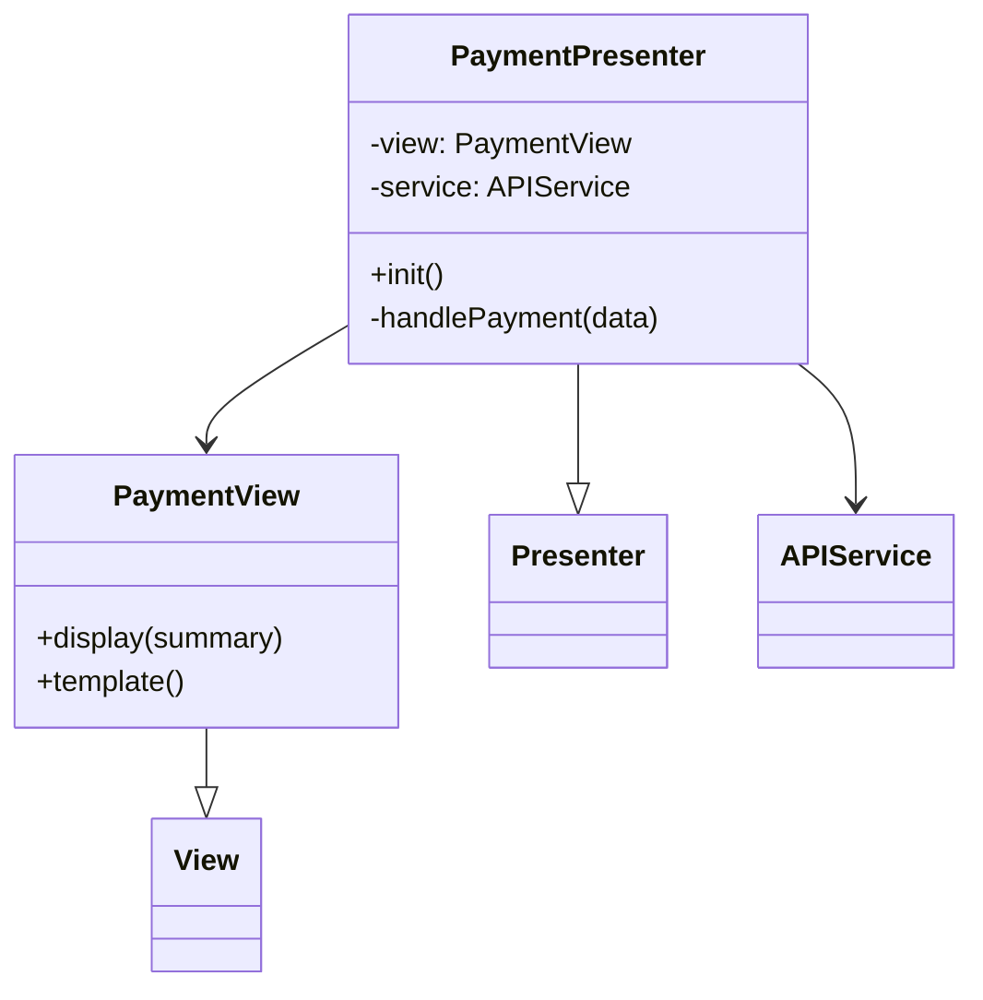
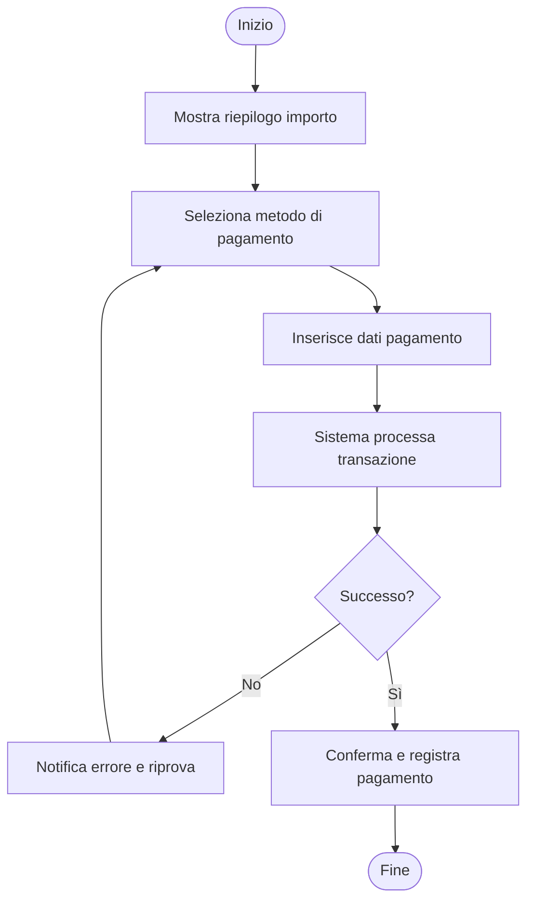
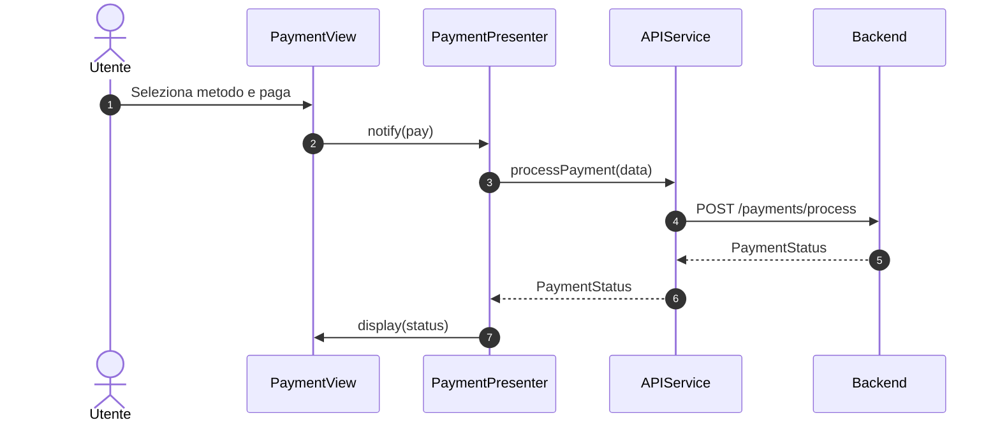

### Diagrammi caso d'uso UC08 - Effettuare pagamento singolo

#### Diagramma delle classi

##### Backend

```mermaid
classDiagram
    class PaymentRepository {
        <<abstract>>
        +savePayment(paymentData) bool
    }
    class DefaultPaymentRepository {
        +savePayment(paymentData) bool
    }
    class PaymentService {
        <<interface>>
        +processPayment(userId, amount, method) Response
    }
    class DefaultPaymentService {
        -paymentRepository: PaymentRepository
        -externalGateway: ExternalGateway
        +processPayment(userId, amount, method) Response
    }
    class PaymentController {
        -paymentService: PaymentService
        +resolve(action) Response
    }

    DefaultPaymentRepository --|> PaymentRepository
    DefaultPaymentService ..|> PaymentService
    DefaultPaymentService --> PaymentRepository
    PaymentController --> PaymentService
```

##### Frontend

```mermaid
classDiagram
    class PaymentView {
        +display(summary)
        +template()
    }
    class PaymentPresenter {
        -view: PaymentView
        -service: APIService
        +init()
        -handlePayment(data)
    }
    PaymentView --|> View
    PaymentPresenter --|> Presenter
    PaymentPresenter --> PaymentView
    PaymentPresenter --> APIService
```

#### Diagramma attività

```mermaid
flowchart TD
    Start([Inizio]) --> ShowSummary[Mostra riepilogo importo]
    ShowSummary --> SelectMethod[Seleziona metodo di pagamento]
    SelectMethod --> InputData[Inserisce dati pagamento]
    InputData --> Process[Sistema processa transazione]
    Process --> Result{Successo?}
    Result -->|No| Fail[Notifica errore e riprova]
    Fail --> SelectMethod
    Result -->|Sì| Success[Conferma e registra pagamento]
    Success --> End([Fine])
```

#### Diagramma di sequenza
##### Frontend

```mermaid
sequenceDiagram
    autonumber
    actor user as Utente
    participant view as PaymentView
    participant presenter as PaymentPresenter
    participant api as APIService
    participant backend as Backend

    user ->> view: Seleziona metodo e paga
    view ->> presenter: notify(pay)
    presenter ->> api: processPayment(data)
    api ->> backend: POST /payments/process
    backend -->> api: PaymentStatus
    api -->> presenter: PaymentStatus
    presenter ->> view: display(status)
```
