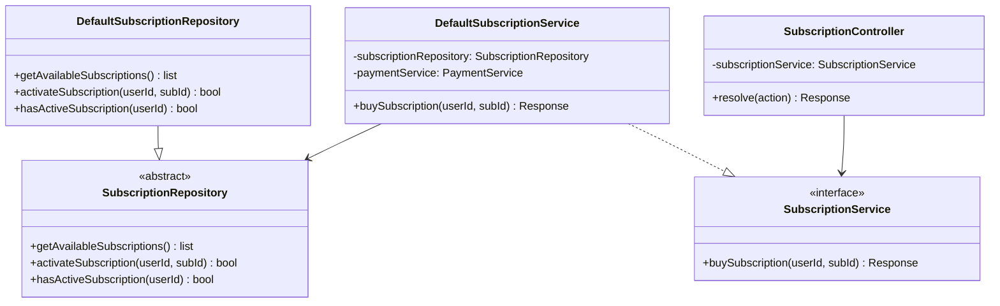
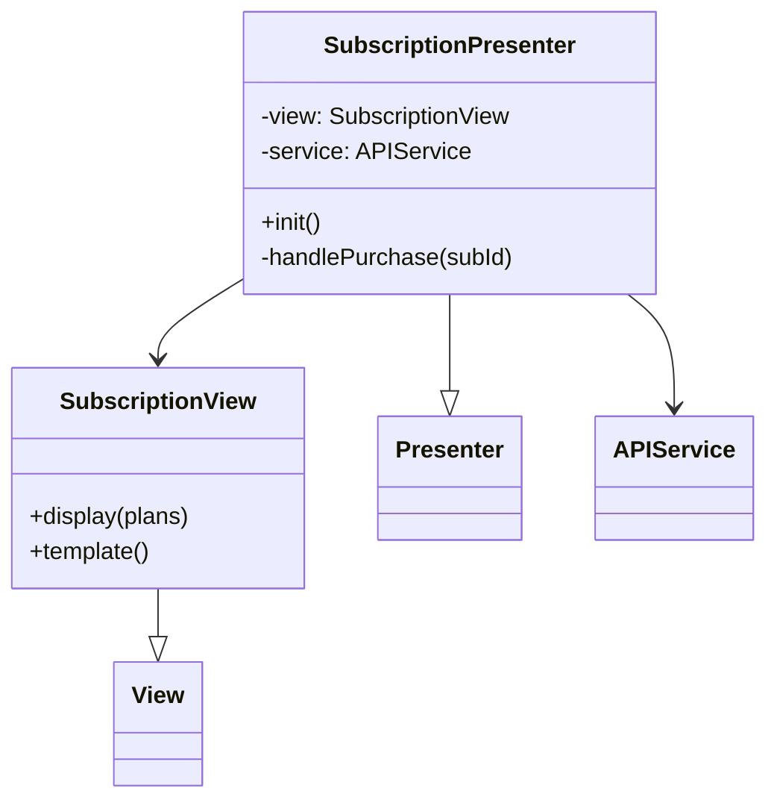
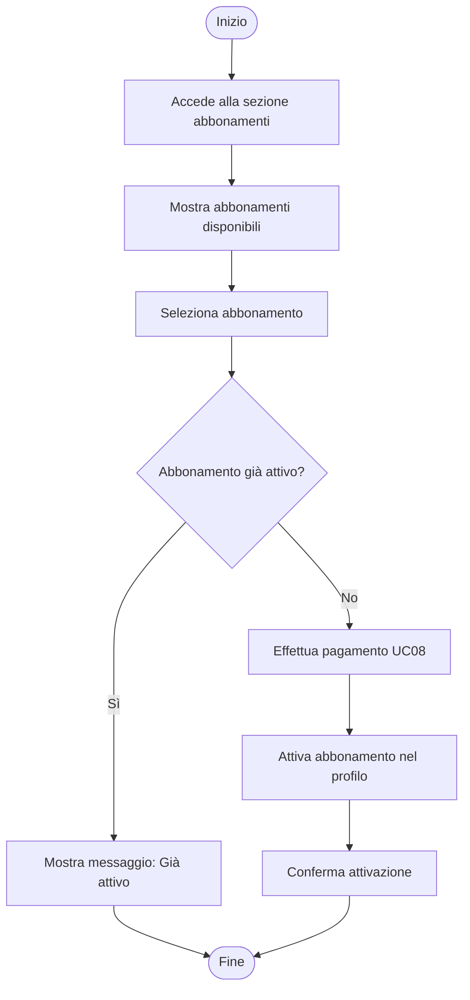
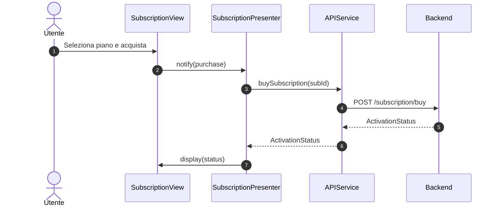

### Diagrammi caso d'uso UC09 - Acquistare abbonamento

#### Diagramma delle classi

##### Backend

```mermaid
classDiagram
    class SubscriptionRepository {
        <<abstract>>
        +getAvailableSubscriptions() list
        +activateSubscription(userId, subId) bool
        +hasActiveSubscription(userId) bool
    }
    class DefaultSubscriptionRepository {
        +getAvailableSubscriptions() list
        +activateSubscription(userId, subId) bool
        +hasActiveSubscription(userId) bool
    }
    class SubscriptionService {
        <<interface>>
        +buySubscription(userId, subId) Response
    }
    class DefaultSubscriptionService {
        -subscriptionRepository: SubscriptionRepository
        -paymentService: PaymentService
        +buySubscription(userId, subId) Response
    }
    class SubscriptionController {
        -subscriptionService: SubscriptionService
        +resolve(action) Response
    }

    DefaultSubscriptionRepository --|> SubscriptionRepository
    DefaultSubscriptionService ..|> SubscriptionService
    DefaultSubscriptionService --> SubscriptionRepository
    SubscriptionController --> SubscriptionService
```

##### Frontend

```mermaid
classDiagram
    class SubscriptionView {
        +display(plans)
        +template()
    }
    class SubscriptionPresenter {
        -view: SubscriptionView
        -service: APIService
        +init()
        -handlePurchase(subId)
    }
    SubscriptionView --|> View
    SubscriptionPresenter --|> Presenter
    SubscriptionPresenter --> SubscriptionView
    SubscriptionPresenter --> APIService
```

#### Diagramma attività

```mermaid
flowchart TD
    Start([Inizio]) --> AccessSection[Accede alla sezione abbonamenti]
    AccessSection --> ShowPlans[Mostra abbonamenti disponibili]
    ShowPlans --> SelectPlan[Seleziona abbonamento]
    SelectPlan --> CheckActive{Abbonamento già attivo?}
    CheckActive -->|Sì| Info[Mostra messaggio: Già attivo]
    Info --> End([Fine])
    CheckActive -->|No| Payment[Effettua pagamento UC08]
    Payment --> Activate[Attiva abbonamento nel profilo]
    Activate --> Success[Conferma attivazione]
    Success --> End
```

#### Diagramma di sequenza
##### Frontend

```mermaid
sequenceDiagram
    autonumber
    actor user as Utente
    participant view as SubscriptionView
    participant presenter as SubscriptionPresenter
    participant api as APIService
    participant backend as Backend

    user ->> view: Seleziona piano e acquista
    view ->> presenter: notify(purchase)
    presenter ->> api: buySubscription(subId)
    api ->> backend: POST /subscription/buy
    backend -->> api: ActivationStatus
    api -->> presenter: ActivationStatus
    presenter ->> view: display(status)
```
