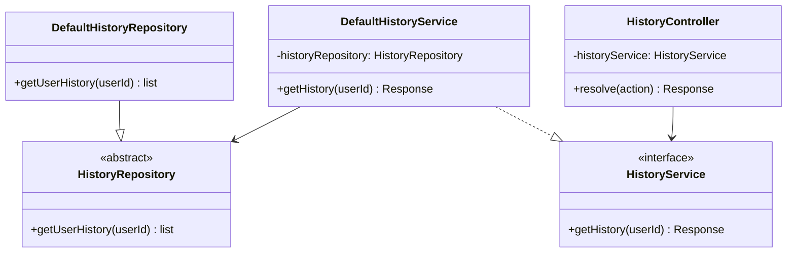
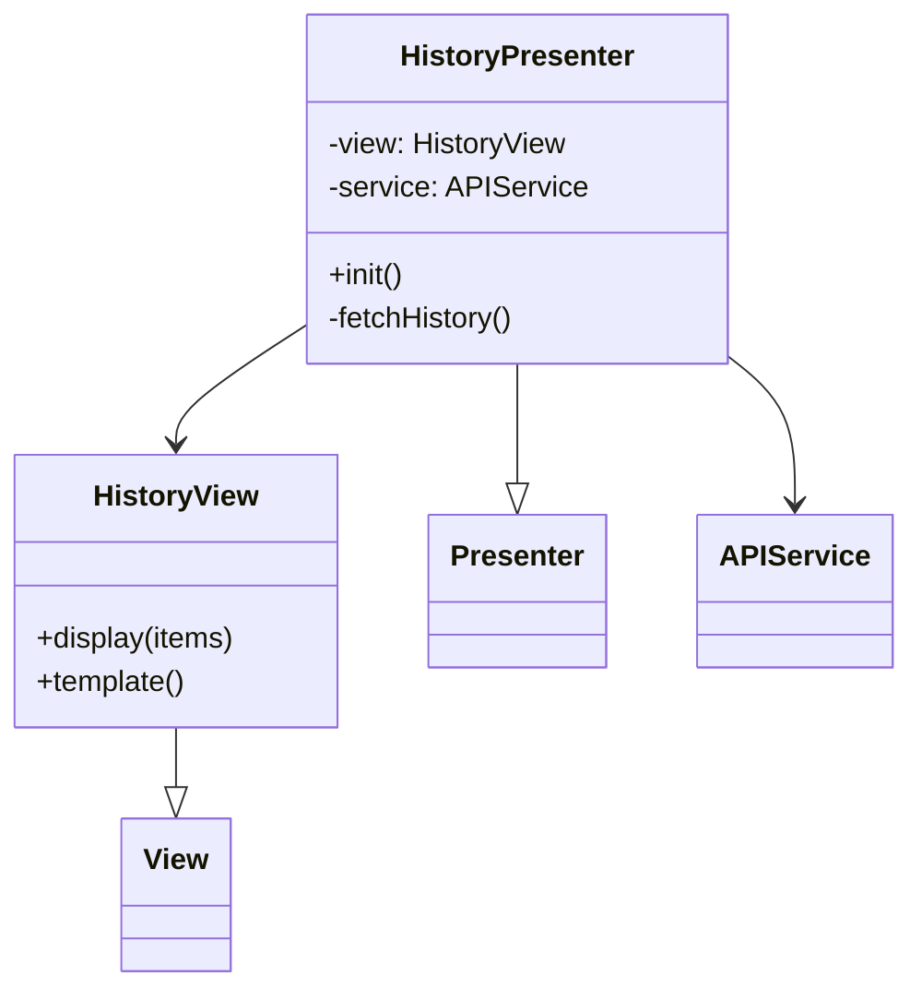
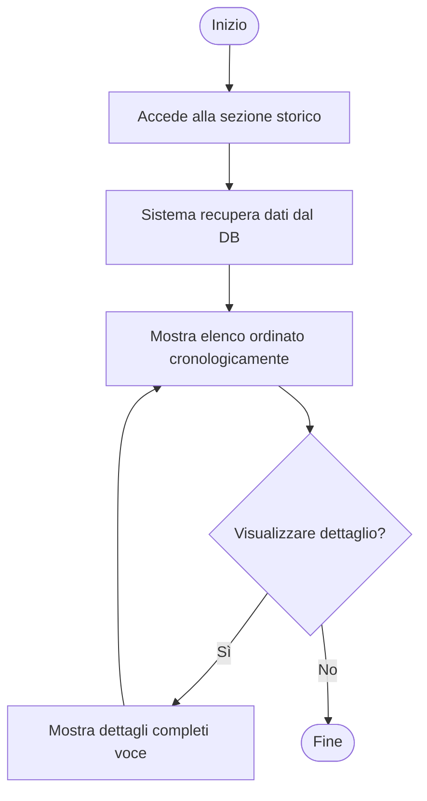
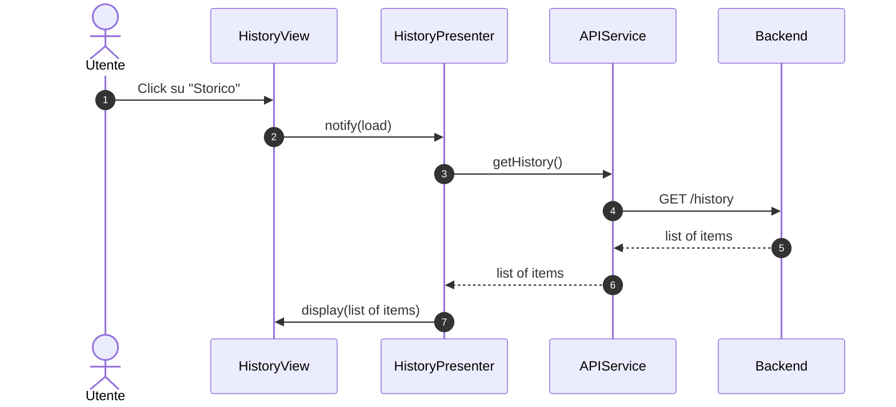

### Diagrammi caso d'uso UC10 - Visualizzare storico prenotazioni e pagamenti

#### Diagramma delle classi

##### Backend

##### Frontend

#### Diagramma attività

#### Diagramma di sequenza
##### Frontend

