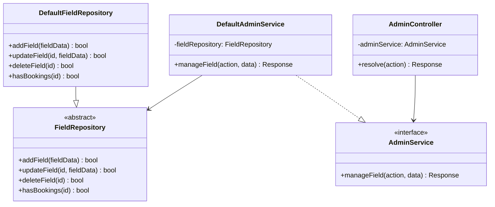
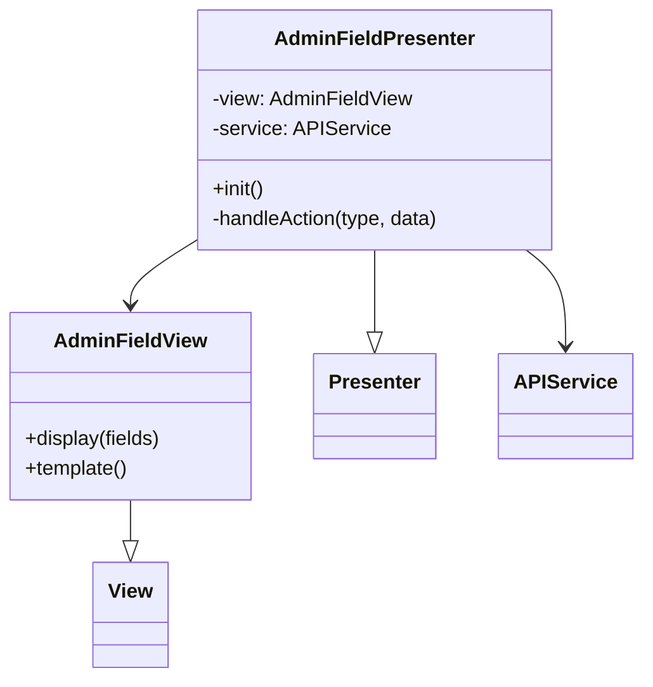
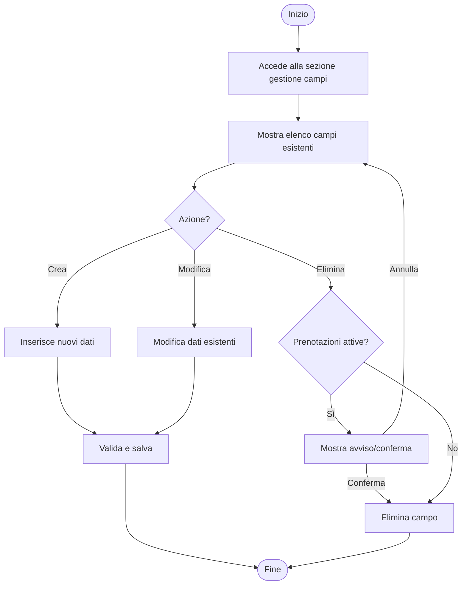
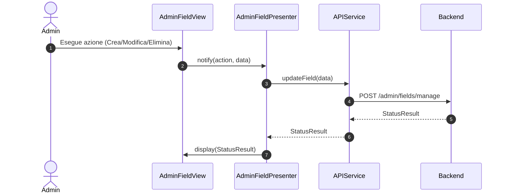

### Diagrammi caso d'uso UC11 - Gestire campi sportivi (Admin)

#### Diagramma delle classi

##### Backend

```mermaid
classDiagram
    class FieldRepository {
        <<abstract>>
        +addField(fieldData) bool
        +updateField(id, fieldData) bool
        +deleteField(id) bool
        +hasBookings(id) bool
    }
    class DefaultFieldRepository {
        +addField(fieldData) bool
        +updateField(id, fieldData) bool
        +deleteField(id) bool
        +hasBookings(id) bool
    }
    class AdminService {
        <<interface>>
        +manageField(action, data) Response
    }
    class DefaultAdminService {
        -fieldRepository: FieldRepository
        +manageField(action, data) Response
    }
    class AdminController {
        -adminService: AdminService
        +resolve(action) Response
    }

    DefaultFieldRepository --|> FieldRepository
    DefaultAdminService ..|> AdminService
    DefaultAdminService --> FieldRepository
    AdminController --> AdminService
```

##### Frontend

```mermaid
classDiagram
    class AdminFieldView {
        +display(fields)
        +template()
    }
    class AdminFieldPresenter {
        -view: AdminFieldView
        -service: APIService
        +init()
        -handleAction(type, data)
    }
    AdminFieldView --|> View
    AdminFieldPresenter --|> Presenter
    AdminFieldPresenter --> AdminFieldView
    AdminFieldPresenter --> APIService
```

#### Diagramma attività

```mermaid
flowchart TD
    Start([Inizio]) --> AccessAdmin[Accede alla sezione gestione campi]
    AccessAdmin --> ShowFields[Mostra elenco campi esistenti]
    ShowFields --> Action{Azione?}
    Action -->|Crea| Input[Inserisce nuovi dati]
    Action -->|Modifica| Edit[Modifica dati esistenti]
    Action -->|Elimina| CheckBookings{Prenotazioni attive?}
    CheckBookings -->|Sì| Warning[Mostra avviso/conferma]
    Warning -->|Annulla| ShowFields
    Warning -->|Conferma| Remove[Elimina campo]
    CheckBookings -->|No| Remove
    Input --> Validate[Valida e salva]
    Edit --> Validate
    Validate --> End([Fine])
    Remove --> End
```

#### Diagramma di sequenza
##### Frontend

```mermaid
sequenceDiagram
    autonumber
    actor admin as Admin
    participant view as AdminFieldView
    participant presenter as AdminFieldPresenter
    participant api as APIService
    participant backend as Backend

    admin ->> view: Esegue azione (Crea/Modifica/Elimina)
    view ->> presenter: notify(action, data)
    presenter ->> api: updateField(data)
    api ->> backend: POST /admin/fields/manage
    backend -->> api: StatusResult
    api -->> presenter: StatusResult
    presenter ->> view: display(StatusResult)
```
