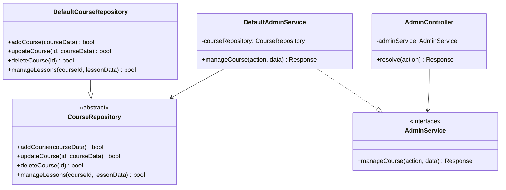
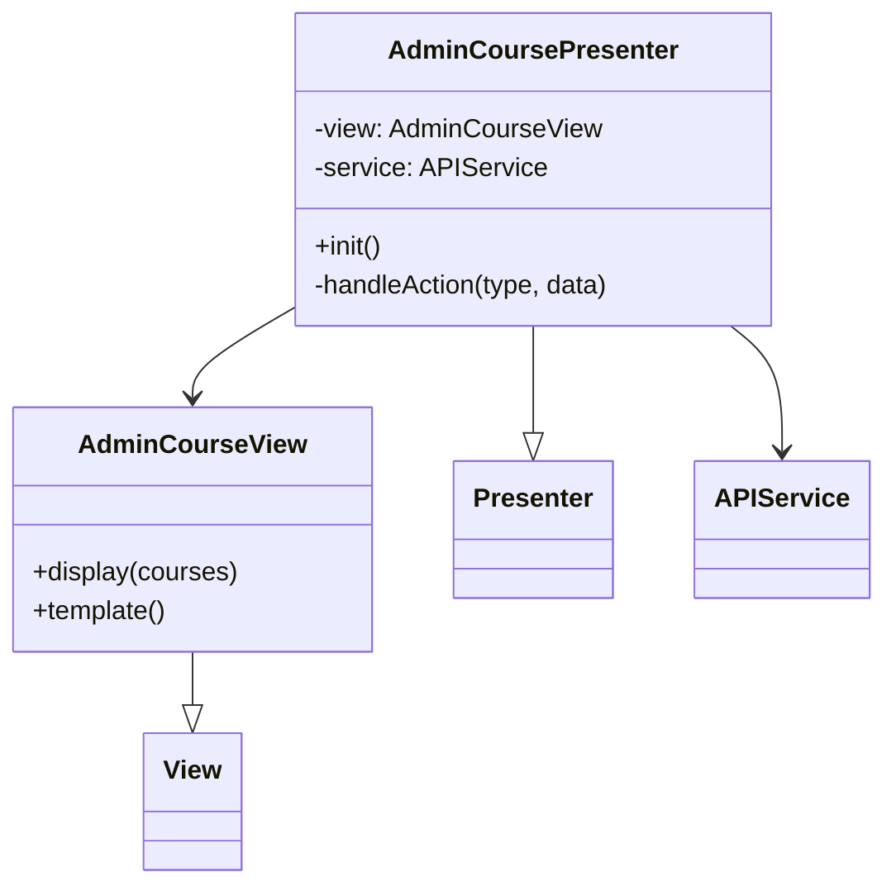
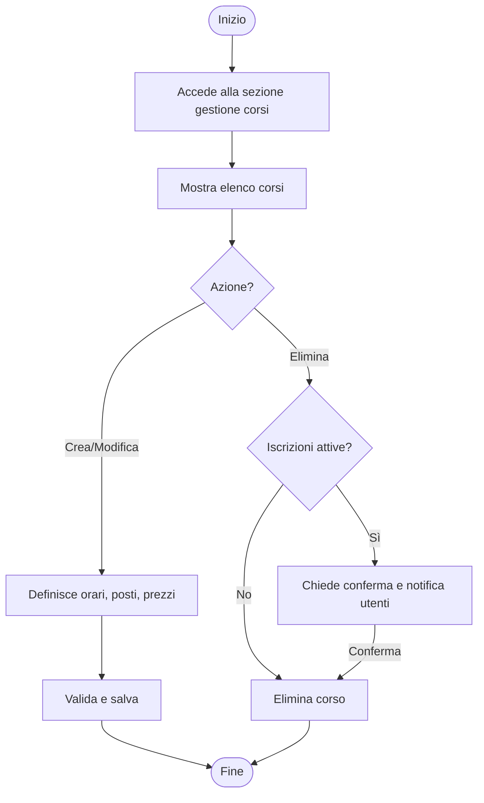
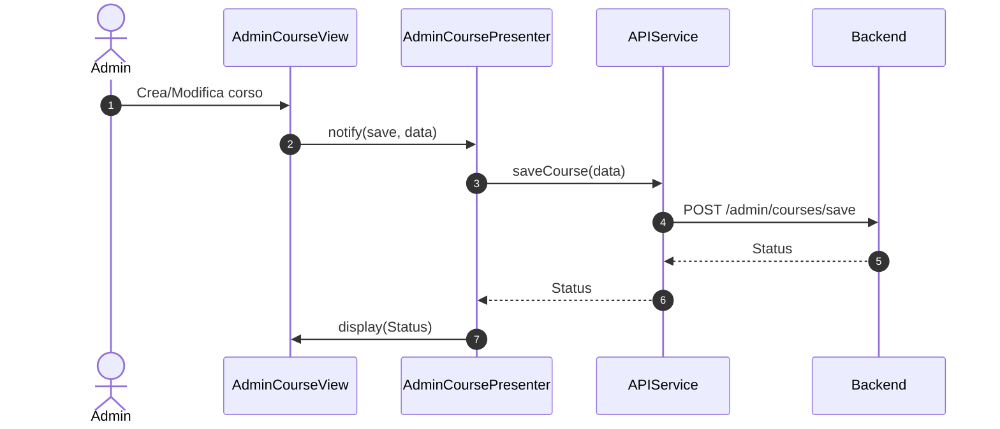

### Diagrammi caso d'uso UC12 - Gestire corsi e lezioni (Admin)

#### Diagramma delle classi

##### Backend

```mermaid
classDiagram
    class CourseRepository {
        <<abstract>>
        +addCourse(courseData) bool
        +updateCourse(id, courseData) bool
        +deleteCourse(id) bool
        +manageLessons(courseId, lessonData) bool
    }
    class DefaultCourseRepository {
        +addCourse(courseData) bool
        +updateCourse(id, courseData) bool
        +deleteCourse(id) bool
        +manageLessons(courseId, lessonData) bool
    }
    class AdminService {
        <<interface>>
        +manageCourse(action, data) Response
    }
    class DefaultAdminService {
        -courseRepository: CourseRepository
        +manageCourse(action, data) Response
    }
    class AdminController {
        -adminService: AdminService
        +resolve(action) Response
    }

    DefaultCourseRepository --|> CourseRepository
    DefaultAdminService ..|> AdminService
    DefaultAdminService --> CourseRepository
    AdminController --> AdminService
```

##### Frontend

```mermaid
classDiagram
    class AdminCourseView {
        +display(courses)
        +template()
    }
    class AdminCoursePresenter {
        -view: AdminCourseView
        -service: APIService
        +init()
        -handleAction(type, data)
    }
    AdminCourseView --|> View
    AdminCoursePresenter --|> Presenter
    AdminCoursePresenter --> AdminCourseView
    AdminCoursePresenter --> APIService
```

#### Diagramma attività

```mermaid
flowchart TD
    Start([Inizio]) --> AccessAdmin[Accede alla sezione gestione corsi]
    AccessAdmin --> ShowCourses[Mostra elenco corsi]
    ShowCourses --> Action{Azione?}
    Action -->|Crea/Modifica| Input[Definisce orari, posti, prezzi]
    Action -->|Elimina| CheckJoins{Iscrizioni attive?}
    CheckJoins -->|Sì| Modal[Chiede conferma e notifica utenti]
    CheckJoins -->|No| Remove[Elimina corso]
    Input --> Validate[Valida e salva]
    Modal -->|Conferma| Remove
    Validate --> End([Fine])
    Remove --> End
```

#### Diagramma di sequenza
##### Frontend

```mermaid
sequenceDiagram
    autonumber
    actor admin as Admin
    participant view as AdminCourseView
    participant presenter as AdminCoursePresenter
    participant api as APIService
    participant backend as Backend

    admin ->> view: Crea/Modifica corso
    view ->> presenter: notify(save, data)
    presenter ->> api: saveCourse(data)
    api ->> backend: POST /admin/courses/save
    backend -->> api: Status
    api -->> presenter: Status
    presenter ->> view: display(Status)
```
