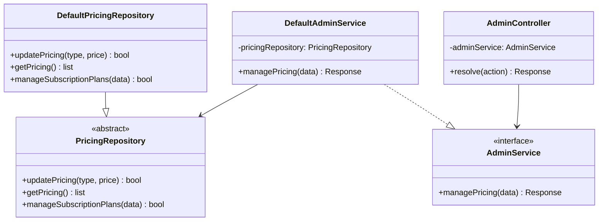
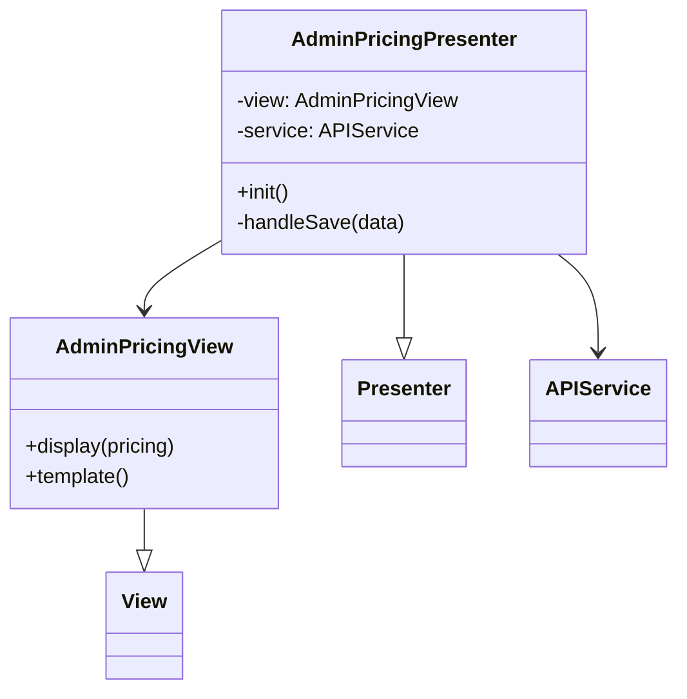
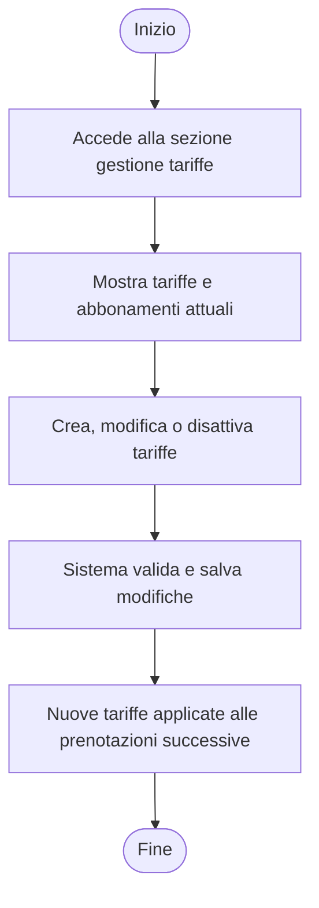
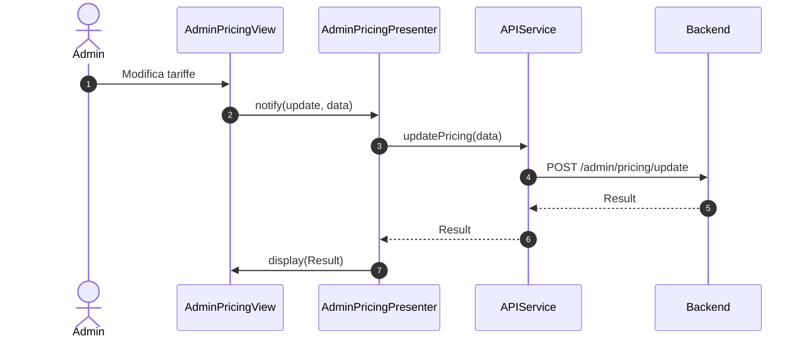

### Diagrammi caso d'uso UC13 - Gestire tariffe e abbonamenti (Admin)

#### Diagramma delle classi

##### Backend

##### Frontend

#### Diagramma attività

#### Diagramma di sequenza
##### Frontend

