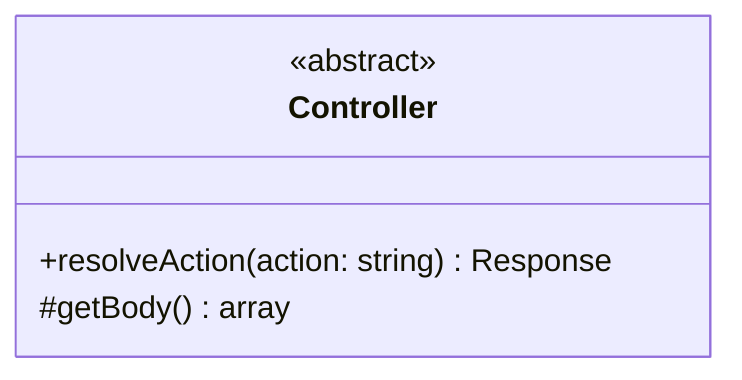
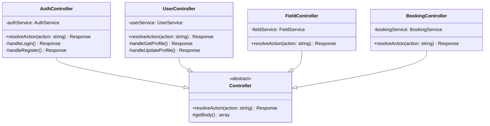
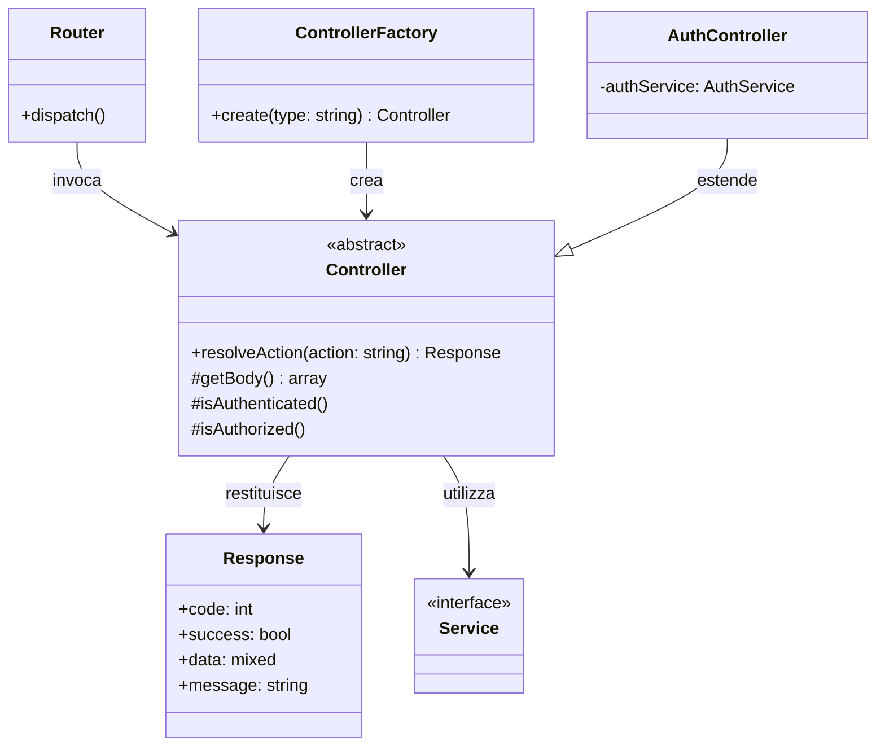

# Controller (Classe Astratta)

Questa è la classe astratta utilizzata nel progetto per la **gestione delle richieste HTTP** nel backend.

## Descrizione

La classe astratta `Controller` definisce la struttura base per tutti i controller dell'applicazione. Fornisce metodi comuni per gestire le richieste, elaborare i dati e creare risposte.

## Struttura

## Responsabilità

- **resolveAction()**: Esegue l'action richiesta (metodo astratto da implementare)
- **getBody()**: Recupera i dati dal body della richiesta

## Implementazioni

Le seguenti classi estendono questa classe astratta:

## Dipendenze

Il seguente diagramma mostra le relazioni e dipendenze di questa classe:

### Relazioni
- **Restituisce**: `Response` - oggetto risposta HTTP
- **Utilizza**: Service layer - per logica business (AuthService, UserService, ecc)
- **Utilizzata da**: `Router` - per gestione richieste
- **Creata da**: `ControllerFactory` - factory pattern
- **Estesa da**: `AuthController`, `UserController`,

