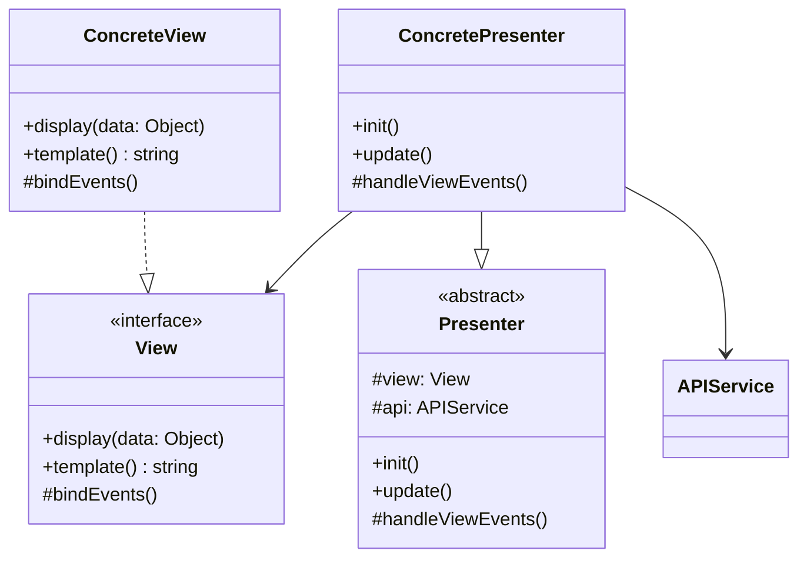
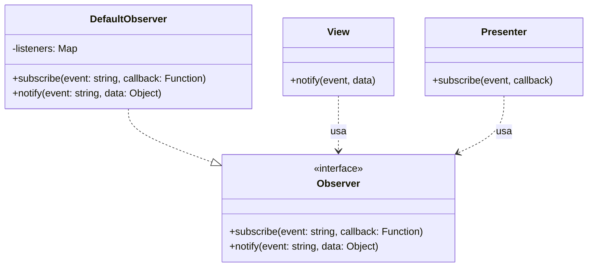
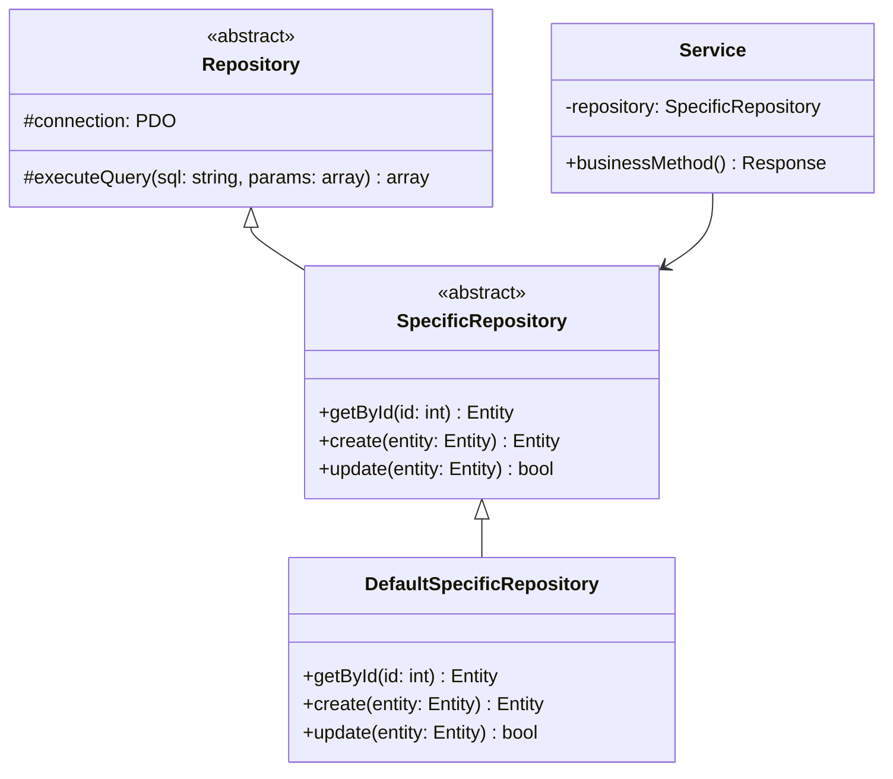
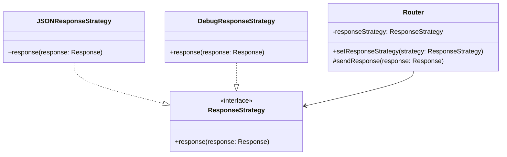
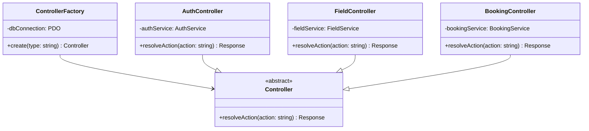

# Design Patterns Utilizzati nel Progetto

Questo documento descrive i design pattern implementati nell'architettura del sistema.

---

## Indice dei Pattern

1. [Model-View-Presenter (MVP)](#model-view-presenter-mvp)
2. [Observer Pattern](#observer-pattern)
3. [Repository Pattern](#repository-pattern)
4. [Strategy Pattern](#strategy-pattern)
5. [Factory Pattern](#factory-pattern)

---

## Model-View-Presenter (MVP)

### Scopo

Separare la logica di presentazione dalla logica di business e dalla visualizzazione, migliorando la testabilità e la manutenibilità del codice frontend.

### Componenti

## Observer Pattern

### Scopo

Permettere la comunicazione tra View e Presenter, disaccoppiando i componenti.

### Struttura

### Flusso di Comunicazione

1. **View** notifica un evento tramite `notify()`
2. **Observer** propaga l'evento a tutti i subscriber
3. **Presenter** riceve l'evento tramite callback registrato con `subscribe()`

---

## Repository Pattern

### Scopo

Astrarre l'accesso ai dati, separando la logica di business dalla logica di persistenza.

### Struttura

---

## Strategy Pattern

### Scopo
Permettere di cambiare dinamicamente l'algoritmo di invio delle risposte HTTP (es. per debug, logging, formati diversi).

### Struttura

## Factory Pattern

### Scopo
Centralizzare la creazione dei controller, gestendo le dipendenze in modo consistente.

### Struttura

### Utilizzo
- `ControllerFactory::create('auth')` → crea `AuthController`
- `ControllerFactory::create('field')` → crea `FieldController`
- `ControllerFactory::create('booking')` → crea `BookingController`

---

- [Architettura Base](../Architettura%20base.md)

