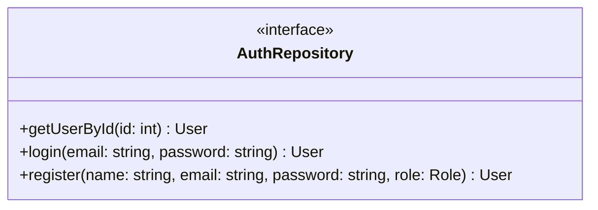
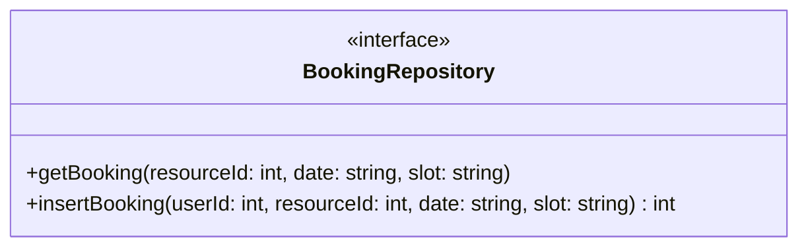
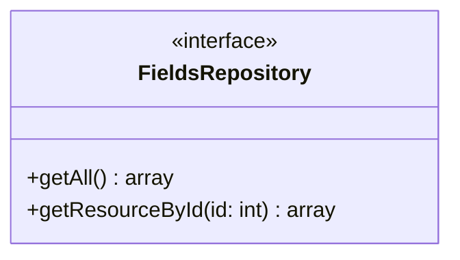
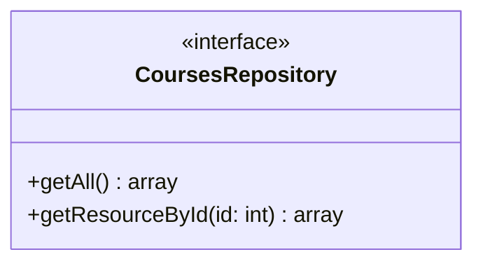
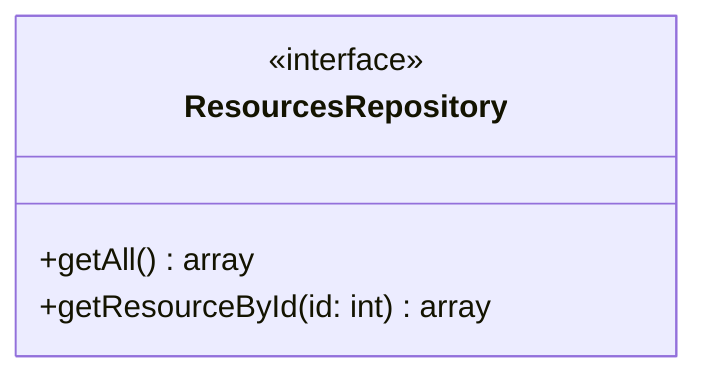
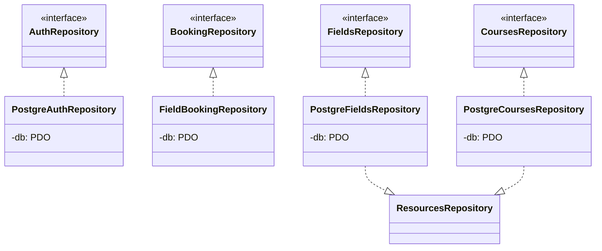
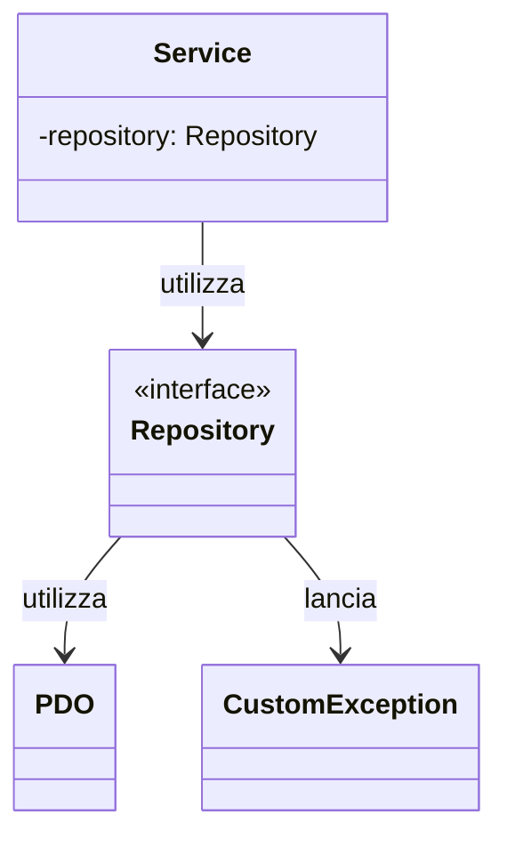

# Repository (Interfacce)

Questo documento descrive le interfacce per l'**accesso ai dati** nel backend. Non esiste una classe base astratta; ogni repository implementa direttamente la propria interfaccia.

## Descrizione

Ogni interfaccia `Repository` definisce i metodi per l'accesso a una specifica entità del dominio. Le implementazioni concrete gestiscono la logica di persistenza (tipicamente PostgreSQL).

## Interfacce

### AuthRepository

### BookingRepository

### FieldsRepository

### CoursesRepository

### ResourcesRepository

## Implementazioni

Le seguenti classi implementano le interfacce repository:

## Dipendenze

### Relazioni

- **Utilizza**: `PDO` - per la connessione e query al database PostgreSQL
- **Utilizzata da**: Service layer (AuthService, BookingService, ecc)
- **Implementata da**: Classi concrete (PostgreAuthRepository, ecc)
- **Lancia**: `CustomException` - per errori di accesso ai dati ...  
