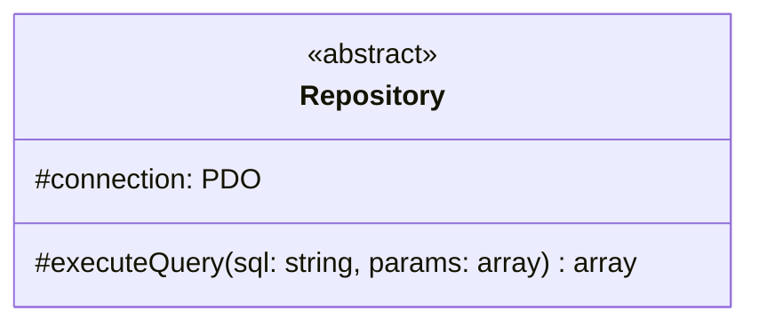
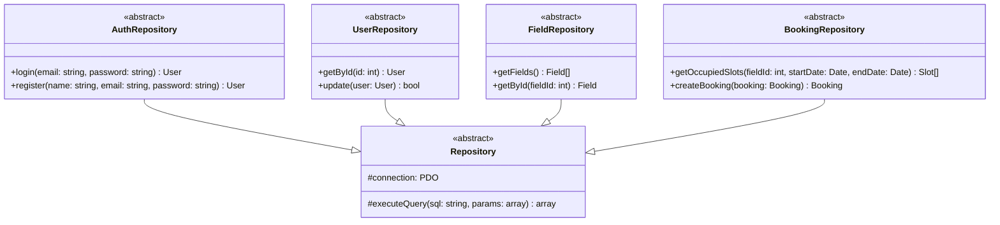
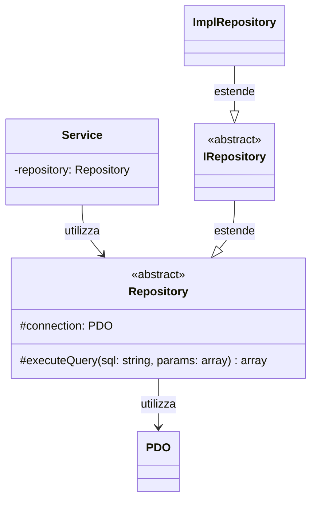

# Repository (Classe Astratta)

Questa è la classe astratta utilizzata nel progetto per l'**accesso ai dati** nel backend.

## Descrizione

La classe astratta `Repository` definisce la struttura base per l'accesso al database. Fornisce metodi comuni per l'esecuzione di query SQL e gestisce la connessione al database.

## Struttura

## Responsabilità

- Gestire la connessione al database (PDO)
- Fornire metodi helper per eseguire query SQL

## Pattern

Implementa il **Repository Pattern** per separare la logica di accesso ai dati dalla logica di business.

## Implementazioni

Le seguenti classi estendono questa classe astratta:

## Dipendenze

Il seguente diagramma mostra le relazioni e dipendenze di questa classe:

### Relazioni

- **Utilizza**: `PDO` - per la connessione e query al database
- **Utilizzata da**: Service layer (AuthService, UserService, ecc)
- **Estesa da**: `AuthRepository`, `UserRepository`, ...  
