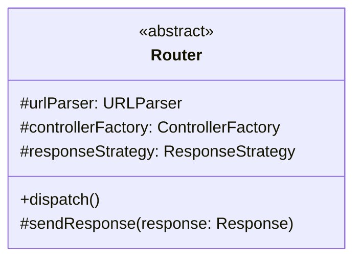
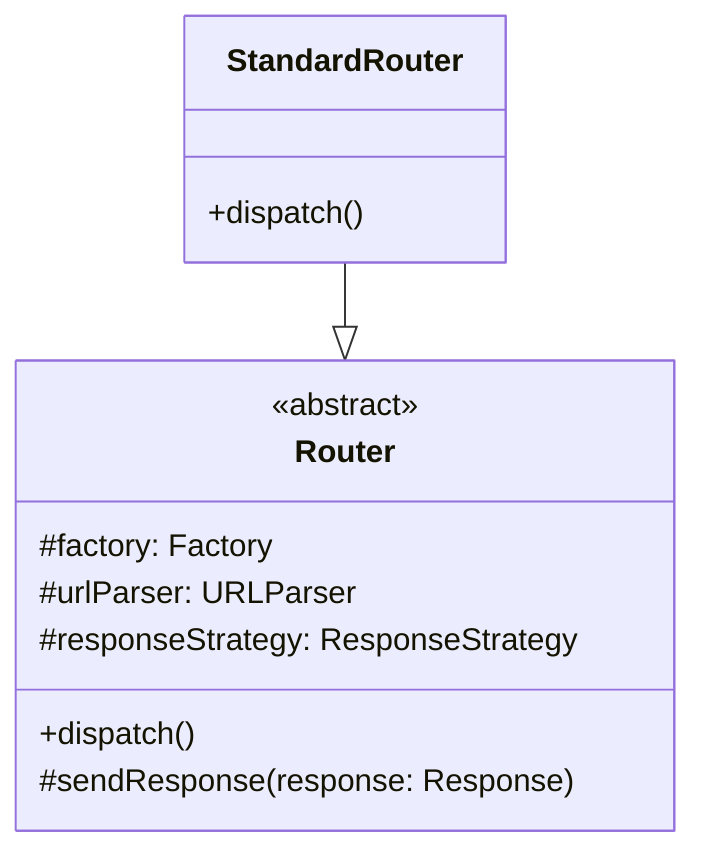
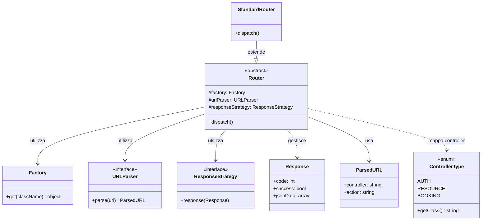

# Router (Classe Astratta)

Questa è la classe astratta utilizzata nel progetto per il **routing delle richieste HTTP** verso i controller appropriati.

## Descrizione

La classe astratta `Router` definisce la struttura base per gestire il routing delle richieste HTTP. Coordina il parsing dell'URL, la creazione del controller e l'invio della risposta.

## Struttura

## Responsabilità

- Ricevere le richieste HTTP
- Delegare il parsing dell'URL a `URLParser`
- Ottenere il controller appropriato tramite `ControllerFactory`
- Invocare l'action sul controller
- Inviare la risposta tramite `ResponseStrategy`

## Implementazioni

Le seguenti classi estendono questa classe astratta:

## Dipendenze

Il seguente diagramma mostra le relazioni e dipendenze di questa classe:

### Relazioni

- **Utilizza**: `Factory` - per la creazione dei controller tramite dependency injection
- **Utilizza**: `URLParser` - per il parsing delle URL
- **Utilizza**: `ResponseStrategy` - per l'invio delle risposte
- **Gestisce**: `Response` - oggetto risposta HTTP
- **Mappa**: `ControllerType` enum - converte stringa controller in classe PHP
