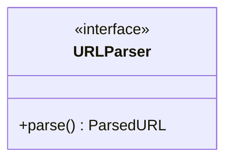
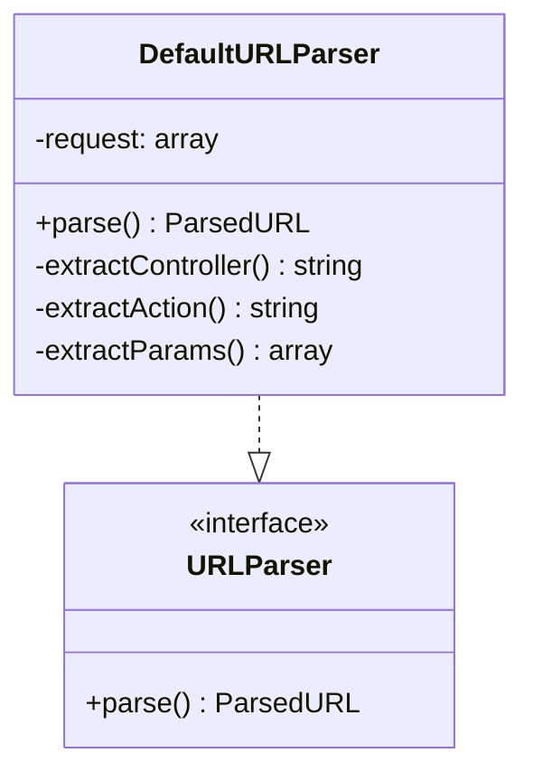
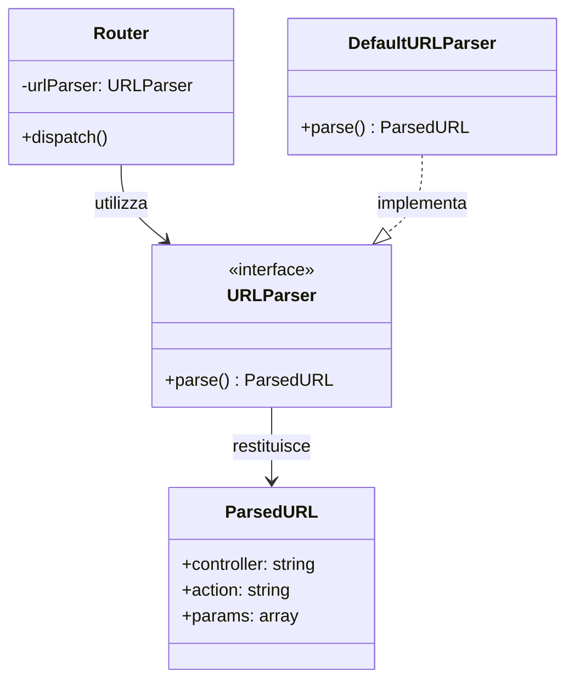

# URLParser Interface

Questa è l'interfaccia utilizzata nel progetto per il **parsing delle URL** nelle richieste HTTP.

## Descrizione

L'interfaccia `URLParser` definisce le funzioni per estrarre le informazioni necessarie per il routing (controller, action, parametri) da una richiesta HTTP.

## Metodi

## Utilizzo

Questa interfaccia viene implementata da classi concrete che si occupano di:
- Analizzare l'URL della richiesta HTTP
- Estrarre il controller target
- Estrarre l'action da eseguire
- Estrarre eventuali parametri dalla query string o dal path

## Implementazioni

Le seguenti classi implementano questa interfaccia:

### DefaultURLParser
- **Scopo**: Implementazione standard per parsing di URL tradizionali
- **Utilizzo**: Utilizzato nel routing principale dell'applicazione
- **Formato supportato**: `/controller/action?param=value`

## Dipendenze

Il seguente diagramma mostra le relazioni e dipendenze di questa interfaccia:

### Relazioni
- **Utilizzata da**: `Router` - per il parsing delle richieste HTTP
- **Restituisce**: `ParsedURL` - oggetto contenente controller, action e parametri
- **Implementata da**: `DefaultURLParser`

