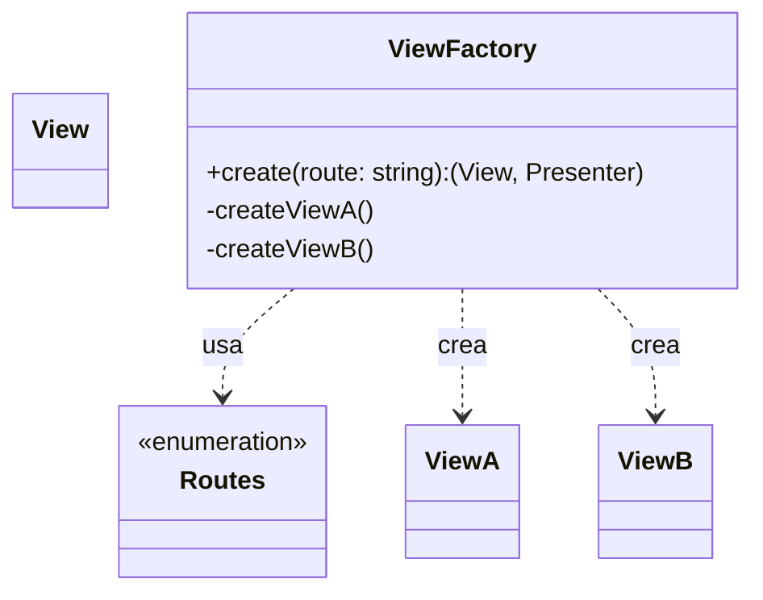
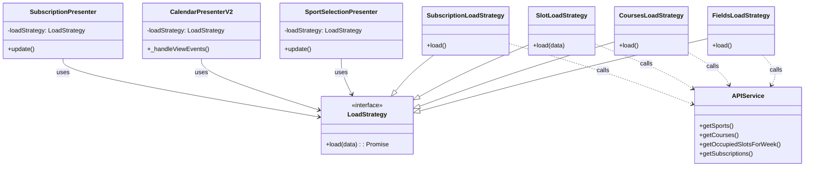
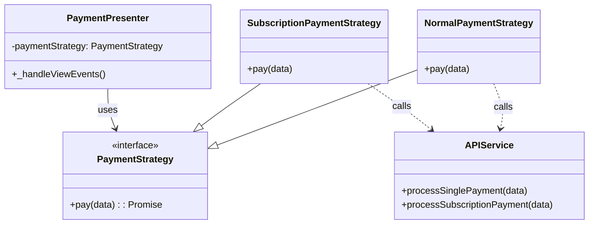
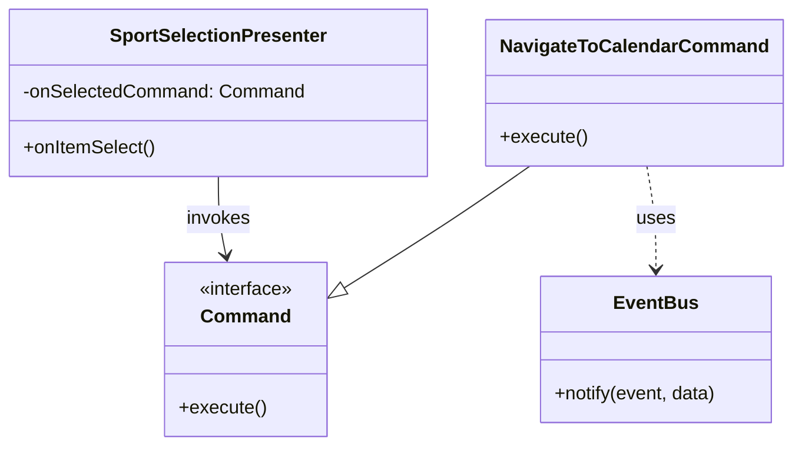

# Design Patterns Frontend

Questo documento descrive i principali design pattern utilizzanti nel frontend, mostrando un singolo esempio di utilizzo.

## 1. Factory Pattern

Il **Factory Pattern** è stato introdotto per centralizzare la logica di creazione delle View e dei Presenter. Questo permette di disaccoppiare il router dalla logica di istanziazione dei componenti e facilita l'iniezione delle dipendenze (come le strategie o i comandi).

### Implementazione

- **`ComponentFactory`**: Classe statica che funge da factory unica per l'applicazione. In base alla rotta richiesta, istanzia e configura la coppia View-Presenter appropriata.

### Diagramma delle Classi

## 2. Strategy Pattern

Lo **Strategy Pattern** è utilizzato per incapsulare le diverse logiche di accesso ai dati e alle API, in modo che i Presenter non conoscano i dettagli delle chiamate HTTP/servizio.
Nel frontend viene applicato principalmente in due famiglie:

- strategie di **caricamento** (`LoadStrategy`) per tutte le chiamate API di lettura (sport, corsi, slot occupati, abbonamenti);
- strategie di **pagamento** (`PaymentStrategy`) per distinguere le modalità di pagamento (pagamento singolo vs abbonamento).

### Implementazione (LoadStrategy)

- **`LoadStrategy`**: Interfaccia che definisce il metodo `load()`.
- **`FieldsLoadStrategy`**: Implementazione che recupera la lista dei campi (`APIService.getSports()`).
- **`CoursesLoadStrategy`**: Implementazione che recupera la lista dei corsi (`APIService.getCourses()`).
- **`SlotLoadStrategy`**: Implementazione che recupera gli slot occupati per una settimana (`APIService.getOccupiedSlotsForWeek()`).
- **`SubscriptionLoadStrategy`**: Implementazione che recupera la lista degli abbonamenti (`APIService.getSubscriptions()`).
- **`SportSelectionPresenter` / `CalendarPresenterV2` / `SubscriptionPresenter`**: ricevono una `LoadStrategy` nel costruttore e la utilizzano per recuperare i dati, senza conoscere i dettagli dell'implementazione.

### Diagramma delle Classi (LoadStrategy)

### Implementazione (PaymentStrategy)

- **`PaymentStrategy`**: Interfaccia che definisce il metodo `pay(data)`.
- **`NormalPaymentStrategy`**: Strategia utilizzata per il pagamento singolo (carrello di prenotazioni), che incapsula la chiamata `APIService.processSinglePayment()`.
- **`SubscriptionPaymentStrategy`**: Strategia utilizzata per il pagamento di un abbonamento, che incapsula la chiamata `APIService.processSubscriptionPayment()`.
- **`PaymentPresenter`**: Riceve una `PaymentStrategy` nel costruttore e, alla conferma del pagamento, invoca `paymentStrategy.pay(...)` senza conoscere i dettagli dell'implementazione o dell'API sottostante.

### Diagramma delle Classi (PaymentStrategy)

## 3. Command Pattern

Il **Command Pattern** è stato utilizzato per disaccoppiare il `Presenter` dall'azione effettiva da eseguire (es. navigazione). In questo modo, il `Presenter` non deve sapre che azione eseguire, ma deve solo eseguire il comando iniettato.

### Implementazione

- **`Command`**: Interfaccia che definisce il metodo `execute()`.
- **`NavigateToCalendarCommand`**: Comando concreto che pubblica un evento sul bus per navigare alla vista del calendario.
- **`SportSelectionPresenter`**: Riceve un comando (`onSelectedCommand`) nella configurazione e lo esegue quando un elemento viene selezionato.

### Diagramma delle Classi

