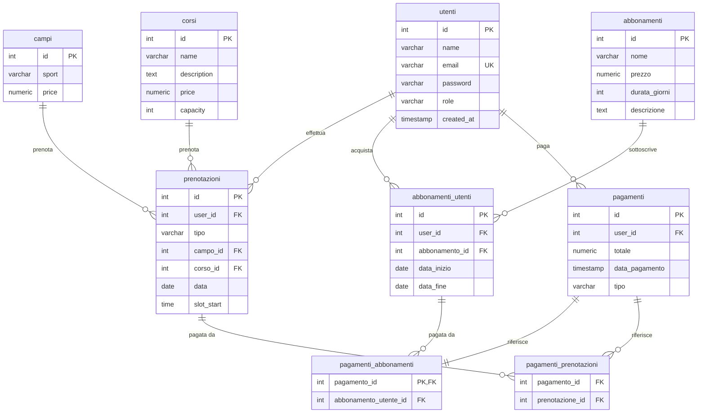

# Diagramma ER del Database Centro Sportivo

## Legenda
- **PK**: Primary Key
- **FK**: Foreign Key
- **UK**: Unique Key (Chiave Unica)
- **||--o{**: Relazione uno a molti
- **}o--||**: Relazione molti a uno
- **||--||**: Relazione uno a uno