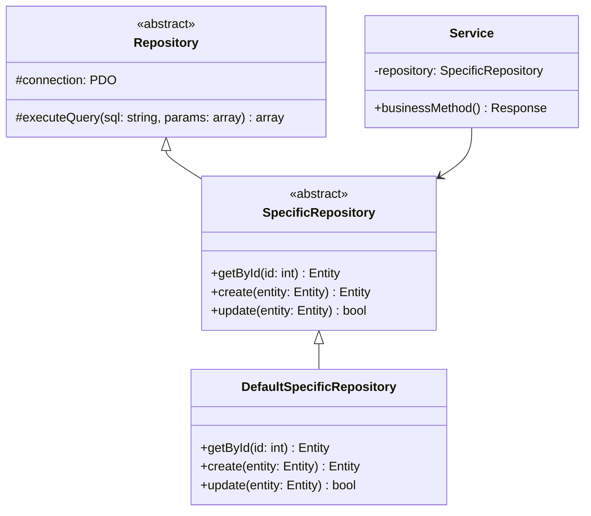
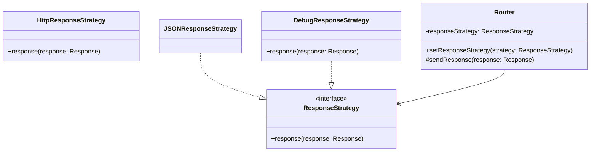
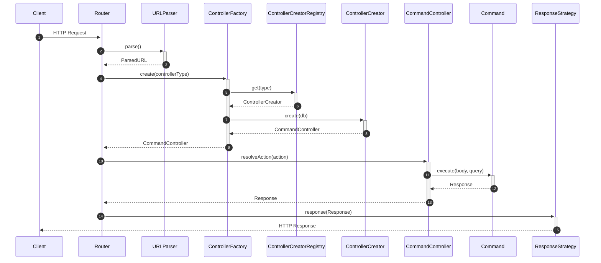

# Design Patterns Backend

Questo documento descrive i principali design pattern implementati nell'architettura backend del sistema.

---

## Repository Pattern

### Scopo
Astrarre l'accesso ai dati, separando la logica di business dalla logica di persistenza.

### Struttura



---

## Strategy Pattern (Backend)

### Scopo
Permettere di cambiare dinamicamente l'algoritmo di invio delle risposte HTTP (es. per debug, logging, formati diversi).

### Struttura



---

## Factory Pattern (Backend)

### Scopo
Centralizzare la creazione dei controller, gestendo le dipendenze in modo consistente.

### Struttura

```mermaid

```

---

## Command Pattern (Backend)

### Scopo
Incapsulare una richiesta come un oggetto, permettendo di parametrizzare i controller con diverse azioni e validazioni.

### Struttura

```mermaid
classDiagram
class Command {
    <<interface>>
    +execute(body, query) Response
    +validateHttpMethod(method) bool
    +validateBody(body) bool
}

class LoginCommand {
    -service: AuthService
    +execute(body, query) Response
}

class CommandController {
    <<abstract>>
    #registry: CommandRegistry
    +resolveAction(action) Response
}

LoginCommand ..|> Command
CommandController --> CommandRegistry
CommandRegistry --> Command
```

---

## Flusso Request/Response

Il seguente diagramma mostra come i pattern backend collaborano per gestire una richiesta HTTP.

### Diagramma di Sequenza


