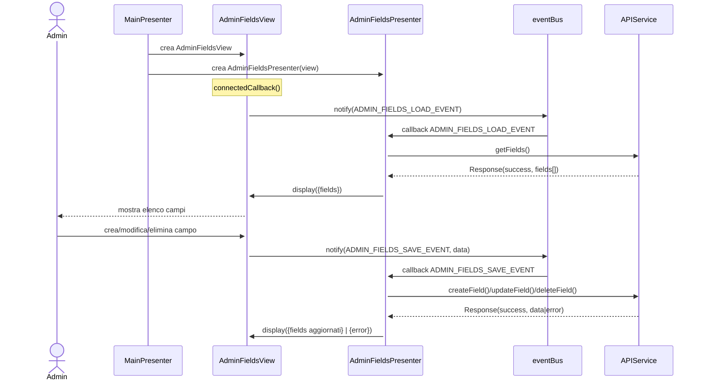
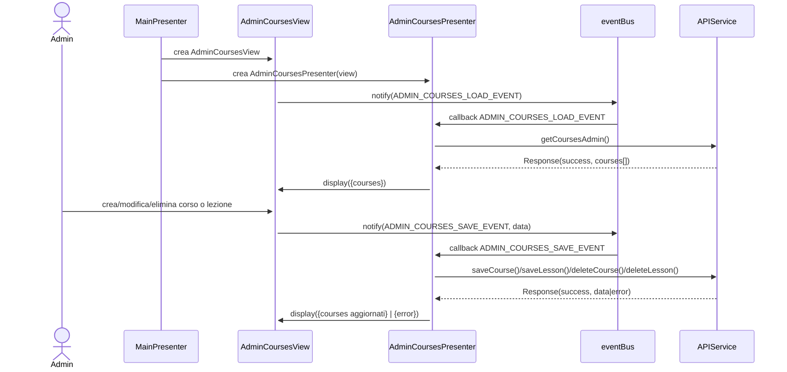
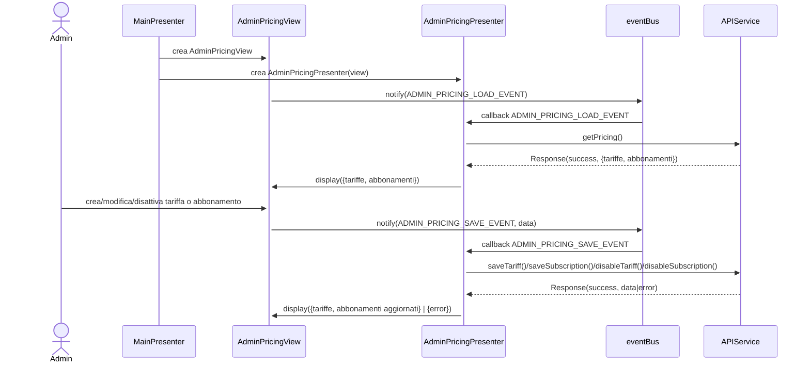

# Modulo Admin - Frontend

## Casi d'uso correlati
- **UC11**: Gestire campi sportivi
- **UC12**: Gestire corsi e lezioni
- **UC13**: Gestire tariffe e abbonamenti

> Nota: al momento l'implementazione frontend non include ancora schermate e presenter dedicati per l'area Admin.  
> Questo documento descrive il design previsto, allineato ai casi d'uso, in modo che possa essere implementato successivamente.

---

## Panoramica

Il modulo **Admin** raggruppa tre sotto-moduli:
- **Admin Fields**: CRUD sui campi sportivi (UC11)
- **Admin Courses**: CRUD su corsi e lezioni (UC12)
- **Admin Pricing**: gestione tariffe e abbonamenti (UC13)

Tutti e tre seguono lo stesso approccio architetturale del resto del frontend:
- pattern **MVP** (View + Presenter),
- comunicazione tramite **eventBus** (Observer),
- accesso ai dati tramite **APIService** (che sostituirà `MockAPIService`).

Le viste Admin saranno raggiungibili da una futura sezione dedicata (es. `Routes.ADMIN_FIELDS`, `Routes.ADMIN_COURSES`, `Routes.ADMIN_PRICING`) e istanziate tramite `ViewFactory`.

---

## UC11 – Admin Fields (Gestire campi sportivi)

### Scopo
Permettere all'amministratore di:
- visualizzare l'elenco dei campi sportivi,
- creare un nuovo campo,
- modificare un campo esistente,
- eliminare un campo (con controlli su prenotazioni attive).

### Componenti previste
- `AdminFieldsView`
- `AdminFieldsPresenter`
- `APIService` (metodi tipo `getFields()`, `createField()`, `updateField()`, `deleteField()`)
- `eventBus` / `Events`

### Diagramma di sequenza (frontend – sintesi)

---

## UC12 – Admin Courses (Gestire corsi e lezioni)

### Scopo
Permettere all'amministratore di:
- creare, modificare, eliminare corsi,
- gestire le relative lezioni (orari, posti disponibili, prezzo),
- vedere lo stato delle iscrizioni.

### Componenti previste
- `AdminCoursesView`
- `AdminCoursesPresenter`
- `APIService` (metodi tipo `getCoursesAdmin()`, `saveCourse()`, `deleteCourse()`, `saveLesson()`, ecc.)
- `eventBus` / `Events`

### Diagramma di sequenza (frontend – sintesi)

---

## UC13 – Admin Pricing (Gestire tariffe e abbonamenti)

### Scopo
Permettere all'amministratore di:
- definire e aggiornare le **tariffe** per campi e corsi,
- definire e aggiornare gli **abbonamenti** (mensile, trimestrale, annuale, numero ingressi, prezzo),
- disattivare tariffe/abbonamenti non più validi.

### Componenti previste
- `AdminPricingView`
- `AdminPricingPresenter`
- `APIService` (metodi tipo `getPricing()`, `saveTariff()`, `saveSubscription()`, `disableTariff()`, …)
- `eventBus` / `Events`

### Diagramma di sequenza (frontend – sintesi)

---

## Estensioni previste al frontend

Per implementare effettivamente il modulo Admin in linea con questa documentazione, sarà necessario:
- aggiungere nuove **route** in `Routes.js` (es. `ADMIN_FIELDS`, `ADMIN_COURSES`, `ADMIN_PRICING`),
- estendere `ViewFactory` con i metodi:
  - `#createAdminFieldsView()`,
  - `#createAdminCoursesView()`,
  - `#createAdminPricingView()`,
- creare le classi:
  - `AdminFieldsView` / `AdminFieldsPresenter`,
  - `AdminCoursesView` / `AdminCoursesPresenter`,
  - `AdminPricingView` / `AdminPricingPresenter`,
- estendere `Events.js` con gli eventi `ADMIN_*` indicati nei diagrammi.

Questo documento ti dà quindi una base coerente con UC11, UC12 e UC13 per aggiungere in un secondo momento le schermate Admin nel frontend.

