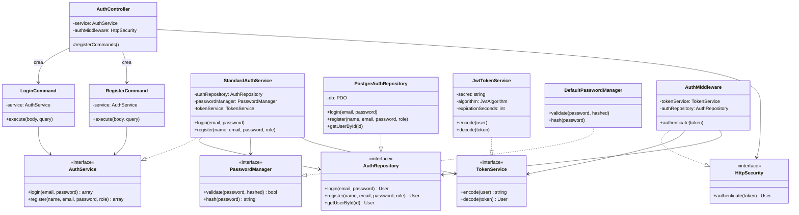
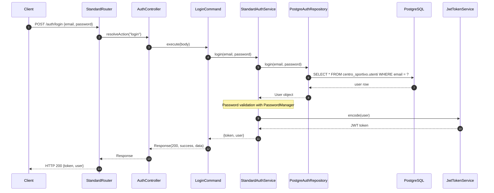
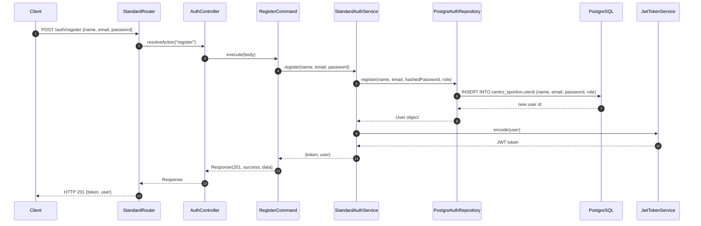
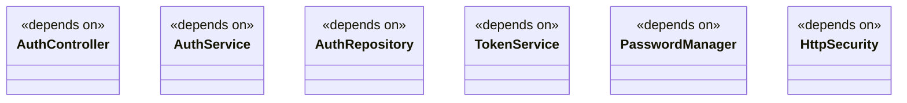
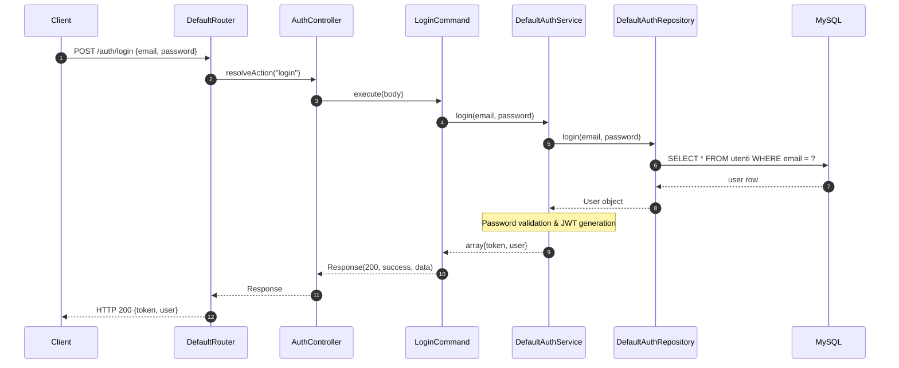

# Modulo auth - Backend

## Panoramica

Questo modulo gestisce l'autenticazione degli utenti tramite login e registrazione, utilizzando JWT per l'autenticazione stateless.

## Diagramma delle Classi



## Flusso di Login (Diagramma di Sequenza)



## Flusso di Registrazione (Diagramma di Sequenza)



## Endpoint

| Metodo | Path | Descrizione |
|--------|------|-------------|
| POST | `/auth/login` | Login utente |
| POST | `/auth/register` | Registrazione nuovo utente |

## Comandi

### LoginCommand

```php
class LoginCommand extends Command {
    public function __construct(private AuthService $service) {}
    public function execute(array $params, array $query = []): Response {
        $result = $this->service->login($params['email'], $params['password']);
        return new Response(200, true, $result);
    }
    public function getRequiredBodyParameters(): array { return ['email', 'password']; }
    public function getRequiredQueryParameters(): array { return []; }
    public function getRequiredHttpMethod(): string { return 'post'; }
    public function requiresAuthentication(): bool { return false; }
    public function getRequiredRoles(): array { return []; }
}
```

### RegisterCommand

```php
class RegisterCommand extends Command {
    public function __construct(private AuthService $service) {}
    public function execute(array $params, array $query = []): Response {
        $result = $this->service->register(
            $params['name'],
            $params['email'],
            $params['password'],
            Role::from($params['role'] ?? 'user')
        );
        return new Response(201, true, $result);
    }
    public function getRequiredBodyParameters(): array { return ['name', 'email', 'password']; }
    public function getRequiredQueryParameters(): array { return []; }
    public function getRequiredHttpMethod(): string { return 'post'; }
    public function requiresAuthentication(): bool { return false; }
    public function getRequiredRoles(): array { return []; }
}
```

## Dipendenze del Modulo



## Note

- Il modulo utilizza **PostgreSQL** come database
- La password viene hashata con `password_hash()` (cost 10)
- I token JWT hanno scadenza di 1 ora (3600 secondi)
- I ruoli supportati sono `user` e `admin`
- L'autenticazione è stateless tramite Bearer token

## Flusso di Login (Diagramma di Sequenza)

Il seguente diagramma mostra il flusso di un'operazione di login andata a buon fine.




