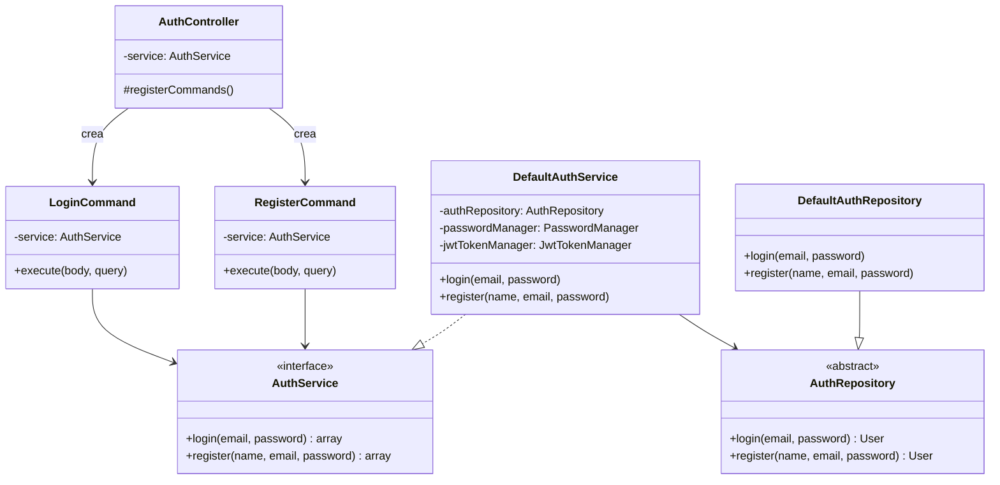
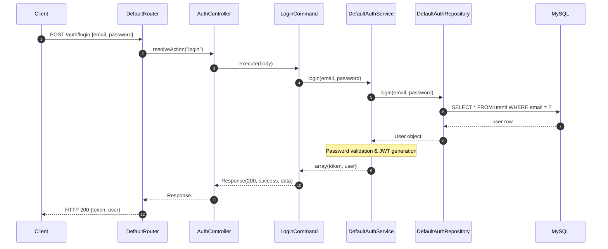

# Modulo auth - Backend

### Diagramma delle Classi

```mermaid
classDiagram
    class AuthController {
        -service: AuthService
        #registerCommands()
    }

    class LoginCommand {
        -service: AuthService
        +execute(body, query)
    }

    class RegisterCommand {
        -service: AuthService
        +execute(body, query)
    }

    class AuthService {
        <<interface>>
        +login(email, password) array
        +register(name, email, password) array
    }

    class DefaultAuthService {
        -authRepository: AuthRepository
        -passwordManager: PasswordManager
        -jwtTokenManager: JwtTokenManager
        +login(email, password)
        +register(name, email, password)
    }

    class AuthRepository {
        <<abstract>>
        +login(email, password) User
        +register(name, email, password) User
    }

    class DefaultAuthRepository {
        +login(email, password)
        +register(name, email, password)
    }

    AuthController --> LoginCommand : crea
    AuthController --> RegisterCommand : crea
    LoginCommand --> AuthService
    RegisterCommand --> AuthService
    DefaultAuthService ..|> AuthService
    DefaultAuthService --> AuthRepository
    DefaultAuthRepository --|> AuthRepository
```

## Flusso di Login (Diagramma di Sequenza)

Il seguente diagramma mostra il flusso di un'operazione di login andata a buon fine.

```mermaid
sequenceDiagram
    autonumber
    participant Client
    participant Router as DefaultRouter
    participant Controller as AuthController
    participant Command as LoginCommand
    participant Service as DefaultAuthService
    participant Repo as DefaultAuthRepository
    participant DB as MySQL

    Client ->> Router: POST /auth/login {email, password}
    Router ->> Controller: resolveAction("login")
    Controller ->> Command: execute(body)
    
    Command ->> Service: login(email, password)
    Service ->> Repo: login(email, password)
    Repo ->> DB: SELECT * FROM utenti WHERE email = ?
    DB -->> Repo: user row
    Repo -->> Service: User object
    
    Note over Service: Password validation & JWT generation
    
    Service -->> Command: array{token, user}
    Command -->> Controller: Response(200, success, data)
    Controller -->> Router: Response
    Router -->> Client: HTTP 200 {token, user}
```

