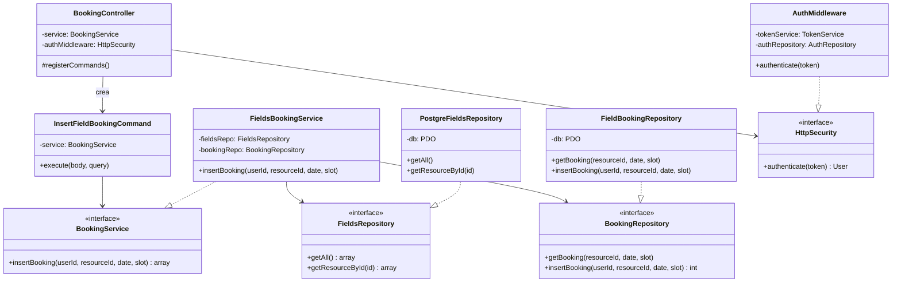
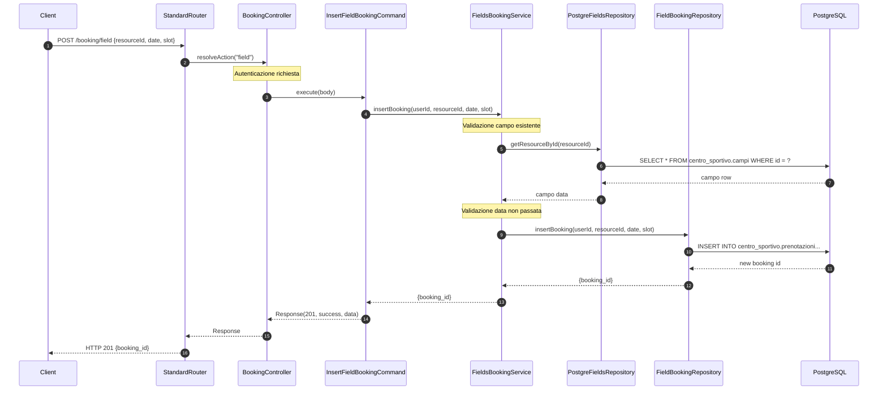
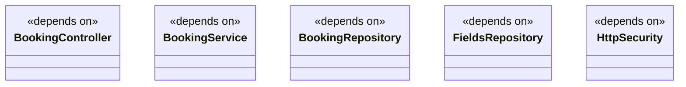

# Modulo prenotazione - Backend

## Panoramica

Questo modulo gestisce le prenotazioni dei campi sportivi. Utilizza il pattern Command per incapsulare le operazioni di prenotazione.

## Diagramma delle Classi



## Flusso di Prenotazione Campo (Diagramma di Sequenza)



## Endpoint

| Metodo | Path | Descrizione |
|--------|------|-------------|
| POST | `/booking/field` | Prenota un campo sportivo |

## Comandi

### InsertFieldBookingCommand

```php
class InsertFieldBookingCommand extends Command {
    public function __construct(private BookingService $service) {}
    
    public function execute(array $params, array $query = []): Response {
        $userId = $params['userId'];  // From JWT token
        $resourceId = (int)$params['resourceId'];
        $date = $params['date'];
        $slot = $params['slot'];
        
        $result = $this->service->insertBooking($userId, $resourceId, $date, $slot);
        return new Response(201, true, $result);
    }
    
    public function getRequiredBodyParameters(): array { 
        return ['resourceId', 'date', 'slot']; 
    }
    
    public function getRequiredQueryParameters(): array { return []; }
    public function getRequiredHttpMethod(): string { return 'post'; }
    public function requiresAuthentication(): bool { return true; }
    public function getRequiredRoles(): array { return ['user', 'admin']; }
}
```

## Dipendenze del Modulo



## Note

- Il modulo utilizza **PostgreSQL** come database
- Le prenotazioni sono salvate con stato iniziale `carrello`
- Ogni campo può essere prenotato solo se lo slot è libero
- La validazione impedisce prenotazioni per date passate
- Gli ID degli utenti vengono estratti dal token JWT